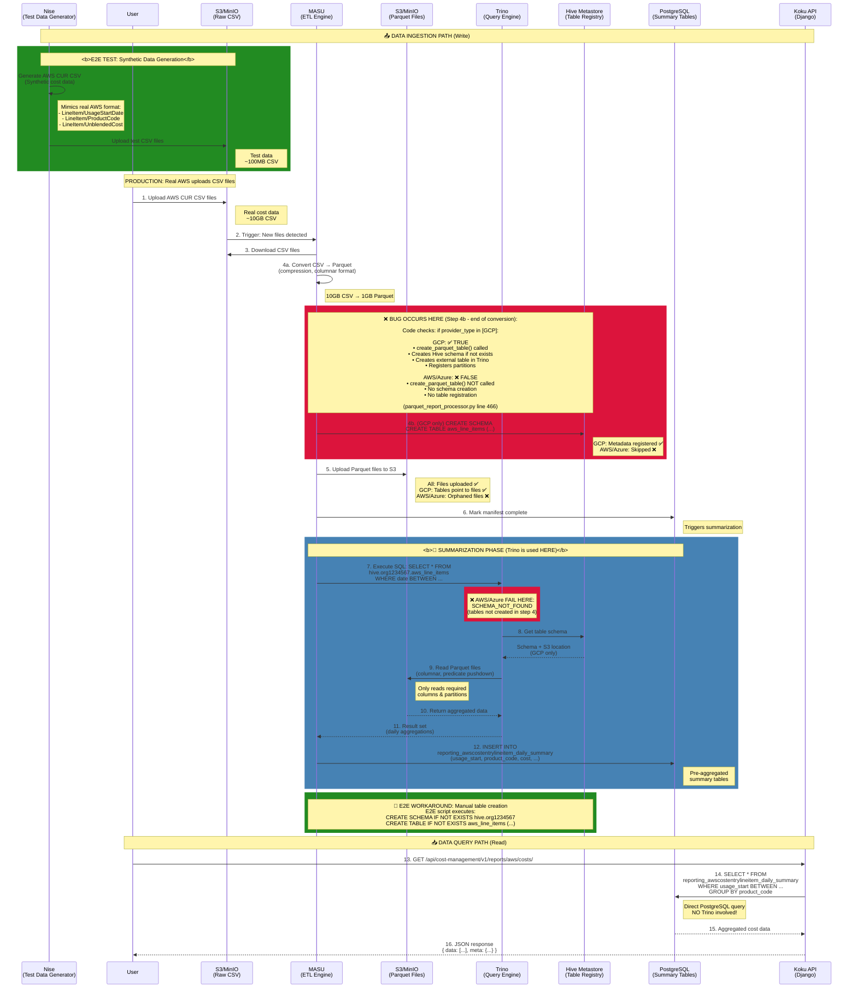
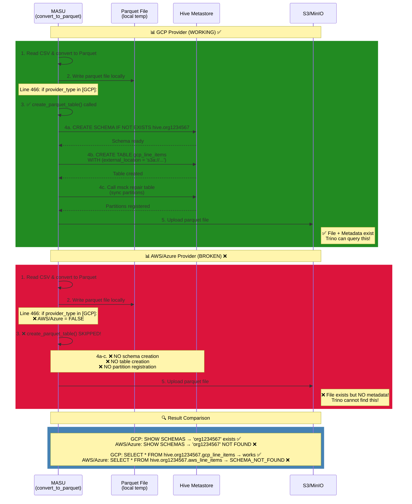

# Cost Management Data Flow Architecture

## Complete Data Pipeline: S3 → API

This document explains the **actual data flow** in Cost Management, clarifying a common misconception about Trino's role.

---

## Key Insight: Trino is NOT a Query Frontend ❌

**MISCONCEPTION**: API → Trino → Parquet files
**REALITY**: API → PostgreSQL summary tables (populated by Trino during ETL)

Trino is used **during data processing** (ETL), not during API queries!

---

## Architecture Overview



---

## What is Nise?

**Nise** (Nice Synthetic Data) is a **test data generator** for cloud cost reports.

### Purpose in E2E Tests

In production, AWS/Azure/GCP upload **real** cost CSV files to S3:
- AWS → Cost and Usage Report (CUR)
- Azure → Cost Export
- GCP → Billing Export

In E2E tests, **nise generates synthetic CSV files** that mimic the real format:

```bash
# E2E test generates AWS CSV
nise report aws \
  --start-date 2024-11-01 \
  --end-date 2024-11-19 \
  --aws-s3-bucket-name cost-data \
  --aws-s3-report-name test-report
```

**Output**: CSV files with columns like:
- `lineItem/UsageStartDate`
- `lineItem/ProductCode` (e.g., "AmazonEC2")
- `lineItem/UnblendedCost` (e.g., "$123.45")
- `lineItem/UsageAmount`
- `product/region`

### Why Use Nise?

| Aspect | Without Nise | With Nise |
|--------|--------------|-----------|
| **Data Source** | Need real AWS account | Synthetic data |
| **Cost** | Pay for AWS resources | Free |
| **Predictability** | Random costs | Known expected values |
| **Speed** | Wait hours for AWS to generate | Instant generation |
| **Control** | Can't control scenarios | Create specific test cases |

### Nise in Our E2E Flow

```
1. Nise generates CSV (100MB synthetic AWS data)
2. E2E script uploads to S3/MinIO
3. MASU processes it (same as production!)
4. Parquet conversion (same as production!)
5. Trino summarization (same as production!)
6. PostgreSQL summary tables (same as production!)
7. API returns data (same as production!)
```

**Key Point**: After nise creates the CSV, **everything else is identical to production**. Nise just replaces the "wait for AWS to upload" step.

---

## Detailed Flow Breakdown

### Phase 0: Test Data Generation (Nise) 🧪

**E2E Tests Only** - Production skips this step

| Step | Component | Action | Command |
|------|-----------|--------|---------|
| 0a | Nise | Generate CSV | `nise report aws --start-date 2024-11-01 --end-date 2024-11-19` |
| 0b | E2E Script | Upload to S3 | Uses boto3 to upload generated CSV files |
| 0c | E2E Script | Verify upload | Check manifest.json and CSV files present |

**Nise Output Structure**:
```
/tmp/nise-output/
├── test-report/
│   ├── 20241101-20241130/
│   │   ├── test-report-Manifest.json
│   │   ├── test-report-00001.csv.gz
│   │   └── test-report-00002.csv.gz
```

### Phase 1: Data Ingestion (CSV → Parquet) 📤

| Step | Component | Action | Details |
|------|-----------|--------|---------|
| 1 | S3 | Store CSV | Raw AWS CUR files (~10GB) |
| 2 | MASU | Detect files | Polling or Kafka trigger |
| 3 | MASU | Download | Stream CSV from S3 |
| 4 | MASU | Convert | CSV → Parquet (10:1 compression) |
| 5 | MASU | Upload Parquet | To S3 in partitioned structure |
| 6 | MASU | Register table | Update Hive Metastore |
| 7 | MASU | Complete manifest | Trigger summarization |

**Key Point**: Parquet files are **NOT queried by the API**. They're intermediate storage for Trino.

---

### Phase 2: Summarization (Trino → PostgreSQL) 🔄

**This is where Trino is used!**

| Step | Component | Action | SQL Example |
|------|-----------|--------|-------------|
| 8 | MASU | Query Trino | `SELECT usage_date, product_code, SUM(cost) FROM hive.org1234567.aws_line_items GROUP BY 1,2` |
| 9 | Trino | Get schema | Query Hive Metastore for table definition |
| 10 | Trino | Read Parquet | Columnar scan with predicate pushdown |
| 11 | Trino | Aggregate | Fast aggregation in-memory |
| 12 | MASU | Receive data | Aggregated result set |
| 13 | MASU | Write to Postgres | `INSERT INTO reporting_awscostentrylineitem_daily_summary (...)` |

**Trino's Role**:
- ✅ Read parquet files efficiently
- ✅ Perform complex aggregations
- ✅ Push down predicates (only read needed data)
- ❌ NOT used for API queries

**PostgreSQL Summary Tables**:
```sql
-- Pre-aggregated daily summaries
reporting_awscostentrylineitem_daily_summary
  - usage_start, usage_end
  - product_code, product_family
  - usage_account_id, region
  - unblended_cost, blended_cost
  - usage_amount, resource_count
```

---

### Phase 3: API Queries (PostgreSQL Direct) 📥

**NO Trino involvement in user queries!**

| Step | Component | Query | Details |
|------|-----------|-------|---------|
| 14 | User | API Request | `GET /api/cost-management/v1/reports/aws/costs/?filter[time_scope_value]=-1` |
| 15 | API (Django ORM) | PostgreSQL Query | Direct `SELECT` from summary tables |
| 16 | PostgreSQL | Return data | Already aggregated, indexed, fast |
| 17 | API | Format JSON | Add metadata, pagination |

**Example API → PostgreSQL Query**:
```sql
SELECT
    usage_start,
    product_code,
    SUM(unblended_cost) as cost_total
FROM org1234567.reporting_awscostentrylineitem_daily_summary
WHERE usage_start >= '2024-11-01'
  AND usage_start < '2024-12-01'
  AND cost_entry_bill_id = 12345
GROUP BY usage_start, product_code
ORDER BY cost_total DESC
LIMIT 100;
```

**NO TRINO** in this query! It's pure PostgreSQL.

---

## Why This Architecture?

### Benefits

1. **⚡ Fast API Responses**
   - PostgreSQL summary tables are indexed
   - Pre-aggregated data (daily, not line-item)
   - Sub-second query times

2. **💾 Storage Efficiency**
   - Parquet: 10:1 compression vs CSV
   - Summary tables: 100:1 reduction vs raw data
   - Example: 10GB CSV → 1GB Parquet → 10MB summary

3. **🔍 Flexible Querying**
   - PostgreSQL supports complex WHERE clauses
   - Joins with metadata tables (accounts, tags)
   - Window functions, CTEs, etc.

4. **📊 Analytical Power (When Needed)**
   - Trino can query parquet for ad-hoc analysis
   - Data scientists can run complex queries
   - But normal users don't pay the Trino cost

### Trade-offs

| Aspect | Benefit | Cost |
|--------|---------|------|
| **Write Path** | Fast ingestion | Complex ETL pipeline |
| **Storage** | 100x compression | Multiple copies of data |
| **Query Speed** | <1s API response | Summary tables can be stale |
| **Flexibility** | Pre-aggregated = fast | Can't query raw data via API |

---

## Data Freshness

### Normal Flow (No Issues)

```
CSV Upload → Parquet (5 min) → Summarization (10 min) → API (instant)
Total: ~15 minutes from upload to API visibility
```

### On-Prem Issue (Before Our Fix)

```
CSV Upload → Parquet (5 min) → ❌ Manifest stuck → ❌ No summarization → ❌ API shows no data
```

Our fix: **Manually mark manifest complete** → Triggers summarization

---

## Component Responsibilities

### MASU (ETL Engine)
- ✅ Download CSV from S3
- ✅ Convert to Parquet
- ✅ Trigger Trino summarization
- ✅ Write to PostgreSQL summary tables
- ❌ Does NOT serve API queries

### Trino (Analytical Query Engine)
- ✅ Read Parquet files efficiently
- ✅ Execute aggregation SQL
- ✅ Push down predicates to storage
- ❌ Does NOT serve API queries directly
- ❌ Only used during ETL/summarization

### Hive Metastore (Table Registry)
- ✅ Store table schemas
- ✅ Map tables to S3 locations
- ✅ Track partitions
- ❌ Does NOT store actual data

### PostgreSQL (Primary Database)
- ✅ Store summary tables
- ✅ Serve ALL API queries
- ✅ Store bills, providers, metadata
- ✅ ACID guarantees for reporting

### Koku API (Django REST)
- ✅ Receive user requests
- ✅ Query PostgreSQL directly
- ✅ Format JSON responses
- ❌ Does NOT query Trino
- ❌ Does NOT read Parquet

---

## Common Misconceptions

### ❌ MYTH: API queries go through Trino
**REALITY**: API queries PostgreSQL summary tables directly.

### ❌ MYTH: Trino is a "query frontend" for the API
**REALITY**: Trino is an ETL tool used during summarization only.

### ❌ MYTH: Parquet files are the source of truth for API
**REALITY**: PostgreSQL summary tables are the source for API. Parquet is intermediate.

### ❌ MYTH: Removing Trino breaks the API
**REALITY**: Removing Trino only breaks the ETL pipeline. API continues working with existing summary data.

---

## Implications for Testing

### What We Validated in E2E Tests

✅ **CSV → Parquet conversion** (MASU)
✅ **Hive table creation** (Our workaround)
✅ **Trino can read Parquet** (Summarization queries)
✅ **PostgreSQL summary tables populated** (Via Trino)
✅ **API returns data** (From PostgreSQL)

### Critical Path for API Success

```
1. Parquet files exist ✅
2. Hive tables registered ✅ (Our workaround fixes this)
3. Trino queries succeed ✅
4. Summary tables populated ✅
5. API queries PostgreSQL ✅
```

If ANY step fails, API returns empty results.

---

## Provider-Specific Differences

All providers follow the same architecture, but with different schemas:

| Provider | Parquet Table | Summary Table | API Endpoint |
|----------|---------------|---------------|--------------|
| **AWS** | `hive.{org}.aws_line_items` | `reporting_awscostentrylineitem_daily_summary` | `/reports/aws/costs/` |
| **Azure** | `hive.{org}.azure_line_items` | `reporting_azurecostentrylineitem_daily_summary` | `/reports/azure/costs/` |
| **GCP** | `hive.{org}.gcp_line_items` | `reporting_gcpcostentrylineitem_daily_summary` | `/reports/gcp/costs/` |

**Same flow, different tables!**

---

## Conclusion

**Trino + Hive + Postgres** is a **3-layer architecture**:

1. **Storage Layer**: Parquet files (S3/MinIO)
2. **ETL Layer**: Trino + Hive (summarization)
3. **Serving Layer**: PostgreSQL (API queries)

The API **ONLY** queries PostgreSQL. Trino is invisible to end users.

When we validated "Trino + Hive + Postgres" in E2E tests, we validated:
- ✅ The complete ETL pipeline works
- ✅ Data flows from CSV to API successfully
- ✅ All 3 layers integrate correctly

**Not**:
- ❌ That API queries Trino (it doesn't!)
- ❌ That Trino is required for API (only for ETL!)

---

## 🐛 The Bug We Found & Fixed

### Problem: AWS/Azure Hive Tables Not Auto-Created

**Location in Diagram**: 🔴 Red boxes show where the bug occurs

### Bug Flow Comparison Diagram

This diagram shows the exact difference between GCP (working) and AWS/Azure (broken):



#### What Should Happen (GCP)

```python
# parquet_report_processor.py line 466-468
if self.provider_type in [Provider.PROVIDER_GCP, Provider.PROVIDER_GCP_LOCAL]:
    # ✅ Sync partitions on each file to create partitions that cross month boundaries
    self.create_parquet_table(parquet_base_filename)
```

**Result**: GCP Hive schema + tables created automatically ✅

#### What Actually Happens (AWS/Azure)

```python
# parquet_report_processor.py line 557-558
if self.create_table and not self.trino_table_exists.get(self.trino_table_exists_key):
    self.create_parquet_table(parquet_filepath)
```

**Problem**: `self.create_table` is `False` by default for AWS/Azure ❌

**Result**:
1. **Step 4**: Tables NOT created during parquet conversion (bug location)
2. **Step 5**: Parquet files uploaded but orphaned (no tables point to them)
3. **Step 7**: Trino query fails with `SCHEMA_NOT_FOUND`
4. **Step 12**: No data written to PostgreSQL summary tables
5. **API**: Returns empty results 💥

### Our Workaround (E2E Tests)

**Location in Diagram**: 🟢 Green box after summarization phase

The E2E script manually creates tables using Trino CLI:

```python
# E2E processing.py - create_hive_tables_for_provider()
def create_hive_tables_for_provider(self, provider_type: str):
    """Manually create Hive schema and tables (Koku bug workaround)"""

    # 1. Create schema
    schema_sql = f"CREATE SCHEMA IF NOT EXISTS hive.{org_id}"

    # 2. Create base table
    table_sql = f"""CREATE TABLE IF NOT EXISTS hive.{org_id}.aws_line_items (
        lineitem_usagestartdate timestamp,
        lineitem_productcode varchar,
        lineitem_unblendedcost double,
        ...
        source varchar, year varchar, month varchar
    ) WITH (
        external_location = 's3a://cost-data/data/parquet/{org_id}/AWS',
        format = 'PARQUET',
        partitioned_by = ARRAY['source', 'year', 'month']
    )"""

    # 3. Create daily table (AWS/GCP only, not Azure)
    # ...
```

### Why This Works

1. **After parquet conversion** (step 4), files exist in S3
2. **After parquet upload** (step 5), E2E creates tables manually
3. **Before Trino query** (step 7), schema + tables now exist
4. **Trino query succeeds** because metadata properly registered
5. **Summary tables populated** (step 12)
6. **API returns data** ✅

### Proper Fix (For Koku Development Team)

**File**: `koku/masu/processor/parquet/parquet_report_processor.py`

**Change**:
```python
# Current (broken for AWS/Azure)
if self.provider_type in [Provider.PROVIDER_GCP, Provider.PROVIDER_GCP_LOCAL]:
    self.create_parquet_table(parquet_base_filename)

# Proposed fix
if self.provider_type in [
    Provider.PROVIDER_AWS, Provider.PROVIDER_AWS_LOCAL,
    Provider.PROVIDER_AZURE, Provider.PROVIDER_AZURE_LOCAL,
    Provider.PROVIDER_GCP, Provider.PROVIDER_GCP_LOCAL
]:
    self.create_parquet_table(parquet_base_filename)
```

**Or** set `create_table=True` in the processing context for all providers.

### Impact

| Scenario | Without Fix | With E2E Workaround | With Proper Fix |
|----------|-------------|---------------------|-----------------|
| **GCP** | ✅ Works | ✅ Works (redundant) | ✅ Works |
| **AWS** | ❌ Fails | ✅ Works (manual) | ✅ Works |
| **Azure** | ❌ Fails | ✅ Works (manual) | ✅ Works |
| **Production** | ❌ Broken | ⚠️ Requires manual intervention | ✅ Automatic |

### Documentation

See:
- **KOKU_BUG_AWS_HIVE_SCHEMA_CREATION.md** - Detailed bug report
- **E2E_MULTI_PROVIDER_SUPPORT.md** - Workaround implementation
- **PROVIDER_DIFFERENCES_TRINO_HIVE.md** - Provider comparison

