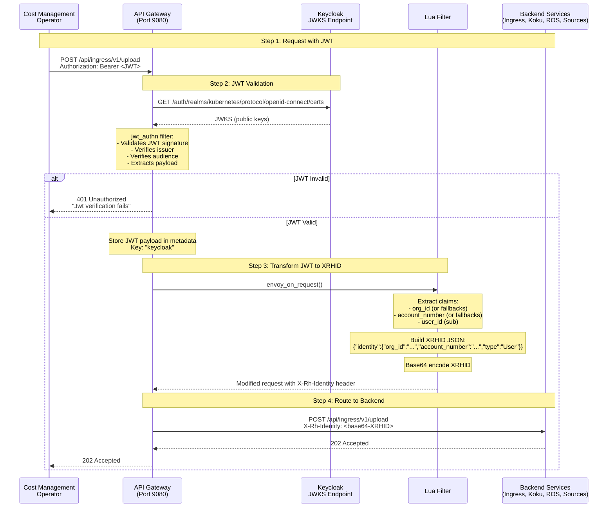

# Keycloak JWT Authentication Setup for Cost Management Operator and ROS Backend

**Technical Guide for Production Deployment**

## Overview

This document describes how to configure Red Hat Build of Keycloak (RHBK) to provide JWT authentication for the Cost Management Metrics Operator with proper `org_id` claim support required by the ROS (Resource Optimization Service) backend.

### Architecture

```mermaid
graph TB
    Operator["<b>Cost Management Operator</b><br/>Uploads metrics with JWT"]
    Keycloak["<b>Red Hat Build of Keycloak (RHBK)</b><br/><br/>• Realm: kubernetes<br/>• Client: cost-management-operator<br/>• org_id claim mapper"]
    Gateway["<b>Centralized API Gateway</b><br/>(Port 9080)<br/><br/>• JWT signature validation<br/>• Inject X-Rh-Identity header<br/>• Route to backend services"]
    Ingress["<b>Ingress Service</b><br/>(Port 8081)<br/><br/>• Receive pre-authenticated requests<br/>• Extract org_id/account from X-Rh-Identity<br/>• Process upload<br/>• Publish to Kafka"]
    Kafka["<b>Kafka</b><br/><br/>• Topic: platform.upload.ros<br/>• Message includes org_id"]
    Backend["<b>ROS Backend Processor</b><br/><br/>• Consumes from Kafka<br/>• Creates XRHID header<br/>• Calls API with org_id"]

    Operator -->|"① Get JWT<br/>(client_credentials)"| Keycloak
    Operator -->|"② Upload<br/>Authorization: Bearer &lt;JWT&gt;"| Gateway
    Gateway -->|"③ Validate JWT<br/>X-Rh-Identity: &lt;base64&gt;"| Ingress
    Ingress -->|"④ Parse identity<br/>Publish message"| Kafka
    Kafka -->|"⑤ Message with<br/>org_id metadata"| Backend

    style Operator fill:#e1f5ff,stroke:#01579b,stroke-width:2px,color:#000
    style Keycloak fill:#fff9c4,stroke:#f57f17,stroke-width:2px,color:#000
    style Gateway fill:#fff59d,stroke:#333,stroke-width:2px,color:#000
    style Ingress fill:#e8f5e9,stroke:#1b5e20,stroke-width:2px,color:#000
    style Kafka fill:#fff3e0,stroke:#e65100,stroke-width:2px,color:#000
    style Backend fill:#fce4ec,stroke:#880e4f,stroke-width:2px,color:#000
```



**Authentication Flow**:
- **Operator** → Gateway: `Authorization: Bearer <JWT>` (Standard OAuth 2.0)
- **Gateway** → Backend Services: `X-Rh-Identity: <base64-XRHID>` (Pre-authenticated)
- **Ingress** → Kafka: Message with `org_id` extracted from X-Rh-Identity
- **Backend Processor** → Cost Management On-Premise API: `X-Rh-Identity: <base64-XRHID>` (XRHID-based auth)

**Key Points**:
- **Centralized Gateway** validates JWT signature and injects `X-Rh-Identity` header for all backend services
- **Backend Services** (Ingress, Koku API, ROS API) receive pre-authenticated requests with `X-Rh-Identity`
- **Sources API** is now integrated into Koku API at `/api/cost-management/v1/sources/`
- **XRHID Format**: `{"org_id":"...","identity":{"org_id":"...","account_number":"...","type":"User"}}` (base64-encoded)
- The `org_id` claim from JWT is required and used throughout the system

> **⚠️ Important: Dual org_id Placement**
>
> The X-Rh-Identity header includes `org_id` in **two locations**:
> 1. **Top-level**: `{"org_id": "org1234567", ...}` - Workaround for Koku dev_middleware bug
> 2. **Inside identity**: `{"identity": {"org_id": "org1234567", ...}}` - Correct location per Red Hat schema
>
> This dual placement is required because Koku's `dev_middleware.py` (line 63) incorrectly reads
> `identity_header.get("org_id")` instead of `identity_header.get("identity", {}).get("org_id")`.
> The Envoy Lua filter places `org_id` in both locations for compatibility.

### Key Requirements

1. **JWT Token** must contain:
   - Standard OIDC claims (`sub`, `iat`, `exp`, `iss`, `aud`)
   - **`org_id`** claim (String) - **REQUIRED** by ROS backend for organization identification
   - **`account_number`** claim (String) - **REQUIRED** for account-level data isolation and tenant identification
   - **`email`** claim (String) - **REQUIRED** by Koku for user creation (if not provided, defaults to `username@example.com`)
   - **`preferred_username`** claim (String) - **Recommended** for user display name

2. **Supported org_id Claim Names** (Envoy Lua filter supports multiple alternatives):
   - `org_id` (preferred)
   - `organization_id` (fallback)
   - `tenant_id` (second fallback)

3. **Supported account_number Claim Names** (Gateway Lua filter supports multiple alternatives):
   - `account_number` (preferred)
   - `account_id` (fallback)
   - `account` (second fallback)

   **Implementation Reference**: See `cost-onprem/templates/gateway/configmap-envoy.yaml` Lua filter section

4. **Keycloak Configuration**:
   - Service account client (client_credentials grant type)
   - Hardcoded claim mapper for `org_id` (REQUIRED)
   - Hardcoded claim mapper for `account_number` (RECOMMENDED)
   - Proper audience and scope configuration

5. **Operator Configuration**:
   - Secret with client_id and client_secret
   - Token URL pointing to Keycloak realm

6. **UI/Interactive User Configuration** (for Cost Management UI access):
   - Uses **ENHANCED_ORG_ADMIN** mode - all authenticated users are org admins
   - No `access` claim required in JWT
   - Simplified setup with full access within each user's org

### Authentication Mode: ENHANCED_ORG_ADMIN

The Cost Management on-premise deployment uses **ENHANCED_ORG_ADMIN** mode for simplified authentication:

| Setting | Value | Purpose |
|---------|-------|---------|
| `DEVELOPMENT` | `false` | Use production middleware (fixes Mock user bugs) |
| `ENHANCED_ORG_ADMIN` | `true` | Bypass external RBAC service for admin users |
| `is_org_admin` | `true` (in X-Rh-Identity) | Grant full access within user's org |

**How it works**:
1. Envoy validates JWT and extracts `org_id`, `account_number`, and `username`
2. Envoy constructs X-Rh-Identity header with `is_org_admin: true`
3. Koku receives the request and sees `is_org_admin=true`
4. With `ENHANCED_ORG_ADMIN=true`, Koku skips RBAC service calls
5. User gets full access to all resources within their org

**Benefits**:
- ✅ No external RBAC service required
- ✅ No `access` claim needed in JWT or Keycloak user attributes
- ✅ Simpler Keycloak configuration
- ✅ Production middleware (no Mock user bugs)

**Limitations**:
- ⚠️ All authenticated users are org admins (no granular RBAC within org)
- ⚠️ Cannot restrict "User A sees only Cluster X" within same org
- ✅ Multi-tenancy IS preserved: users only see their own org's data

**When to use**:
- Single-tenant deployments
- Trusted-user environments
- Deployments where all users should have full access

### Future: Granular RBAC (Not Currently Implemented)

For deployments requiring granular permissions within an org, a future enhancement could:
1. Deploy a custom RBAC service
2. Set `ENHANCED_ORG_ADMIN=false`
3. Add `access` claim to JWT with resource-level permissions
4. Configure Koku to call the RBAC service

**Resource Types** (for future RBAC implementation):

| Resource Type | Description |
|--------------|-------------|
| `openshift.cluster` | OpenShift cluster access |
| `openshift.project` | OpenShift project/namespace access |
| `openshift.node` | OpenShift node access |
| `cost_model` | Cost model read/write access |

> **Note**: AWS, Azure, and GCP providers are not currently supported in on-prem deployments.

### Creating a User with Required Attributes

To create a user that can access Cost Management UI, you must configure the following user attributes in Keycloak:

**Required User Attributes**:

| Attribute | Type | Description | Example |
|-----------|------|-------------|---------|
| `org_id` | String | Tenant identifier (maps to database schema) | `org1234567` |
| `account_number` | String | Customer account identifier | `7890123` |

> **Note**: The `access` attribute is **NOT required** when using ENHANCED_ORG_ADMIN mode.
> All authenticated users are treated as org admins with full access within their org.

**Creating a User via Keycloak Admin Console**:

1. Navigate to **Users** → **Add User**
2. Fill in username, email, first/last name
3. Go to **Attributes** tab
4. Add the following attributes:

   | Key | Value |
   |-----|-------|
   | `org_id` | `org1234567` |
   | `account_number` | `7890123` |

5. Go to **Credentials** tab and set a password
6. Ensure user is enabled

**Creating a User via Keycloak Admin API**:

```bash
curl -X POST "$KEYCLOAK_URL/admin/realms/kubernetes/users" \
  -H "Authorization: Bearer $ADMIN_TOKEN" \
  -H "Content-Type: application/json" \
  -d '{
    "username": "cost-user",
    "email": "cost-user@example.com",
    "emailVerified": true,
    "enabled": true,
    "firstName": "Cost",
    "lastName": "User",
    "attributes": {
      "org_id": ["org1234567"],
      "account_number": ["7890123"]
    }
  }'
```

> **Note**: The `org_id` currently requires the `org` prefix (e.g., `org1234567` instead of `1234567`)
> as a workaround for a Koku schema naming bug. This will be addressed in a future release.

### How org_id and account_number are Extracted (Technical Details)

The authentication flow uses a **centralized API gateway** that handles JWT validation for all external traffic:

#### Centralized Gateway - JWT Validation and Header Injection

**Service**: `cost-onprem-gateway` (Port 9080)

**Location**: `cost-onprem/templates/gateway/configmap-envoy.yaml`

**Purpose**: Single point of authentication for all external API traffic. Validates JWT tokens, extracts claims, and injects `X-Rh-Identity` header for all backend services.

**Authentication Flow (Sequence Diagram)**:



**Gateway JWT Validation Steps**:
1. Receives request with `Authorization: Bearer <JWT>` header
2. Validates JWT signature against Keycloak JWKS endpoint (cached for 5 minutes)
3. Verifies `issuer` matches Keycloak realm URL
4. Verifies `audience` contains expected client ID (e.g., `cost-management-operator`)
5. Stores validated JWT payload in Envoy metadata under key `keycloak` for Lua filter access

**Gateway Lua Filter**: Transforms JWT to XRHID format
1. Retrieves JWT payload from Envoy metadata:
   ```lua
   local metadata = request_handle:streamInfo():dynamicMetadata()
   local jwt_data = metadata:get("envoy.filters.http.jwt_authn")
   local payload = jwt_data["keycloak"]
   ```

2. Extracts `org_id` with fallback logic:
   ```lua
   -- Tries: org_id → organization_id → tenant_id
   local org_id = get_claim(payload, "org_id", "organization_id", "tenant_id")
   -- Default: "1" if missing (with warning)
   ```

3. Extracts `account_number` with fallback logic:
   ```lua
   -- Tries: account_number → account_id → account
   local account_number = get_claim(payload, "account_number", "account_id", "account")
   -- Default: org_id value if missing
   ```

4. Builds XRHID JSON structure (Red Hat Identity format with dual org_id):
   ```lua
   -- NOTE: org_id appears in TWO places as a workaround for Koku middleware compatibility
   -- 1. Top-level "org_id" - for middleware compatibility
   -- 2. identity.org_id - correct location per Red Hat identity schema
   -- is_org_admin=true triggers ENHANCED_ORG_ADMIN bypass (no RBAC service calls)
   local xrhid = string.format(
     '{"org_id":"%s","identity":{"org_id":"%s","account_number":"%s","type":"User","user":{"username":"%s","is_org_admin":true}},"entitlements":{"cost_management":{"is_entitled":true}}}',
     org_id, org_id, account_number, username
   )
   ```

5. Base64 encodes the XRHID JSON and injects headers:
   ```lua
   local b64_xrhid = request_handle:base64Escape(xrhid)
   request_handle:headers():add("X-Rh-Identity", b64_xrhid)
   ```

**Header Injection**:
- **`X-Rh-Identity`** (REQUIRED): Base64-encoded XRHID JSON used by all backend services for:
  - Authentication and authorization
  - Multi-tenancy (org_id and account_number extraction)
  - Database query filtering
  - Audit logging

**Gateway Routing**:
The gateway routes requests to backend services based on URL path:

| Path | Backend Service | Port |
|------|-----------------|------|
| `/api/ingress/*` | Ingress | 8081 |
| `/api/cost-management/v1/recommendations/openshift` | ROS API | 8000 |
| `/api/cost-management/*` (GET, HEAD) | Koku API Reads | 8000 |
| `/api/cost-management/*` (POST, PUT, DELETE, PATCH) | Koku API Writes | 8000 |

**Note**: Sources API is now integrated into Koku at `/api/cost-management/v1/sources/`

**Request Flow**:
```
Cost Management Operator
  ↓ Authorization: Bearer <JWT>
Centralized Gateway (port 9080)
  ↓ Validates JWT, Transforms to XRHID
  ↓ Routes based on path
  ↓ X-Rh-Identity: <base64-encoded-JSON>
Backend Service (Ingress, Koku, ROS, Sources)
  ↓ Decodes XRHID, extracts org_id
  ↓ Processes request with tenant isolation
```

#### Backend Services

All backend services receive pre-authenticated requests from the gateway with the `X-Rh-Identity` header.

**Services**:
- **Ingress** (port 8081): File upload processing
- **Koku API** (port 8000): Cost management read/write operations
- **ROS API** (port 8000): Resource optimization recommendations
- **Sources API** (port 8000): Provider and source management

**Authentication**:
- All services use `X-Rh-Identity` header from gateway
- Services decode base64 XRHID and extract `org_id`, `account_number`
- Multi-tenancy enforced via database query filtering

**Benefits of Centralized Gateway**:
- ✅ **Single authentication point**: All JWT validation in one place
- ✅ **Simplified architecture**: No per-service Envoy sidecars needed
- ✅ **Easy debugging**: All authentication logs in gateway
- ✅ **Consistent security**: Same authentication for all APIs
- ✅ **Performance**: JWT validation cached at gateway level

**Complete End-to-End Flow**:

```
1. Cost Management Operator → Keycloak
   Request: client_credentials grant
   Response: JWT token with org_id and account_number claims

2. Operator → Gateway (port 9080)
   Request: Authorization: Bearer <JWT>
   Gateway: Validates JWT signature, extracts payload

3. Gateway → Backend Service
   Headers: X-Rh-Identity: <base64-XRHID>
   Service: Decodes XRHID, extracts org_id
            Processes request with tenant isolation

4. For Ingress uploads:
   Ingress → Kafka: Message with org_id metadata
   Kafka → Processors: Message consumed
   Processors → APIs: Internal calls with X-Rh-Identity

5. For API requests:
   Gateway → Koku/ROS/Sources: Pre-authenticated request
   Service → Database: Query with org_id filter
```

**Summary**:
- **Gateway validates all JWT tokens** from external traffic
- **Gateway injects X-Rh-Identity header** for all backend services
- **Backend services use X-Rh-Identity** for multi-tenant database queries
- **No per-service Envoy sidecars** - centralized authentication at gateway

---

## Part 1: Red Hat Build of Keycloak Installation

### Prerequisites

- OpenShift cluster with admin access (version 4.14 or later)
- Cluster admin permissions
- `oc` CLI installed and logged in

### Installation Options

#### Option A: Red Hat Build of Keycloak Operator (Recommended)

Follow the official Red Hat documentation to install RHBK on OpenShift:

**📖 Official Documentation:**
- [Red Hat Build of Keycloak for OpenShift](https://access.redhat.com/documentation/en-us/red_hat_build_of_keycloak)
- [Installing the RHBK Operator](https://www.keycloak.org/operator/installation)

**Quick Installation Steps:**

1. Install the Red Hat Build of Keycloak Operator from OperatorHub
2. Create a namespace for RHBK (e.g., `keycloak`)
3. Deploy a Keycloak instance
4. Create a Keycloak realm

#### Option B: Automated Script (Quick Start)

For testing or development environments, use the provided automation script:

```bash
cd scripts/
./deploy-rhbk.sh
```

This script automates the operator installation and basic configuration.

### Post-Installation Verification

Verify that RHBK is running:

```bash
# Check Keycloak instance status
oc get keycloak -n keycloak

# Get Keycloak URL
oc get keycloak keycloak -n keycloak -o jsonpath='{.status.hostname}'

# Get admin credentials (auto-generated by RHBK operator)
oc get secret keycloak-initial-admin -n keycloak \
  -o jsonpath='{.data.username}' | base64 -d
oc get secret keycloak-initial-admin -n keycloak \
  -o jsonpath='{.data.password}' | base64 -d
```

---

## Part 2: Keycloak Configuration for Cost Management Operator

This section shows how to configure an existing Red Hat Build of Keycloak (RHBK) instance to work with the Cost Management Operator.

### Overview

The Cost Management Operator requires:
1. **Realm**: A Keycloak realm (e.g., `kubernetes`)
2. **Client**: A service account client with specific configuration
3. **org_id Claim Mapper**: Critical for ROS backend compatibility

### 2.1: Create or Verify Realm

If you don't already have a realm, create one using a `KeycloakRealm` CR:

```yaml
apiVersion: k8s.keycloak.org/v2alpha1
kind: KeycloakRealm
metadata:
  name: kubernetes-realm
  namespace: keycloak
  labels:
    app: keycloak
spec:
  realm:
    id: kubernetes
    realm: kubernetes
    enabled: true
    displayName: "Kubernetes Realm"
    accessTokenLifespan: 300
    bruteForceProtected: true
    failureFactor: 30
    maxFailureWaitSeconds: 900
    maxDeltaTimeSeconds: 43200
    registrationAllowed: false
    rememberMe: true
    resetPasswordAllowed: true
    verifyEmail: false
    clientScopes:
    - name: api.console
      description: "API Console access scope for cost management"
      protocol: openid-connect
      attributes:
        include.in.token.scope: "true"
        display.on.consent.screen: "false"
    defaultDefaultClientScopes:
    - api.console
  instanceSelector:
    matchLabels:
      app: keycloak
```

**📝 Configuration Notes:**
- `accessTokenLifespan: 300` - JWT tokens expire after 5 minutes
- `bruteForceProtected: true` - Protects against brute force attacks
- `registrationAllowed: false` - Disable self-registration for security
- **`clientScopes`**: Defines the `api.console` scope at the realm level
  - `include.in.token.scope: "true"` - Includes this scope in the token's scope claim
  - `display.on.consent.screen: "false"` - Don't show to users (service account clients)
- **`defaultDefaultClientScopes`**: Automatically includes `api.console` in all clients
  - This makes the `api.console` scope available to all clients in this realm by default
  - Clients can still explicitly reference it in their `defaultClientScopes` array

> **ℹ️ Session Configuration Note:**
> The Red Hat Build of Keycloak (RHBK) v2alpha1 API does not support `clientSessionMaxLifespan` or `ssoSessionMaxLifespan` fields in the KeycloakRealm CRD.
> If you need to configure session timeouts beyond the access token lifespan, you must set them via:
> - The Keycloak Admin Console UI (`Realm Settings` → `Sessions`)
> - The Keycloak Admin REST API
>
> The `accessTokenLifespan` setting controls how long JWT tokens remain valid.

Apply the realm:

```bash
oc apply -f keycloak-realm.yaml -n keycloak

# Wait for realm to be ready
oc wait --for=condition=ready keycloakrealm/kubernetes-realm -n keycloak --timeout=120s
```

### 2.2: Create Cost Management Client with org_id Support (CRITICAL)

**⚠️ IMPORTANT**: The `org_id` claim is **REQUIRED** by the ROS backend. Without it, all uploads will be rejected.

#### Why org_id is Required

The ROS backend (`cost-onprem-backend`) requires the `org_id` claim to:
- Identify which organization the data belongs to
- Enforce multi-tenancy boundaries
- Route data to correct storage partitions
- Apply organization-specific policies

#### Complete KeycloakClient Custom Resource

Create a `KeycloakClient` CR with the `org_id` mapper included:

```yaml
apiVersion: k8s.keycloak.org/v2alpha1
kind: KeycloakClient
metadata:
  name: cost-management-service-account
  namespace: keycloak
  labels:
    app: keycloak
spec:
  client:
    clientId: cost-management-operator
    secret:
      name: keycloak-client-secret-cost-management-service-account
    publicClient: false
    serviceAccountsEnabled: true
    protocol: openid-connect
    defaultClientScopes:
    - openid
    - profile
    - email
    - api.console
    protocolMappers:
    - name: org-id-mapper
      protocol: openid-connect
      protocolMapper: oidc-hardcoded-claim-mapper
      config:
        access.token.claim: "true"
        claim.name: org_id
        claim.value: "12345"
        id.token.claim: "false"
        jsonType.label: String
        userinfo.token.claim: "false"
    - name: account-number-mapper
      protocol: openid-connect
      protocolMapper: oidc-hardcoded-claim-mapper
      config:
        access.token.claim: "true"
        claim.name: account_number
        claim.value: "7890123"
        id.token.claim: "false"
        jsonType.label: String
        userinfo.token.claim: "false"
    - name: audience-mapper
      protocol: openid-connect
      protocolMapper: oidc-audience-mapper
      config:
        access.token.claim: "true"
        id.token.claim: "false"
        included.client.audience: cost-management-operator
    - name: client-id-mapper
      protocol: openid-connect
      protocolMapper: oidc-usersessionmodel-note-mapper
      config:
        access.token.claim: "true"
        claim.name: clientId
        id.token.claim: "true"
        user.session.note: clientId
    - name: api-console-mock
      protocol: openid-connect
      protocolMapper: oidc-hardcoded-claim-mapper
      config:
        access.token.claim: "true"
        claim.name: scope
        claim.value: api.console
        id.token.claim: "false"
  realmSelector:
    matchLabels:
      app: keycloak
```

**📝 Important Configuration Notes:**

1. **Change `claim.value: "1"`** to your actual organization ID in the `org-id-mapper`
2. **Change `claim.value: "1"`** to your actual account number in the `account-number-mapper` (optional)
3. **api.console scope**: Included in `defaultClientScopes` and added via `api-console-mock` mapper
4. **Labels**: Use `app: sso` labels to match with Keycloak instance selector
5. **Multi-Organization Support**: The system will extract `org_id` from the `clientId` claim
   - The `clientId` is automatically included in JWT tokens by the `client-id-mapper`
   - Backend services can parse the `clientId` to derive the organization identifier
   - This allows flexible multi-tenancy without hardcoding `org_id` values

**Protocol Mappers Explained:**
- **org-id-mapper**: Adds `org_id` claim (REQUIRED by ROS backend) - for explicit org identification
- **account-number-mapper**: Adds `account_number` claim (recommended for tenant identification)
- **audience-mapper**: Adds audience validation for JWT
- **client-id-mapper**: Adds `clientId` claim to tokens - used for org_id extraction in multi-tenant setups
- **api-console-mock**: Adds `api.console` to the `scope` claim (required for OpenShift integration)

**Multi-Organization Architecture:**
- The `clientId` claim can be used to derive `org_id` dynamically
- Example: `clientId: "cost-management-operator-org123"` → `org_id: "org123"`
- This eliminates the need for separate Keycloak clients per organization
- Backend services parse the `clientId` to determine the organization context

#### Apply the Client Configuration

```bash
# Save the YAML above to a file
vi cost-management-client.yaml

# Apply the KeycloakClient CR
oc apply -f cost-management-client.yaml -n keycloak

# Wait for client to be ready
oc wait --for=condition=ready keycloakclient/cost-management-service-account -n keycloak --timeout=120s

# Verify the client was created
oc get keycloakclient -n keycloak cost-management-service-account

# Verify the client secret was created
oc get secret keycloak-client-secret-cost-management-service-account -n keycloak

# Get the client secret value
CLIENT_SECRET=$(oc get secret keycloak-client-secret-cost-management-service-account -n keycloak \
  -o jsonpath='{.data.CLIENT_SECRET}' | base64 -d)
echo "Client Secret: $CLIENT_SECRET"
```

#### Alternative: Update Existing Client (Patch Method)

If you already have a client without `org_id`, patch it:

```bash
# Set your organization ID
ORG_ID="1"  # Change to your actual org_id

# Patch the existing KeycloakClient
oc patch keycloakclient cost-management-service-account -n keycloak --type=json -p='[
  {
    "op": "add",
    "path": "/spec/client/protocolMappers/-",
    "value": {
      "name": "org-id-mapper",
      "protocol": "openid-connect",
      "protocolMapper": "oidc-hardcoded-claim-mapper",
      "config": {
        "claim.name": "org_id",
        "claim.value": "'$ORG_ID'",
        "jsonType.label": "String",
        "access.token.claim": "true",
        "id.token.claim": "false"
      }
    }
  }
]'

# Wait for Keycloak to reconcile
sleep 10
```

#### Alternative: Add org_id via Keycloak Admin Console (Manual Method)

If you prefer to use the Keycloak web UI:

1. **Log into Keycloak Admin Console**
   ```bash
   # Get URL and credentials
   KEYCLOAK_URL=$(oc get keycloak keycloak -n keycloak -o jsonpath='{.status.hostname}')
   echo "Admin Console: https://$KEYCLOAK_URL/admin/"
   ```

2. **Navigate to the Client**
   - Realms → `kubernetes`
   - Clients → `cost-management-operator`
   - Mappers tab

3. **Create org_id Mapper**
   - Click "Create"
   - **Name**: `org-id-mapper`
   - **Mapper Type**: `Hardcoded claim`
   - **Token Claim Name**: `org_id`
   - **Claim value**: `1` (your organization ID)
   - **Claim JSON Type**: `String`
   - **Add to ID token**: OFF
   - **Add to access token**: ON ✅
   - **Add to userinfo**: OFF
   - Click "Save"

---

## Part 3: Helm Chart Configuration (Keycloak URL and CA Certificate)

### Overview

The Cost Management On-Premise Helm chart needs to know how to reach Keycloak and validate its TLS certificate. The chart provides **intelligent defaults with automatic fallback** to minimize manual configuration.

### Configuration Behavior

#### Keycloak URL

**Automatic Discovery (Default):**
```yaml
# No jwt_auth configuration needed!
# The chart will auto-discover Keycloak from the cluster
```

**Manual Override (External Keycloak):**
```yaml
jwt_auth:
  keycloak:
    url: "https://keycloak.external-company.com"
    realm: "production"
```

**Logic:**
- ✅ **IF** `jwtAuth.keycloak.url` **is specified** → Use that URL
  - ✅ **IF NOT specified** → Auto-discover from cluster:
  1. Search for Keycloak Custom Resources
  2. Find Routes in `keycloak` or `keycloak-system` namespaces
  3. Construct URL from service discovery

#### CA Certificate

**Automatic Fetching (Default):**
```yaml
jwt_auth:
  keycloak:
    url: "https://keycloak.example.com"
    # No tls.caCert needed - will be dynamically fetched
```

**Manual Override (Production/Air-gapped):**
```yaml
jwt_auth:
  keycloak:
    url: "https://keycloak.example.com"
    tls:
      caCert: |
        -----BEGIN CERTIFICATE-----
        MIIDXTCCAkWgAwIBAgIJAKLnUhVP3GVDMA0GCSqGSIb3...
        -----END CERTIFICATE-----
```

**Logic:**
- ✅ **IF** `jwtAuth.keycloak.tls.caCert` **is provided** → Use that CA (skip dynamic fetch)
- ✅ **IF NOT provided** → Dynamically fetch from Keycloak endpoint during pod initialization
  - Fetches entire certificate chain
  - Combines with system CA bundle and OpenShift CAs
  - Gracefully degrades if fetch fails (uses system CAs only)

### Configuration Examples by Scenario

#### Scenario 1: Local Keycloak on OpenShift (Zero Configuration)

```yaml
# openshift-values.yaml
# NO jwt_auth configuration needed!
```

**What happens:**
- Keycloak URL: Auto-discovered from cluster ✅
- Keycloak CA: Auto-injected by OpenShift service CA + dynamic fetch ✅
- Realm: Defaults to `redhat-external`

**Confidence: 95%+** - This is the recommended approach for local Keycloak.

---

#### Scenario 2: External Keycloak with Public CA (Let's Encrypt)

```yaml
jwt_auth:
  keycloak:
    url: "https://auth.company.com"  # Uses Let's Encrypt
    realm: "production"
```

**What happens:**
- Keycloak URL: Uses specified URL ✅
- Keycloak CA: System CA bundle already trusts Let's Encrypt ✅
- Dynamic fetch provides redundancy

**Confidence: 85-90%** - Works reliably with public CAs.

---

#### Scenario 3: External Keycloak with Self-Signed Cert (Development)

```yaml
jwt_auth:
  keycloak:
    url: "https://keycloak.dev.external.com"
    realm: "development"
    # No tls.caCert - will attempt dynamic fetch
```

**What happens:**
- Keycloak URL: Uses specified URL ✅
- Keycloak CA: Dynamically fetched from endpoint ⚠️
  - Requires: Network egress from pods
  - Requires: DNS resolution of external hostname
  - 10-second timeout for fetch

**Confidence: 70-80%** - Works if network allows egress. Test thoroughly.

---

#### Scenario 4: External Keycloak with Self-Signed Cert (Production)

```yaml
jwt_auth:
  keycloak:
    url: "https://keycloak.prod.external.com"
    realm: "production"
    tls:
      caCert: |
        -----BEGIN CERTIFICATE-----
        MIIDXTCCAkWgAwIBAgIJAKLnUhVP3GVDMA0GCSqGSIb3DQEBCwUAMEUxCzAJBgNV
        BAYTAlVTMRMwEQYDVQQIDApDYWxpZm9ybmlhMRYwFAYDVQQHDA1TYW4gRnJhbmNp
        ... (full certificate) ...
        -----END CERTIFICATE-----
```

**What happens:**
- Keycloak URL: Uses specified URL ✅
- Keycloak CA: Uses manually provided certificate ✅
  - No external dependency during pod startup
  - No network requirements
  - Predictable behavior

**Confidence: 95-99%** - **Recommended for production** external Keycloak.

**How to get the CA certificate:**
```bash
# From your local machine or bastion host
echo | openssl s_client -connect keycloak.prod.external.com:443 -showcerts 2>/dev/null | \
  openssl x509 -outform PEM > keycloak-ca.crt

# Verify it's valid
openssl x509 -in keycloak-ca.crt -noout -text

# Copy the contents into values.yaml
cat keycloak-ca.crt
```

---

#### Scenario 5: Air-Gapped Environment

```yaml
jwt_auth:
  keycloak:
    url: "https://keycloak.internal"
    realm: "production"
    tls:
      caCert: |
        -----BEGIN CERTIFICATE-----
        ... (REQUIRED - must be provided manually) ...
        -----END CERTIFICATE-----
```

**What happens:**
- Keycloak URL: Uses specified URL ✅
- Keycloak CA: Uses manually provided certificate ✅
- Dynamic fetch will fail (no external access) but manual CA prevents issues

**Confidence: 95-99%** - Manual CA is **mandatory** for air-gapped deployments.

---

### Recommendation Summary

| Environment | Keycloak Location | Recommended Configuration | Confidence |
|-------------|-------------------|---------------------------|------------|
| **Development** | Local (OpenShift) | Zero config | 95%+ |
| **Development** | External, Public CA | URL only | 85-90% |
| **Development** | External, Self-Signed | URL + dynamic CA | 70-80% |
| **Production** | Local (OpenShift) | Zero config | 95%+ |
| **Production** | External, Public CA | URL only | 85-90% |
| **Production** | External, Self-Signed | **URL + manual CA** | **95-99%** |
| **Air-gapped** | Any | **URL + manual CA** | **95-99%** |

### Verification

**Check what URL is being used:**
```bash
kubectl get configmap -n cost-onprem cost-onprem-gateway-envoy-config -o yaml | grep issuer
```

**Check CA bundle contents:**
```bash
# Number of certificates in bundle
kubectl exec -n cost-onprem deploy/cost-onprem-gateway -c envoy -- \
  cat /etc/ca-certificates/ca-bundle.crt | grep -c "BEGIN CERTIFICATE"

# Check init container logs
kubectl logs -n cost-onprem deploy/cost-onprem-gateway -c prepare-ca-bundle | grep -E "(Adding|Fetched)"
```

**Expected output:**
```
📋 Adding system CA bundle...
📋 Adding Kubernetes service account CA...
📋 Adding OpenShift service CA...
✅ Successfully fetched Keycloak certificate chain (2 certificates)
```

### Additional Resources

- [Configuration Behavior Details](./configuration-behavior-summary.md) - Complete behavior reference
- [TLS Certificate Options](./tls-certificate-options.md) - Detailed CA configuration options
- [External Keycloak Scenario](./external-keycloak-scenario.md) - Architecture and troubleshooting
- [Confidence Assessment](./external-keycloak-ca-fetch-confidence-assessment.md) - Risk analysis for dynamic CA fetch

---

## Part 4: Operator Configuration and Verification

### 4.1: Verify JWT Contains org_id

```bash
# Get Keycloak URL
KEYCLOAK_URL=$(oc get keycloak keycloak -n keycloak -o jsonpath='{.status.hostname}')

# Get client credentials
CLIENT_ID="cost-management-operator"
CLIENT_SECRET=$(oc get secret keycloak-client-secret-cost-management-service-account \
  -n keycloak -o jsonpath='{.data.clientSecret}' | base64 -d)

# Get JWT token
TOKEN=$(curl -k -s -X POST \
  "https://${KEYCLOAK_URL}/auth/realms/kubernetes/protocol/openid-connect/token" \
  -d "grant_type=client_credentials" \
  -d "client_id=${CLIENT_ID}" \
  -d "client_secret=${CLIENT_SECRET}" \
  | jq -r '.access_token')

# Decode JWT and check for org_id
echo "JWT Header:"
echo $TOKEN | cut -d'.' -f1 | base64 -d 2>/dev/null | jq .

echo ""
echo "JWT Payload:"
echo $TOKEN | cut -d'.' -f2 | base64 -d 2>/dev/null | jq .

echo ""
echo "org_id claim:"
echo $TOKEN | cut -d'.' -f2 | base64 -d 2>/dev/null | jq -r '.org_id'

echo ""
echo "account_number claim:"
echo $TOKEN | cut -d'.' -f2 | base64 -d 2>/dev/null | jq -r '.account_number'
```

**Expected Output:**
```json
{
  "exp": 1760628776,
  "iat": 1760628476,
  "jti": "5a1e42a0-6de5-4722-af84-de7170f2b4b0",
  "iss": "https://keycloak-keycloak.apps.example.com/auth/realms/kubernetes",
  "aud": "cost-management-operator",
  "sub": "27f3c0e2-37c3-4207-9adc-691351165d9b",
  "typ": "Bearer",
  "azp": "cost-management-operator",
  "scope": "api.console email profile",
  "org_id": "12345",             <-- MUST BE PRESENT (REQUIRED)
  "account_number": "1",     <-- RECOMMENDED FOR ACCOUNT ISOLATION
  "clientId": "cost-management-operator",
  "email_verified": false,
  "clientHost": "192.168.122.217",
  "preferred_username": "service-account-cost-management-operator",
  "clientAddress": "192.168.122.217"
}
```

### 3.2: Configure Operator Secret

Create the authentication secret in the operator namespace:

```bash
# Get credentials
CLIENT_ID="cost-management-operator"
CLIENT_SECRET=$(oc get secret keycloak-client-secret-cost-management-service-account \
  -n keycloak -o jsonpath='{.data.CLIENT_SECRET}' | base64 -d)

# Create operator secret
oc create secret generic cost-management-auth-secret \
  -n costmanagement-metrics-operator \
  --from-literal=client_id=${CLIENT_ID} \
  --from-literal=client_secret=${CLIENT_SECRET} \
  --dry-run=client -o yaml | oc apply -f -
```

### 3.3: Configure Operator

Update the `CostManagementMetricsConfig` to use JWT authentication:

```bash
KEYCLOAK_URL=$(oc get route keycloak -n keycloak -o jsonpath='{.spec.host}')

oc patch costmanagementmetricsconfig costmanagementmetricscfg-tls \
  -n costmanagement-metrics-operator \
  --type merge -p '{
  "spec": {
    "authentication": {
      "type": "service-account",
      "secret_name": "cost-management-auth-secret",
      "token_url": "https://'${KEYCLOAK_URL}'/auth/realms/kubernetes/protocol/openid-connect/token"
    }
  }
}'
```

### 3.4: Verify Operator Authentication

Monitor operator logs to ensure JWT acquisition is working:

```bash
oc logs -n costmanagement-metrics-operator \
  deployment/costmanagement-metrics-operator \
  --tail=50 -f | grep -E "token|auth|jwt"
```

**Expected log entries:**
```
INFO crc_http.GetAccessToken requesting service-account access token
INFO crc_http.GetAccessToken successfully retrieved and set access token for subsequent requests
```

### 3.5: Verify End-to-End Flow

Test the complete flow from operator to ROS backend:

```bash
# Trigger an upload (or wait for scheduled upload)
# Check operator status
oc get costmanagementmetricsconfig -n costmanagement-metrics-operator \
  -o jsonpath='{.status.upload.last_upload_status}'

# Should show: "202 Accepted" (not 401 Unauthorized)

# Check ingress logs for org_id extraction
oc logs -n cost-onprem deployment/cost-onprem-ingress -c ingress --tail=50 | \
  grep -E "org_id|account"

# Expected: account="1", org_id="1"
```

---

## Part 5: Multi-Organization Setup

### Overview

The ROS backend can extract `org_id` from the `clientId` claim in JWT tokens, enabling flexible multi-tenant deployments without requiring multiple Keycloak clients.

### Recommended Approach: Dynamic org_id from clientId

**How It Works:**
1. The `client-id-mapper` protocol mapper adds the `clientId` claim to JWT tokens
2. Backend services parse the `clientId` to extract the organization identifier
3. Example: `cost-management-operator-org123` → extracts `org_id: "org123"`

**Benefits:**
- ✅ Single Keycloak client handles multiple organizations
- ✅ Simplified Keycloak administration
- ✅ Easy to onboard new organizations
- ✅ Reduced operational overhead

### Implementation

#### Option 1: Naming Convention (Recommended)

Use a consistent `clientId` naming pattern that embeds the org_id:

```yaml
# Client for Organization "12345"
apiVersion: k8s.keycloak.org/v2alpha1
kind: KeycloakClient
metadata:
  name: cost-management-org-12345
  namespace: keycloak
  labels:
    app: keycloak
spec:
  client:
    clientId: cost-management-operator-12345  # org_id embedded
    secret:
      name: keycloak-client-secret-cost-management-org-12345
    publicClient: false
    serviceAccountsEnabled: true
    protocol: openid-connect
    protocolMappers:
    - name: client-id-mapper
      protocol: openid-connect
      protocolMapper: oidc-usersessionmodel-note-mapper
      config:
        claim.name: "clientId"
        # Backend extracts "12345" from "cost-management-operator-12345"
  realmSelector:
    matchLabels:
      app: keycloak
```

**Backend Parsing Logic** (to be implemented):
```go
// Example: Extract org_id from clientId
clientId := claims["clientId"]  // "cost-management-operator-12345"
orgId := extractOrgId(clientId) // "12345"
```

#### Option 2: Explicit org_id Claim (Current Implementation)

Continue using the hardcoded `org_id` mapper for explicit organization identification:

```yaml
protocolMappers:
  - name: org-id-mapper
    protocolMapper: oidc-hardcoded-claim-mapper
    config:
      claim.name: "org_id"
      claim.value: "12345"  # Explicit org_id
```

**When to Use:**
- Transitioning to the new architecture
- Need explicit org_id validation
- Legacy system compatibility

#### Option 3: Multiple Clients (Legacy Approach)

Create separate clients for each organization (not recommended for new deployments):

```bash
# Organization 1
ORG_ID="1" CLIENT_ID="cost-management-operator-1"
# Apply KeycloakClient with org_id="1"

# Organization 2
ORG_ID="2" CLIENT_ID="cost-management-operator-2"
# Apply KeycloakClient with org_id="2"
```

**Drawbacks:**
- More Keycloak clients to manage
- Separate secrets per organization
- Increased operational complexity

---

## Part 6: Technical Notes

### ENHANCED_ORG_ADMIN Mode

The on-premise deployment uses `DEVELOPMENT=false` and `ENHANCED_ORG_ADMIN=true` to provide a simpler authentication model without requiring an external RBAC service.

**Configuration**:
```yaml
# In Koku deployment
DEVELOPMENT: "False"        # Use production middleware
ENHANCED_ORG_ADMIN: "True"  # Bypass RBAC for org admins
```

**X-Rh-Identity Header Format**:

```json
{
  "org_id": "org1234567",              
  "identity": {
    "org_id": "org1234567",            
    "account_number": "7890123",
    "type": "User",
    "user": {
      "username": "test",
      "is_org_admin": true
    }
  },
  "entitlements": {
    "cost_management": {"is_entitled": true}
  }
}
```

**How it works**:
1. `is_org_admin: true` in the identity marks the user as an organization admin
2. With `ENHANCED_ORG_ADMIN=true`, Koku's `_get_access()` method returns `{}` for admin users
3. This bypasses the RBAC service call entirely
4. User gets full access to all resources within their org

**Benefits over DEVELOPMENT mode**:
- ✅ No Mock user bugs (production middleware)
- ✅ Proper `beta` attribute handling
- ✅ Real User objects instead of Mock objects
- ✅ All middleware checks work correctly

**Dual org_id placement**:
The `org_id` appears at both top-level and inside `identity` for middleware compatibility.
This ensures proper tenant lookup regardless of which code path reads the org_id.

---

## Part 7: Troubleshooting

### Issue: "Invalid or missing identity" (401 Unauthorized)

**Symptoms:**
- Operator logs: `upload failed | error: status: 401`
- Ingress logs: `"error":"Invalid or missing identity"`

**Root Cause:**
- JWT doesn't contain `org_id`
- Gateway not deployed or misconfigured

**Fix:**
1. Verify `org_id` in JWT (see Part 3, Step 1)
2. Check gateway is running:
   ```bash
   oc get pod -n cost-onprem -l app.kubernetes.io/component=gateway
   # Should show gateway pods running
   ```
3. Verify Helm chart version includes JWT support (v0.1.5+)

### Issue: JWT Contains org_id but Still Rejected

**Symptoms:**
- JWT has `org_id` claim
- Still get 401 Unauthorized

**Root Cause:**
- Gateway JWT filter not recognizing the token
- Wrong issuer or audience

**Fix:**
1. Check gateway Envoy configuration:
   ```bash
   oc get configmap cost-onprem-gateway-envoy-config -n cost-onprem -o yaml
   ```
2. Verify `issuer` matches Keycloak:
   ```yaml
   issuer: "https://keycloak-keycloak.apps.example.com/auth/realms/kubernetes"
   ```
3. Verify `audiences` includes your client_id:
   ```yaml
   audiences:
     - "cost-management-operator"
   ```

### Issue: Operator Can't Get JWT

**Symptoms:**
- Operator logs: `failed to get access token`
- Operator logs: `connection refused` or `timeout`

**Root Cause:**
- Network connectivity issue
- Wrong token URL
- Missing CA certificates

**Fix:**
1. Test connectivity from operator pod:
   ```bash
   oc exec -n costmanagement-metrics-operator \
     deployment/costmanagement-metrics-operator -- \
     curl -k -I https://keycloak-keycloak.apps.example.com
   ```
2. Verify CA certificates are mounted:
   ```bash
   oc get deployment costmanagement-metrics-operator \
     -n costmanagement-metrics-operator \
     -o jsonpath='{.spec.template.spec.volumes[?(@.name=="ca-bundle")]}'
   ```
3. Check token URL is correct:
   ```bash
   oc get costmanagementmetricsconfig \
     -o jsonpath='{.items[0].spec.authentication.token_url}'
   ```

### Issue: Wrong org_id Value

**Symptoms:**
- Data appears in wrong organization
- ROS backend accepts upload but stores in wrong partition

**Fix:**
1. Verify org_id in JWT matches expected value
2. Update mapper in Keycloak:
   - Admin Console → Clients → Mappers → org-id-mapper
   - Change "Claim value" to correct org_id
3. Delete operator pod to force new token acquisition

---

## Part 8: Security Considerations

### Token Lifespan

Default token lifespan is 5 minutes (300 seconds). The operator caches tokens and refreshes automatically.

To adjust:
```bash
oc patch keycloakrealm kubernetes-realm -n keycloak --type=merge -p '{
  "spec": {
    "realm": {
      "accessTokenLifespan": 300
    }
  }
}'
```

### Client Secret Rotation

Rotate client secrets periodically:

```bash
# Keycloak will regenerate the secret
oc delete secret keycloak-client-secret-cost-management-service-account -n keycloak

# Wait for regeneration (handled by operator)
sleep 30

# Update operator secret
NEW_SECRET=$(oc get secret keycloak-client-secret-cost-management-service-account \
  -n keycloak -o jsonpath='{.data.clientSecret}' | base64 -d)

oc patch secret cost-management-auth-secret \
  -n costmanagement-metrics-operator \
  --type=json -p='[{
    "op": "replace",
    "path": "/data/client_secret",
    "value": "'$(echo -n $NEW_SECRET | base64)'"
  }]'

# Restart operator
oc delete pod -n costmanagement-metrics-operator \
  -l app=costmanagement-metrics-operator
```

### TLS/SSL Configuration

Always use HTTPS for token endpoints:

```bash
# Good
token_url: "https://keycloak-keycloak.apps.example.com/auth/realms/kubernetes/protocol/openid-connect/token"

# Bad (insecure)
token_url: "http://keycloak-keycloak.apps.example.com/auth/realms/kubernetes/protocol/openid-connect/token"
```

Ensure CA certificates are properly configured for self-signed certs.

---

## Part 9: Complete Example

Here's a complete end-to-end setup script:

```bash
#!/bin/bash
set -e

# Configuration
ORG_ID="1"
CLIENT_ID="cost-management-operator"
KEYCLOAK_NAMESPACE="keycloak"
OPERATOR_NAMESPACE="costmanagement-metrics-operator"

echo "=== Step 1: Deploy Red Hat Build of Keycloak ==="
./scripts/deploy-rhbk.sh

echo "=== Step 2: Add org_id mapper ==="
oc patch keycloakclient cost-management-service-account \
  -n $KEYCLOAK_NAMESPACE --type=json -p='[
  {
    "op": "add",
    "path": "/spec/client/protocolMappers/-",
    "value": {
      "name": "org-id-mapper",
      "protocol": "openid-connect",
      "protocolMapper": "oidc-hardcoded-claim-mapper",
      "config": {
        "claim.name": "org_id",
        "claim.value": "'$ORG_ID'",
        "jsonType.label": "String",
        "access.token.claim": "true"
      }
    }
  }
]'

echo "Waiting for Keycloak to reconcile..."
sleep 15

echo "=== Step 3: Verify JWT contains org_id ==="
KEYCLOAK_URL=$(oc get keycloak keycloak -n $KEYCLOAK_NAMESPACE -o jsonpath='{.status.hostname}')
CLIENT_SECRET=$(oc get secret keycloak-client-secret-cost-management-service-account \
  -n $KEYCLOAK_NAMESPACE -o jsonpath='{.data.clientSecret}' | base64 -d)

TOKEN=$(curl -k -s -X POST \
  "https://${KEYCLOAK_URL}/auth/realms/kubernetes/protocol/openid-connect/token" \
  -d "grant_type=client_credentials" \
  -d "client_id=${CLIENT_ID}" \
  -d "client_secret=${CLIENT_SECRET}" \
  | jq -r '.access_token')

ORG_ID_IN_TOKEN=$(echo $TOKEN | cut -d'.' -f2 | base64 -d 2>/dev/null | jq -r '.org_id')

if [ "$ORG_ID_IN_TOKEN" = "$ORG_ID" ]; then
  echo "✅ JWT contains correct org_id: $ORG_ID"
else
  echo "❌ JWT org_id mismatch. Expected: $ORG_ID, Got: $ORG_ID_IN_TOKEN"
  exit 1
fi

echo "=== Step 4: Create operator secret ==="
oc create secret generic cost-management-auth-secret \
  -n $OPERATOR_NAMESPACE \
  --from-literal=client_id=${CLIENT_ID} \
  --from-literal=client_secret=${CLIENT_SECRET} \
  --dry-run=client -o yaml | oc apply -f -

echo "=== Step 5: Configure operator ==="
oc patch costmanagementmetricsconfig costmanagementmetricscfg-tls \
  -n $OPERATOR_NAMESPACE \
  --type merge -p '{
  "spec": {
    "authentication": {
      "type": "service-account",
      "secret_name": "cost-management-auth-secret",
      "token_url": "https://'${KEYCLOAK_URL}'/auth/realms/kubernetes/protocol/openid-connect/token"
    }
  }
}'

echo "=== Setup Complete! ==="
echo ""
echo "Next steps:"
echo "  1. Wait for next operator upload cycle"
echo "  2. Verify upload status: oc get costmanagementmetricsconfig -o jsonpath='{.status.upload}'"
echo "  3. Check ingress logs: oc logs -n cost-onprem deployment/cost-onprem-ingress -c ingress"
```

---

## Summary

**Critical Steps:**
1. ✅ Deploy Red Hat Build of Keycloak using `deploy-rhbk.sh`
2. ✅ Add `org_id` mapper to client (REQUIRED for backend services)
3. ✅ Add `account_number` mapper to client (RECOMMENDED for account-level isolation)
4. ✅ Verify JWT contains both `org_id` and `account_number` claims
5. ✅ Configure operator with client credentials
6. ✅ Verify end-to-end flow (operator → centralized gateway → backend services)

**Key Takeaway:** The `org_id` claim is **mandatory** for ROS backend compatibility. The `account_number` claim is **recommended** for proper multi-tenant account isolation. The basic Keycloak deployment does not include these claims by default, so they must be added as a post-deployment step.

For questions or issues, refer to:
- `scripts/deploy-rhbk.sh` - Automated deployment
- `scripts/run-pytest.sh --auth` - JWT authentication testing
- `docs/operations/troubleshooting.md` - Common issues

