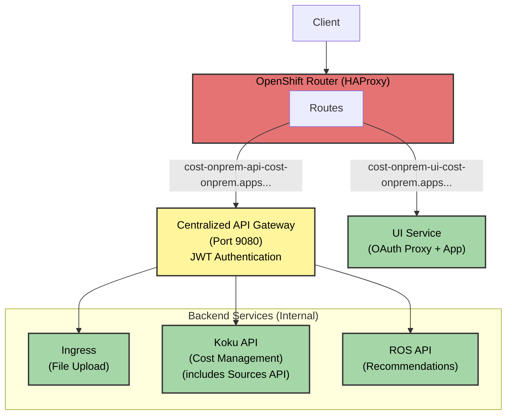

# Cost Management On-Premise Platform Guide

Platform-specific configuration and details for OpenShift deployments.

## Table of Contents
- [Platform Overview](#platform-overview)
- [OpenShift Deployment](#openshift-deployment)
- [Platform-Specific Troubleshooting](#platform-specific-troubleshooting)

## Platform Overview

The Cost Management On-Premise Helm chart is designed for OpenShift environments, providing optimized configurations for production deployments.

### Supported Platforms

| Platform | Version | Status | Use Case |
|----------|---------|--------|----------|
| **OpenShift** | 4.18+ | ✅ Supported | Production |
| **Single Node OpenShift** | 4.18+ | ✅ Supported | Edge, Development |

> **Note**: Tested with OpenShift 4.18.24 (Kubernetes 1.31.12)

---

## OpenShift Deployment

### Architecture



### Networking

**Centralized Gateway Architecture:**
- All external API traffic routes through a single **API Gateway** on port 9080
- Gateway handles JWT authentication and routes to backend services
- Backend services are not directly exposed externally

**Route Configuration:**
```yaml
apiVersion: route.openshift.io/v1
kind: Route
metadata:
  name: cost-onprem-api
  annotations:
    haproxy.router.openshift.io/timeout: "30s"
spec:
  host: ""  # Auto-generated: cost-onprem-api-namespace.apps.cluster.com
  to:
    kind: Service
    name: cost-onprem-gateway
  port:
    targetPort: 9080
  tls:
    termination: edge
    insecureEdgeTerminationPolicy: Redirect
```

**Access URLs:**
```bash
# Get route hostnames
oc get routes -n cost-onprem

# Example routes
https://cost-onprem-api-cost-onprem.apps.cluster.com       # API Gateway (all APIs)
https://cost-onprem-ui-cost-onprem.apps.cluster.com        # UI (web interface)

# API endpoints via gateway:
# - /api/ingress/*                      - File upload
# - /api/cost-management/*              - Cost management API (includes Sources API at /v1/sources/)
# - /api/cost-management/v1/recommendations/openshift - ROS recommendations
```

### Storage

**S3-Compatible Object Storage:**
- Any S3-compatible backend (ODF, AWS S3, MinIO, or other)
- ODF is **not required** — it is one option among several
- Requires credentials secret with `access-key` and `secret-key`

**Configuration:**
```yaml
objectStorage:
  endpoint: "s3.amazonaws.com"       # Or ODF: s3.openshift-storage.svc
  port: 443
  useSSL: true
  existingSecret: "my-s3-credentials"
  s3:
    region: "us-east-1"              # Or "onprem" for non-AWS backends
```

See [Storage Configuration](../operations/configuration.md#storage-configuration) for full details including AWS S3, ODF, and MinIO options.

### Security

**Enhanced Security Context:**
```yaml
# OpenShift SCCs (Security Context Constraints)
securityContext:
  runAsNonRoot: true
  seccompProfile:
    type: RuntimeDefault

# Automatically uses restricted-v2 SCC
```

**Service Accounts:**
```bash
# View service accounts
oc get sa -n cost-onprem

# View assigned SCCs
oc get pod <pod-name> -n cost-onprem -o yaml | grep scc
```

### TLS Configuration

**Automatic TLS Termination:**
```yaml
gatewayRoute:
  tls:
    termination: edge                # TLS at router
    insecureEdgeTerminationPolicy: Redirect  # Redirect HTTP to HTTPS
```

**Options:**
- `edge`: TLS termination at router
- `passthrough`: TLS to pod
- `reencrypt`: TLS at router and pod

### UI Component

**Availability:**
- ✅ **OpenShift**: Fully supported with Keycloak OAuth proxy authentication

**Architecture:**
The UI component consists of two containers in a single pod:
- **OAuth2 Proxy**: Handles Keycloak OIDC authentication flow (port 8443)
- **Application**: Serves the Koku UI micro-frontend (port 8080, internal)

**Access:**
```bash
# Get UI route
oc get route cost-onprem-ui -n cost-onprem -o jsonpath='{.spec.host}'

# Access UI (requires Keycloak authentication)
# Browser will redirect to Keycloak login, then back to UI
https://cost-onprem-ui-cost-onprem.apps.cluster.example.com
```

**Configuration:**
```yaml
ui:
  replicaCount: 1
  oauthProxy:
    image:
      repository: quay.io/oauth2-proxy/oauth2-proxy
      tag: "v7.7.1"
  keycloak:
    client:
      id: "cost-management-ui"
      secret: "<client-secret>"
  app:
    image:
      repository: quay.io/insights-onprem/koku-ui-mfe-on-prem
      tag: "0.0.14"
    port: 8080
```

**Features:**
- Automatic TLS certificate management via OpenShift service serving certificates
- Cookie-based session management
- Seamless Keycloak OIDC authentication integration
- Connects to ROS API backend for data

**Documentation:**
- **Templates**: See [Helm Templates Reference - UI Templates](helm-templates-reference.md#ui-templates) for resource definitions
- **Authentication**: See [UI OAuth Authentication](ui-oauth-authentication.md) for OAuth proxy setup and troubleshooting

### OpenShift-Specific Values

```yaml
# values-openshift.yaml
gatewayRoute:
  enabled: true
  annotations:
    haproxy.router.openshift.io/timeout: "30s"
  tls:
    termination: edge
    insecureEdgeTerminationPolicy: Redirect

objectStorage:
  endpoint: ""  # Auto-detected by install script, or set manually
  port: 443
  useSSL: true
  existingSecret: ""  # Set to use a pre-existing credentials secret

global:
  platform:
    openshift: true
    domain: "apps.cluster.example.com"
```

---

## Platform-Specific Troubleshooting

### OpenShift Issues

**Routes not accessible:**
```bash
# Check routes
oc get routes -n cost-onprem
oc describe route cost-onprem-api -n cost-onprem

# Check router pods
oc get pods -n openshift-ingress

# Check gateway pods
oc get pods -n cost-onprem -l app.kubernetes.io/component=gateway

# Test internal connectivity via gateway
oc rsh deployment/cost-onprem-gateway
curl http://localhost:9080/ready
```

**S3 storage issues:**
```bash
# Check storage credentials secret
oc get secret -n cost-onprem -l app.kubernetes.io/component=storage

# Test S3 connectivity from ingress pod
oc rsh deployment/cost-onprem-ingress
aws --endpoint-url <S3_ENDPOINT> s3 ls

# If using ODF, check NooBaa status
oc get noobaa -n openshift-storage
```

**Security Context Constraints:**
```bash
# Check which SCC is being used
oc get pod <pod-name> -n cost-onprem -o yaml | grep scc

# List available SCCs
oc get scc

# Check if service account has required permissions
oc adm policy who-can use scc restricted-v2
```

---

## Next Steps

- **Installation**: See [Installation Guide](installation.md)
- **Configuration**: See [Configuration Guide](configuration.md)
- **Troubleshooting**: See [Troubleshooting Guide](troubleshooting.md)

---

**Related Documentation:**
- [Installation Guide](installation.md)
- [Configuration Guide](configuration.md)
- [Quick Start Guide](quickstart.md)
