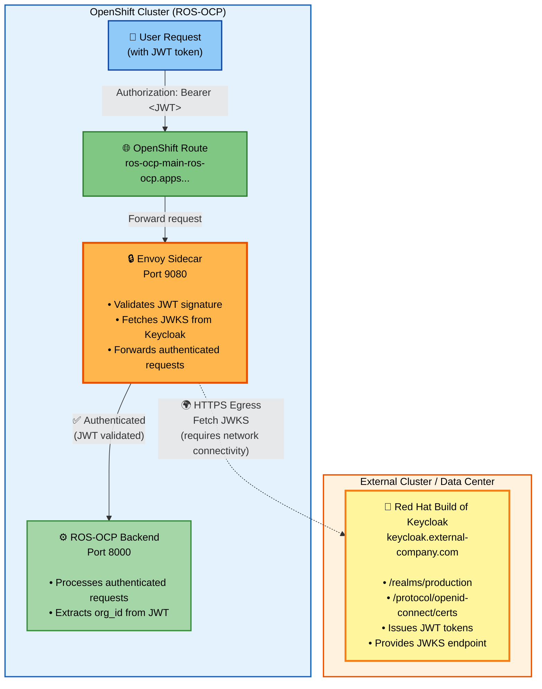

# External Keycloak Scenario Analysis

## Scenario: Keycloak in a Different Cluster

This document analyzes the architecture when the OpenShift cluster uses a Keycloak instance running in a **different cluster** or external environment.

---

## Configuration Requirements

### Minimal Configuration (with Dynamic CA Fetch)

```yaml
jwt_auth:
  keycloak:
    url: "https://keycloak.external-company.com"
    realm: "production"  # if not default
```

### Full Configuration (Manual CA - Recommended for External)

```yaml
jwt_auth:
  keycloak:
    url: "https://keycloak.external-company.com"
    realm: "production"
    tls:
      caCert: |
        -----BEGIN CERTIFICATE-----
        MIIDXTCCAkWgAwIBAgIJAKLnUhVP3GVDMA0GCSqGSIb3DQEBCwUAMEUxCzAJBgNV
        ... external Keycloak CA certificate ...
        -----END CERTIFICATE-----
```

---

## Architecture Analysis

### Component Flow



**Key Points:**
- 🔒 **Envoy** validates JWT tokens by fetching JWKS from external Keycloak
- 🌍 **Egress Required**: Envoy must be able to reach `keycloak.external-company.com:443`
- 🔑 **External Keycloak**: Issues JWT tokens and provides public keys for validation
- ⚙️ **Backend**: Receives only authenticated requests from Envoy

---

## Critical Requirements

### 1. Network Connectivity

**Envoy must be able to reach the external Keycloak:**

| Traffic Type | Source | Destination | Port | Protocol | Required? |
|--------------|--------|-------------|------|----------|-----------|
| JWKS Fetch | Envoy pods | External Keycloak | 443 | HTTPS | ✅ Yes |
| Token Validation | Envoy pods | External Keycloak | 443 | HTTPS | ✅ Yes |
| CA Fetch (init) | Init container | External Keycloak | 443 | HTTPS | ⚠️ Optional |

**Required Network Policies:**

```yaml
# Allow egress to external Keycloak
apiVersion: networking.k8s.io/v1
kind: NetworkPolicy
metadata:
  name: allow-external-keycloak-egress
  namespace: ros-ocp
spec:
  podSelector:
    matchLabels:
      app.kubernetes.io/instance: ros-ocp
  policyTypes:
  - Egress
  egress:
  - to:
    - namespaceSelector: {}  # Allow all external traffic
    ports:
    - protocol: TCP
      port: 443
```

**OpenShift Egress Configuration:**

```yaml
# May need EgressNetworkPolicy (OpenShift specific)
apiVersion: network.openshift.io/v1
kind: EgressNetworkPolicy
metadata:
  name: allow-external-keycloak
  namespace: ros-ocp
spec:
  egress:
  - type: Allow
    to:
      cidrSelector: 0.0.0.0/0  # Or specific IP range
```

### 2. DNS Resolution

The external Keycloak hostname must be resolvable from within pods:

```bash
# Test from a pod
kubectl exec -n ros-ocp deploy/ros-ocp-ingress -c envoy-proxy -- \
  nslookup keycloak.external-company.com

# Should return a valid IP address
```

### 3. TLS Certificate Validation

**Option A: Dynamic CA Fetch (Auto)**

The init container will attempt:
```bash
openssl s_client -connect keycloak.external-company.com:443 -showcerts
```

**Requirements:**
- Network egress allowed from init containers
- External Keycloak endpoint accessible during pod startup
- Certificate chain must be complete

**Limitations:**
- Fails in air-gapped environments
- Fails if egress is blocked during initialization
- Adds dependency on external service availability during deployments

**Option B: Manual CA Configuration (Recommended for External)**

Provide the CA certificate explicitly:

```yaml
jwt_auth:
  keycloak:
    tls:
      caCert: |
        -----BEGIN CERTIFICATE-----
        ... CA certificate for keycloak.external-company.com ...
        -----END CERTIFICATE-----
```

**Advantages:**
- No external dependency during pod startup
- Works in air-gapped environments
- Predictable behavior
- Faster pod initialization

---

## Failure Modes

### Failure Mode 1: Auto-Discovery Without Manual URL

**Symptom:** Deployment fails with error

```
ERROR: Keycloak URL not found on OpenShift cluster. JWT authentication requires Keycloak (RHBK)...
```

**Cause:** `jwt_auth.keycloak.url` not set, auto-discovery finds no local Keycloak

**Fix:** Set explicit URL:
```yaml
jwt_auth:
  keycloak:
    url: "https://keycloak.external-company.com"
```

### Failure Mode 2: CA Fetch Fails (Egress Blocked)

**Symptom:** Pods start, but Envoy logs show:

```
Invalid path: /etc/ca-certificates/ca-bundle.crt
Failed to load trusted CA certificates
```

**Cause:**
- Init container couldn't fetch CA (network blocked)
- No manual CA provided
- Only system CAs available (don't include external Keycloak)

**Fix:** Provide manual CA certificate in `values.yaml`

### Failure Mode 3: JWT Validation Fails (Runtime)

**Symptom:** All requests return `401 Unauthorized`, Envoy logs show:

```
Jwks remote fetch is failed
Failed to fetch JWKS from https://keycloak.external-company.com/...
```

**Cause:**
- Envoy pods cannot reach external Keycloak (egress blocked)
- DNS resolution fails
- Certificate validation fails (CA bundle incomplete)

**Debug:**

```bash
# Test connectivity from Envoy pod
kubectl exec -n ros-ocp deploy/ros-ocp-ingress -c envoy-proxy -- \
  curl -v https://keycloak.external-company.com/auth/realms/production/protocol/openid-connect/certs

# Test CA validation
kubectl exec -n ros-ocp deploy/ros-ocp-ingress -c envoy-proxy -- \
  openssl s_client -connect keycloak.external-company.com:443 \
    -CAfile /etc/ca-certificates/ca-bundle.crt
```

### Failure Mode 4: Token Issuer Mismatch

**Symptom:** Valid tokens rejected, Envoy logs show:

```
Jwt issuer is not configured
```

**Cause:** Token `iss` claim doesn't match configured issuer URL

**Fix:** Ensure issuer URL matches exactly:

```yaml
# Keycloak token has: "iss": "https://keycloak.external-company.com/auth/realms/production"
jwt_auth:
  keycloak:
    url: "https://keycloak.external-company.com"
    realm: "production"
```

---

## Recommended Configuration for External Keycloak

```yaml
jwt_auth:
  keycloak:
    # REQUIRED: Explicit URL (auto-discovery won't work)
    url: "https://keycloak.external-company.com"

    # REQUIRED: Realm name (must match token issuer)
    realm: "production"

    # STRONGLY RECOMMENDED: Manual CA certificate
    # Avoids runtime dependency on external service during pod initialization
    tls:
      caCert: |
        -----BEGIN CERTIFICATE-----
        MIIDXTCCAkWgAwIBAgIJAKLnUhVP3GVDMA0GCSqGSIb3DQEBCwUAMEUxCzAJBgNV
        BAYTAlVTMRMwEQYDVQQIDApDYWxpZm9ybmlhMRYwFAYDVQQHDA1TYW4gRnJhbmNp
        c2NvMQ8wDQYDVQQKDAZDb21wYW55MB4XDTI1MDEwMTAwMDAwMFoXDTI2MDEwMTAw
        MDAwMFowRTELMAkGA1UEBhMCVVMxEzARBgNVBAgMCkNhbGlmb3JuaWExFjAUBgNV
        BAcMDVNhbiBGcmFuY2lzY28xDzANBgNVBAoMBkNvbXBhbnkwggEiMA0GCSqGSIb3
        DQEBAQUAA4IBDwAwggEKAoIBAQC... (full certificate) ...
        -----END CERTIFICATE-----

# Additional egress configuration may be required
# See above for NetworkPolicy and EgressNetworkPolicy examples
```

### How to Get the External Keycloak CA Certificate

```bash
# From your local machine or a system that can reach the external Keycloak
echo | openssl s_client -connect keycloak.external-company.com:443 -showcerts 2>/dev/null | \
  openssl x509 -outform PEM > external-keycloak-ca.crt

# Verify the certificate
openssl x509 -in external-keycloak-ca.crt -noout -text

# Add to values.yaml
cat external-keycloak-ca.crt
```

---

## Testing External Keycloak Integration

### 1. Test DNS Resolution

```bash
kubectl exec -n ros-ocp deploy/ros-ocp-ingress -c envoy-proxy -- \
  nslookup keycloak.external-company.com
```

### 2. Test Network Connectivity

```bash
kubectl exec -n ros-ocp deploy/ros-ocp-ingress -c envoy-proxy -- \
  curl -v https://keycloak.external-company.com/auth/realms/production
```

### 3. Test CA Bundle

```bash
kubectl exec -n ros-ocp deploy/ros-ocp-ingress -c envoy-proxy -- \
  cat /etc/ca-certificates/ca-bundle.crt | grep -c "BEGIN CERTIFICATE"
```

### 4. Test JWKS Endpoint

```bash
kubectl exec -n ros-ocp deploy/ros-ocp-ingress -c envoy-proxy -- \
  curl -v --cacert /etc/ca-certificates/ca-bundle.crt \
  https://keycloak.external-company.com/auth/realms/production/protocol/openid-connect/certs
```

### 5. Test End-to-End JWT Validation

```bash
# Get token from external Keycloak
TOKEN=$(curl -X POST "https://keycloak.external-company.com/auth/realms/production/protocol/openid-connect/token" \
  -d "client_id=ros-ocp" \
  -d "username=testuser" \
  -d "password=testpass" \
  -d "grant_type=password" | jq -r '.access_token')

# Test via OpenShift route
ROUTE=$(kubectl get route -n ros-ocp ros-ocp-main -o jsonpath='{.spec.host}')
curl -H "Authorization: Bearer $TOKEN" "http://$ROUTE/status"
```

---

## Summary

| Aspect | Local Keycloak | External Keycloak |
|--------|----------------|-------------------|
| **URL Configuration** | Auto-discovered | **Must set explicitly** |
| **CA Certificate** | Auto-injected by OpenShift | **Strongly recommend manual** |
| **Network Policies** | Not needed | **Must allow egress** |
| **DNS Resolution** | Internal cluster DNS | **Must resolve external** |
| **Deployment Dependency** | None | **External service must be up** |
| **Air-gapped Support** | Yes | **Only with manual CA** |
| **Recommended Approach** | Zero config | **Full manual config** |

For external Keycloak, the **manual configuration approach is strongly recommended** to avoid runtime dependencies and ensure predictable behavior across all network environments.

