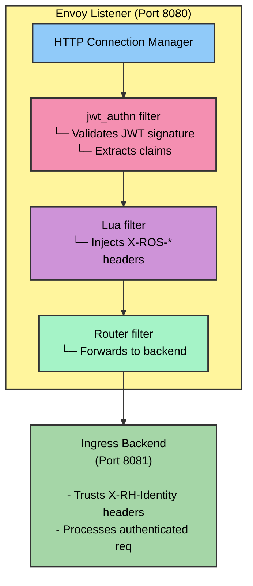
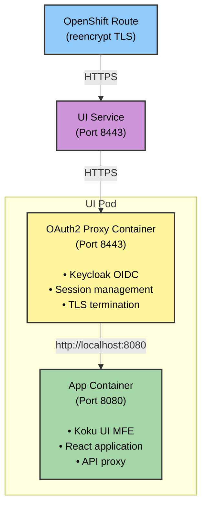

# Helm Templates & Manifests Reference

Technical reference for Cost Management On-Premise Helm chart templates, focusing on JWT authentication and TLS certificate handling.

## Overview

This document provides detailed information about the Helm templates used in the Cost Management On-Premise chart, particularly those related to JWT authentication with Envoy's native JWT filter.

## JWT Authentication Templates

### Overview

**Two backend services** are deployed with Envoy proxy sidecars on OpenShift:

| Template File | Service | Purpose |
|---------------|---------|---------|
| `ingress/deployment.yaml` | Ingress | JWT validation from Cost Management Operator |
| `ros/api/deployment.yaml` | ROS API | X-Rh-Identity authentication for API requests |

**Services without Envoy sidecars** (protected by network policies):

| Template File | Service | Authentication Method |
|---------------|---------|----------------------|
| `sources-api/deployment.yaml` | Sources API | Mixed: X-Rh-Identity middleware for protected endpoints, some endpoints unauthenticated for internal use |
| `kruize/deployment.yaml` | Kruize | Internal service accessed via ROS API |

**Common Sidecar Configuration:**
- Envoy listens on port **8080** (public-facing, authenticated)
- Application container listens on internal port (**8001** for ROS API, **8081** for Ingress)
- Network policies provide defense-in-depth for services without sidecars
- Metrics endpoints remain accessible to Prometheus

### `cost-onprem/templates/ingress/deployment.yaml`

**Purpose**: Enhanced ingress deployment with Envoy sidecar for native JWT authentication from Cost Management Operator.

**Key Features**:
- Envoy proxy sidecar with native JWT filter
- Inline JWT validation (no external authorization service)
- Lua filter for JWT claims extraction
- Port configuration for sidecar routing
- Health probe adjustments

**Container Configuration**:

When JWT authentication is enabled (automatic on OpenShift):
- **Ingress container**: Listens on port `8081` (internal)
- **Envoy sidecar**: Listens on port `8080` (public-facing)
- **Flow**: Client → Envoy (8080) → JWT validation → Ingress (8081)

**Key Environment Variables**:
| Variable | Value (JWT enabled) | Description |
|----------|---------------------|-------------|
| `AUTH_ENABLED` | `"true"` | Ingress trusts X-ROS headers from Envoy |
| `SERVER_PORT` | `8081` | Ingress listens on internal port |
| `UPLOAD_REQUIRE_AUTH` | `"true"` | Upload endpoint requires authentication |

**Volume Mounts**:
- `envoy-config`: Mounted at `/etc/envoy/envoy.yaml` (Envoy configuration)

**Example Template Snippet**:
```yaml
- name: envoy-proxy
  image: "{{ .Values.jwtAuth.envoy.image.repository }}:{{ .Values.jwtAuth.envoy.image.tag }}"
  ports:
    - name: http
      containerPort: {{ .Values.jwtAuth.envoy.port }}
    - name: admin
      containerPort: {{ .Values.jwtAuth.envoy.adminPort }}
  volumeMounts:
    - name: envoy-config
      mountPath: /etc/envoy
      readOnly: true
```

---

### `cost-onprem/templates/ros/api/envoy-config.yaml`

**Purpose**: Envoy proxy configuration with native JWT authentication filter.

**Architecture**:


**Key Components**:

#### 1. JWT Authentication Filter (`jwt_authn`)
- **Provider**: `keycloak`
- **Issuer**: `{{ .Values.jwtAuth.keycloak.url }}/auth/realms/{{ .Values.jwtAuth.keycloak.realm }}`
- **JWKS URI**: `/protocol/openid-connect/certs` endpoint
- **Cache Duration**: 300 seconds (5 minutes)
- **Payload Storage**: Stores JWT payload in metadata as `jwt_payload`

**Configuration Options**:
| Helm Value | Description | Default |
|------------|-------------|---------|
| `jwt_auth.keycloak.url` | Keycloak base URL | Auto-detected |
| `jwt_auth.keycloak.realm` | Keycloak realm name | `kubernetes` |
| `jwt_auth.keycloak.audiences` | Expected JWT audiences | `[account, cost-management-operator]` |

**Authentication Rules**:
- `/api/ingress/*` - Requires JWT authentication
- `/health` - Public (health checks)
- `/ready` - Public (readiness checks)

#### 2. Lua Filter (Claims Extraction)
- **Purpose**: Extracts JWT claims from Envoy metadata and injects X-ROS headers
- **Language**: Lua (inline script)
- **Execution**: On every authenticated request

**Header Mapping**:
| JWT Claim | HTTP Header | Description |
|-----------|-------------|-------------|
| `sub` | `X-ROS-User-ID` | User/service account ID |
| `preferred_username` | `X-ROS-User-Name` | Username |
| `azp` or `client_id` | `X-Client-ID` | Client ID |
| (authentication) | `X-ROS-Authenticated` | Always `"true"` |
| (method) | `X-ROS-Auth-Method` | `"Envoy-Native-JWT"` |
| Authorization header | `X-Bearer-Token` | JWT token (without "Bearer" prefix) |

**Lua Script Example**:
```lua
function envoy_on_request(request_handle)
  local metadata = request_handle:streamInfo():dynamicMetadata()
  local jwt_data = metadata:get("envoy.filters.http.jwt_authn")

  if jwt_data ~= nil then
    local payload = jwt_data["jwt_payload"]
    if payload ~= nil then
      request_handle:headers():add("X-ROS-Authenticated", "true")
      request_handle:headers():add("X-ROS-User-ID", tostring(payload["sub"]))
      -- ... additional header extractions
    end
  end
end
```

#### 3. Cluster Configuration

**Backend Cluster** (`ingress-backend`):
- **Type**: STATIC
- **Address**: `127.0.0.1:8081` (same pod, different port)
- **Timeout**: 5 seconds

**JWKS Cluster** (`keycloak_jwks`):
- **Type**: STRICT_DNS
- **Address**: Keycloak hostname (extracted from `jwt_auth.keycloak.url`)
- **Port**: 443 (HTTPS)
- **TLS**: UpstreamTlsContext with SNI
- **Timeout**: 5 seconds

**TLS Configuration**:
```yaml
transport_socket:
  name: envoy.transport_sockets.tls
  typed_config:
    "@type": type.googleapis.com/envoy.extensions.transport_sockets.tls.v3.UpstreamTlsContext
    sni: {{ .Values.jwtAuth.keycloak.url | replace "https://" "" }}
```

---

### `cost-onprem/templates/service-ingress.yaml`

**Purpose**: Kubernetes Service for ingress with Envoy proxy endpoints.

**Port Configuration**:

When JWT is enabled:
```yaml
ports:
  - name: http
    port: 80
    targetPort: {{ .Values.jwtAuth.envoy.port }}  # 8080 (Envoy)
  - name: http-ingress
    port: 8081
    targetPort: 8081  # Direct ingress access (internal)
```

When JWT is disabled:
```yaml
ports:
  - name: http
    port: 80
    targetPort: 8080  # Direct ingress access
```

**Service Discovery**:
- **Selector**: `app.kubernetes.io/name: ingress`
- **Type**: ClusterIP (internal) or LoadBalancer (if configured)

---

### `cost-onprem/templates/_helpers.tpl`

**Purpose**: Helm template helper functions for configuration logic.

**Key Functions**:

#### JWT Authentication
JWT authentication is always enabled. Envoy sidecars handle JWT validation with Keycloak OIDC.

**Configuration**:
```yaml
jwtAuth:
  # JWT authentication is always enabled
  keycloak:
    url: ""  # Auto-detected from Keycloak CR, or set manually
    realm: kubernetes
```

---

## UI Templates

### Overview

The UI component provides a web-based user interface for Cost Management On-Premise. It uses an OAuth2 proxy sidecar with Keycloak OIDC for authentication and serves the Koku UI micro-frontend application.

**Requirements:**
- ✅ OpenShift with Keycloak OAuth proxy authentication

**Key Features:**
- OAuth2 proxy sidecar for seamless Keycloak OIDC authentication
- Automatic TLS certificate management via OpenShift service serving certificates
- Cookie-based session management
- Integration with ROS API backend

### `cost-onprem/templates/ui/deployment.yaml`

**Purpose**: Deployment for UI component with OAuth proxy sidecar and application container.

**Architecture**:


**Container Configuration**:

#### OAuth2 Proxy Container
- **Image**: `quay.io/oauth2-proxy/oauth2-proxy:v7.7.1`
- **Port**: `8443` (HTTPS)
- **Purpose**: Handles Keycloak OIDC authentication flow

**Key Arguments**:
```yaml
- --https-address=:8443
- --provider=keycloak-oidc
- --client-id={{ .Values.ui.keycloak.client.id }}
- --oidc-issuer-url={{ include "cost-onprem.keycloak.issuerUrl" . }}
- --redirect-url=https://{{ include "cost-onprem.fullname" . }}-ui-{{ .Release.Namespace }}.{{ include "cost-onprem.platform.clusterDomain" . }}/oauth2/callback
- --cookie-secret-file=/etc/proxy/secrets/session-secret
- --tls-cert=/etc/tls/private/tls.crt
- --tls-key=/etc/tls/private/tls.key
- --upstream=http://localhost:{{ .Values.ui.app.port }}
- --pass-host-header=false
- --skip-provider-button
- --skip-auth-preflight
- --pass-authorization-header
```

**Health Probes**:
- **Liveness**: `GET /ping` on port `8443` (HTTPS)
- **Readiness**: `GET /ping` on port `8443` (HTTPS)

**Volume Mounts**:
- `proxy-tls`: TLS certificate and key from OpenShift service serving certificate secret
- `cookie-secret`: Session secret for cookie encryption

#### App Container
- **Image**: `quay.io/insights-onprem/koku-ui-mfe-on-prem:0.0.14`
- **Port**: `8080` (HTTP, internal only)
- **Purpose**: Serves the Koku UI micro-frontend application

**Environment Variables**:
| Variable | Value | Description |
|----------|-------|-------------|
| `API_PROXY_URL` | `http://{{ include "cost-onprem.fullname" . }}-ros-api:{{ .Values.ros.api.port }}` | Backend API endpoint for UI requests |

**Health Probes**:
- **Liveness**: `GET /` on port `8080`
- **Readiness**: `GET /` on port `8080`

**Resource Configuration**:
```yaml
resources:
  requests:
    cpu: 50m
    memory: 64Mi
  limits:
    cpu: 100m
    memory: 128Mi
```

**Deployment Conditions**:
- Only deployed when `ui` values are defined
- Template check: `{{- if .Values.ui }}`

---

### `cost-onprem/templates/ui/service.yaml`

**Purpose**: Kubernetes Service exposing the UI OAuth proxy endpoint.

**Port Configuration**:
```yaml
ports:
  - port: 8443
    targetPort: https
    name: https
    protocol: TCP
```

**Service Type**: `ClusterIP` (internal access only, exposed via OpenShift Route)

**OpenShift Integration**:
- **Annotation**: `service.beta.openshift.io/serving-cert-secret-name: {{ include "cost-onprem.fullname" . }}-ui-tls`
- **Purpose**: Automatically provisions TLS certificate secret for OAuth proxy
- **Certificate**: Managed by OpenShift, automatically rotated

**Service Discovery**:
- **Selector**: `app.kubernetes.io/component: ui`
- **Access**: Internal cluster access only (via Route)

---

### `cost-onprem/templates/ui/secret.yaml`

**Purpose**: Secret for OAuth proxy cookie encryption.

**Secret Type**: `Opaque`

**Data**:
```yaml
data:
  session-secret: <base64-encoded-random-32-char-string>
```

**Key Features**:
- **Generation**: Random 32-character alphanumeric string, base64-encoded
- **Persistence**: Uses Helm `lookup` function to preserve existing secret on upgrades
- **Purpose**: Encrypts OAuth session cookies

**Template Logic**:
```yaml
{{- $secret := (lookup "v1" "Secret" .Release.Namespace (printf "%s-ui-cookie-secret" (include "cost-onprem.fullname" .))) -}}
session-secret: {{ if $secret }}{{ index $secret.data "session-secret" }}{{ else }}{{ randAlphaNum 32 | b64enc }}{{ end }}
```

This ensures:
- ✅ New installations: Generates random secret
- ✅ Upgrades: Preserves existing secret (no session invalidation)

---

### `cost-onprem/templates/ui/serviceaccount.yaml`

**Purpose**: ServiceAccount for the UI pod with standard RBAC permissions.

**Note**: With Keycloak OAuth proxy, the ServiceAccount does not require special OAuth redirect annotations. The OAuth2 proxy handles authentication directly with Keycloak OIDC.

**OAuth Flow**:
1. User accesses UI Route
2. OAuth2 proxy redirects to Keycloak OIDC server
3. User authenticates with Keycloak credentials
4. Keycloak redirects back to UI Route with authorization code
5. OAuth2 proxy exchanges code for token, creates session cookie
6. User accesses UI application

---

### `cost-onprem/templates/ingress/routes.yaml` (UI Route)

**Purpose**: OpenShift Route exposing the UI service externally.

**Route Configuration**:
```yaml
apiVersion: route.openshift.io/v1
kind: Route
metadata:
  name: {{ include "cost-onprem.fullname" . }}-ui
spec:
  to:
    kind: Service
    name: {{ include "cost-onprem.fullname" . }}-ui
  port:
    targetPort: https
  tls:
    termination: reencrypt
    insecureEdgeTerminationPolicy: Redirect
```

**TLS Configuration**:
- **Termination**: `reencrypt` (TLS passthrough to OAuth proxy)
- **Insecure Policy**: `Redirect` (HTTP → HTTPS redirect)
- **Certificate**: Managed by OpenShift service serving certificates

**Host Configuration**:
- Uses `serviceRoute.hosts[0].host` from values (empty = cluster default domain)
- Example: `cost-onprem-ui-cost-onprem.apps.cluster.example.com`

**Access Pattern**:
```bash
# Get UI route URL
oc get route cost-onprem-ui -n cost-onprem -o jsonpath='{.spec.host}'

# Access UI
https://cost-onprem-ui-cost-onprem.apps.cluster.example.com
```

---

### UI Configuration Values

**Helm Values Structure**:
```yaml
ui:
  replicaCount: 1

  oauthProxy:
    image:
      repository: quay.io/oauth2-proxy/oauth2-proxy
      tag: "v7.7.1"
      pullPolicy: IfNotPresent
    resources:
      limits:
        cpu: "100m"
        memory: "128Mi"
      requests:
        cpu: "50m"
        memory: "64Mi"

  app:
    image:
      repository: quay.io/insights-onprem/koku-ui-mfe-on-prem
      tag: "0.0.14"
      pullPolicy: IfNotPresent
    port: 8080
    resources:
      limits:
        cpu: "100m"
        memory: "128Mi"
      requests:
        cpu: "50m"
        memory: "64Mi"
```

**Configuration Options**:

| Value Path | Description | Default |
|------------|-------------|---------|
| `ui.replicaCount` | Number of UI pod replicas | `1` |
| `ui.oauthProxy.image.repository` | OAuth2 proxy container image | `quay.io/oauth2-proxy/oauth2-proxy` |
| `ui.oauthProxy.image.tag` | OAuth2 proxy image tag | `v7.7.1` |
| `ui.oauthProxy.resources` | OAuth proxy resource limits/requests | See defaults above |
| `ui.app.image.repository` | UI application container image | `quay.io/insights-onprem/koku-ui-mfe-on-prem` |
| `ui.app.image.tag` | UI application image tag | `0.0.14` |
| `ui.app.port` | Internal application port | `8080` |
| `ui.app.resources` | Application resource limits/requests | See defaults above |

---

### UI Deployment Flow

1. **Pre-Deployment Checks**:
   - Platform detection: Must be OpenShift
   - Values validation: `ui` section must be defined

2. **Resource Creation Order**:
   - ServiceAccount (with OAuth redirect reference)
   - Secret (cookie secret)
   - Service (triggers OpenShift serving certificate creation)
   - Deployment (OAuth proxy + app containers)
   - Route (external access)

3. **Post-Deployment**:
   - OAuth2 proxy authenticates with Keycloak OIDC
   - TLS certificates provisioned automatically
   - Route becomes accessible
   - UI application connects to ROS API backend

---

### Troubleshooting UI Deployment

**Common Issues**:

1. **OAuth redirect errors**:
   - Check ServiceAccount annotation: `oc get sa cost-onprem-ui -n cost-onprem -o yaml`
   - Verify Route name matches redirect reference

2. **TLS certificate issues**:
   - Check service annotation: `oc get svc cost-onprem-ui -n cost-onprem -o yaml`
   - Verify secret exists: `oc get secret cost-onprem-ui-tls -n cost-onprem`

3. **UI cannot connect to API**:
   - Check `API_PROXY_URL` environment variable in app container
   - Verify ROS API service is accessible: `oc get svc cost-onprem-ros-api -n cost-onprem`

**For detailed OAuth authentication troubleshooting, see [UI OAuth Authentication Guide](ui-oauth-authentication.md)**

---

## Security & Certificate Templates

### `cost-onprem/templates/ca-configmap.yaml`

**Purpose**: ConfigMap for CA certificate bundle injection.

**Use Case**: Required when Keycloak uses self-signed certificates or internal CA.

**Features**:
- Automatic CA certificate extraction from cluster
- Mount point for backend services
- Support for multiple CA sources

**Data**:
```yaml
data:
  ca-bundle.crt: |
    # Consolidated CA certificates
    # - OpenShift ingress router CA
    # - Keycloak route CA
    # - System CAs
    # - Custom CAs
```

**Mount Path**: Typically mounted at `/etc/ssl/certs/custom-ca-bundle.crt`

---

## Configuration Files & Examples

### `cost-onprem/values-jwt-auth-complete.yaml`

**Purpose**: Complete JWT authentication configuration for production deployments.

**Key Sections**:

```yaml
jwt_auth:

  envoy:
    image:
      repository: registry.redhat.io/openshift-service-mesh/proxyv2-rhel9
      tag: "2.6"
    port: 8080
    adminPort: 9901
    logLevel: info

  keycloak:
    url: ""  # Auto-detected from cluster
    realm: kubernetes
    audiences:
      - account
      - cost-management-operator
    tls:
      insecureSkipVerify: false
```

**Usage**:
```bash
helm upgrade cost-onprem ./cost-onprem \
  -f cost-onprem/values-jwt-auth-complete.yaml \
  --namespace cost-onprem \
  --create-namespace
```

---

## Template Lifecycle

### Installation Flow

1. **Pre-Install**: Helm validates values schema
2. **Template Rendering**:
   - Templates generate manifests with JWT auth configuration
3. **Manifest Application**:
   - ConfigMaps (Envoy config)
   - Deployments (Ingress + Envoy sidecar)
   - Services (Port configuration)
4. **Post-Install**: Health checks and validation

### Upgrade Flow

1. **Diff Calculation**: Helm compares current vs new manifests
2. **Rolling Update**: Pods restart with new configuration
3. **Zero-Downtime**: Service maintains availability during upgrade

---

## Debugging Templates

### View Rendered Templates

```bash
# Render templates without installing
helm template cost-onprem ./cost-onprem \
  -f values-jwt-auth-complete.yaml \
  --namespace cost-onprem \
  --debug

# Filter specific template
helm template cost-onprem ./cost-onprem \
  -f values-jwt-auth-complete.yaml \
  -s templates/ingress/deployment.yaml
```

### Validate Template Syntax

```bash
# Lint chart
helm lint ./cost-onprem -f values-jwt-auth-complete.yaml

# Dry-run installation
helm upgrade cost-onprem ./cost-onprem \
  -f values-jwt-auth-complete.yaml \
  --dry-run --debug
```

### Check Applied Configuration

```bash
# Get live manifest
helm get manifest cost-onprem -n cost-onprem

# Get specific resource
kubectl get deployment cost-onprem-ingress -n cost-onprem -o yaml

# Get values used
helm get values cost-onprem -n cost-onprem
```

---

## Performance Considerations

### JWT Validation Latency

- **JWKS Caching**: 5-minute cache reduces remote calls
- **Inline Validation**: <1ms overhead per request
- **Lua Execution**: Negligible overhead (<0.1ms)

### Resource Usage

**Envoy Sidecar**:
```yaml
resources:
  requests:
    cpu: 100m
    memory: 128Mi
  limits:
    cpu: 500m
    memory: 256Mi
```

**Typical Usage**:
- CPU: 50-100m (idle), 200-300m (moderate load)
- Memory: 100-150Mi (stable)

---

## References

- [Envoy JWT Authentication](https://www.envoyproxy.io/docs/envoy/latest/api-v3/extensions/filters/http/jwt_authn/v3/config.proto)
- [Envoy Lua Filter](https://www.envoyproxy.io/docs/envoy/latest/configuration/http/http_filters/lua_filter)
- [Helm Template Guide](https://helm.sh/docs/chart_template_guide/)
- [Kubernetes Service Mesh Patterns](https://www.envoyproxy.io/docs/envoy/latest/intro/arch_overview/security/jwt_authn_filter)

---

**Last Updated**: October 2025
**Maintainer**: ROS Engineering Team

