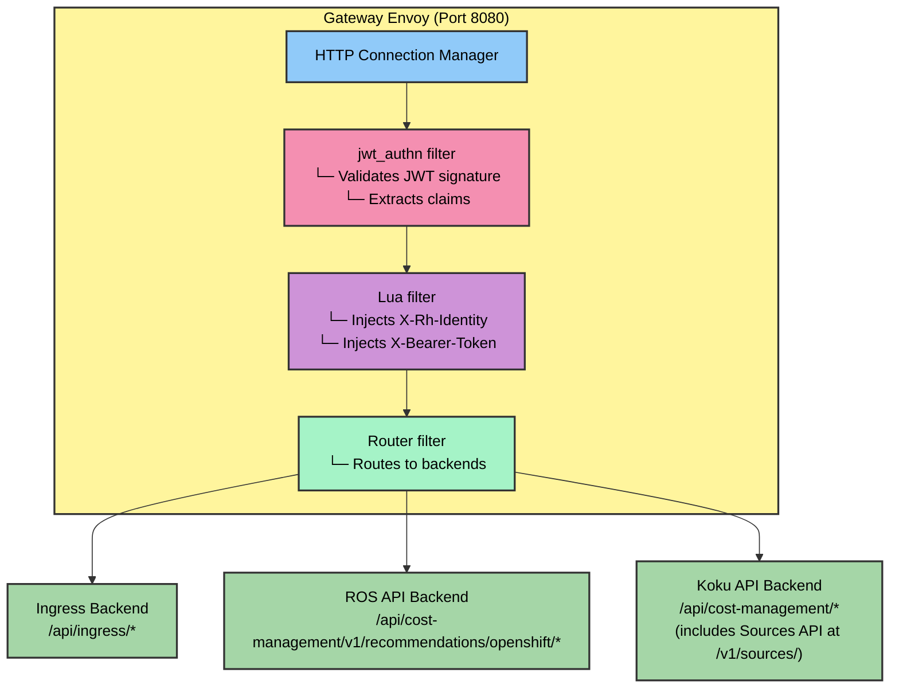
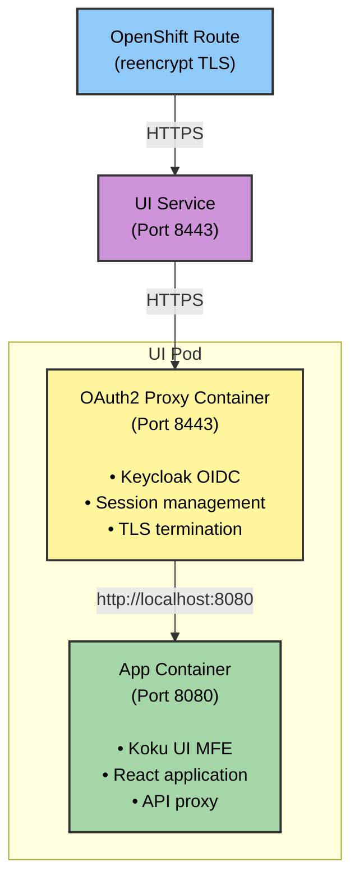

# Helm Templates & Manifests Reference

Technical reference for Cost Management On-Premise Helm chart templates, focusing on JWT authentication and TLS certificate handling.

## Overview

This document provides detailed information about the Helm templates used in the Cost Management On-Premise chart, particularly those related to JWT authentication with Envoy's native JWT filter.

## JWT Authentication Templates

### Overview

**Centralized Gateway** handles JWT authentication for all external traffic:

| Template File | Service | Purpose |
|---------------|---------|---------|
| `gateway/deployment.yaml` | Gateway | Centralized JWT validation and routing for all APIs |
| `gateway/envoy-config.yaml` | Gateway Config | Envoy configuration with JWT filter and Lua scripts |

**Backend Services** (protected by gateway and network policies):

| Template File | Service | Authentication Method |
|---------------|---------|----------------------|
| `cost-management/api/deployment.yaml` | Koku API | X-Rh-Identity header from Gateway |
| `ingress/deployment.yaml` | Ingress | Receives pre-authenticated requests from Gateway |
| `ros/api/deployment.yaml` | ROS API | Receives pre-authenticated requests from Gateway |
| `kruize/deployment.yaml` | Kruize | Internal service accessed via ROS API |

**Gateway Architecture:**
- Gateway Envoy listens on port **8080** (public-facing, authenticated)
- Gateway routes to backend services on their internal ports
- Network policies restrict backend access to gateway only
- Metrics endpoints remain accessible to Prometheus

### `cost-onprem/templates/gateway/deployment.yaml`

**Purpose**: Centralized gateway deployment with Envoy for JWT authentication and API routing.

**Key Features**:
- Single Envoy instance handling all external API traffic
- Native JWT filter for token validation
- Lua filter for JWT claims extraction and header injection
- Routes requests to appropriate backend services
- Eliminates need for per-service Envoy sidecars

**Container Configuration**:
- **Gateway container**: Envoy listening on port `8080` (public-facing)
- **Flow**: Client → Gateway (8080) → JWT validation → Backend services

**Key Environment Variables**:
| Variable | Description |
|----------|-------------|
| `ENVOY_UID` | User ID for Envoy process |

**Volume Mounts**:
- `envoy-config`: Mounted at `/etc/envoy/envoy.yaml` (Envoy configuration)
- `ca-bundle`: Mounted at `/etc/ca-certificates/` (CA certificates for Keycloak TLS)

**Example Template Snippet**:
```yaml
- name: gateway
  image: "{{ .Values.gateway.image.repository }}:{{ .Values.gateway.image.tag }}"
  ports:
    - name: http
      containerPort: {{ .Values.gateway.port }}
    - name: admin
      containerPort: {{ .Values.gateway.adminPort }}
  volumeMounts:
    - name: envoy-config
      mountPath: /etc/envoy
      readOnly: true
    - name: ca-bundle
      mountPath: /etc/ca-certificates
      readOnly: true
```

### `cost-onprem/templates/ingress/deployment.yaml`

**Purpose**: Ingress deployment for file upload handling (receives pre-authenticated requests from Gateway).

**Key Features**:
- Processes file uploads from Cost Management Operator
- Trusts `X-Rh-Identity` header injected by Gateway
- No longer requires Envoy sidecar (JWT validation handled by centralized Gateway)

**Container Configuration**:
- **Ingress container**: Listens on port `8080`
- **Flow**: Gateway → Ingress (8080) with `X-Rh-Identity` header

**Key Environment Variables**:
| Variable | Value | Description |
|----------|-------|-------------|
| `INGRESS_WEBPORT` | `8080` | Ingress listens on standard port |
| `INGRESS_METRICSPORT` | `9090` | Prometheus metrics endpoint |
| `INGRESS_AUTH` | `"false"` | Auth disabled - Gateway handles JWT validation and injects `X-Rh-Identity` |
| `INGRESS_MINIOENDPOINT` | (from helper) | S3/MinIO storage endpoint |
| `INGRESS_STAGEBUCKET` | (from helper) | S3 bucket for staged uploads |
| `INGRESS_USESSL` | (from helper) | Whether to use SSL for S3 connection |
| `INGRESS_KAFKA_BROKERS` | (from helper) | Kafka bootstrap servers |
| `INGRESS_KAFKAANNOUNCETOPIC` | `platform.upload.announce` | Topic for upload announcements |
| `AWS_CONFIG_FILE` | `/etc/aws/config` | AWS SDK configuration for S3v4 signatures |

**Volume Mounts**:
- `aws-config`: Mounted at `/etc/aws` (AWS SDK configuration for path-style S3 addressing)
- `service-ca-cert`: Mounted at `/etc/ssl/certs/service-ca.crt` (TLS CA certificate)

**Authentication Flow**:
1. Client sends JWT in `Authorization: Bearer <token>` header
2. Gateway Envoy validates JWT signature against Keycloak JWKS
3. Gateway Lua filter extracts claims and constructs `X-Rh-Identity` header
4. Ingress receives request with `X-Rh-Identity` header (no additional auth needed)

---

### `cost-onprem/templates/gateway/envoy-config.yaml`

**Purpose**: Centralized Envoy gateway configuration with JWT authentication and API routing.

**Architecture**:


**Key Components**:

#### 1. JWT Authentication Filter (`jwt_authn`)
- **Provider**: `keycloak`
- **Issuer**: `{{ .Values.jwtAuth.keycloak.url }}/auth/realms/{{ .Values.jwtAuth.keycloak.realm }}`
- **JWKS URI**: `/protocol/openid-connect/certs` endpoint
- **Cache Duration**: 300 seconds (5 minutes)
- **Payload Storage**: Stores JWT payload in metadata as `jwt_payload`

**Configuration Options**:
| Helm Value | Description | Default |
|------------|-------------|---------|
| `jwt_auth.keycloak.url` | Keycloak base URL | Auto-detected |
| `jwt_auth.keycloak.realm` | Keycloak realm name | `kubernetes` |
| `jwt_auth.keycloak.audiences` | Expected JWT audiences | `[account, cost-management-operator]` |

**Authentication Rules**:
- `/api/ingress/*` - Requires JWT authentication
- `/health` - Public (health checks)
- `/ready` - Public (readiness checks)

#### 2. Lua Filter (Identity Header Construction)
- **Purpose**: Constructs X-Rh-Identity header from JWT claims for Koku compatibility
- **Language**: Lua (inline script)
- **Execution**: On every authenticated request

**Header Mapping**:
| Source | HTTP Header | Description |
|--------|-------------|-------------|
| JWT claims (org_id, account_number, username, email) | `X-Rh-Identity` | Base64-encoded identity JSON for Koku |
| Authorization header | `X-Bearer-Token` | JWT token (without "Bearer" prefix) |

**Lua Script Example**:
```lua
function envoy_on_request(request_handle)
  local metadata = request_handle:streamInfo():dynamicMetadata()
  local jwt_data = metadata:get("envoy.filters.http.jwt_authn")

  if jwt_data ~= nil then
    local payload = jwt_data["jwt_payload"]
    if payload ~= nil then
      -- Build X-Rh-Identity JSON from JWT claims
      local xrhid_json = build_xrhid_json(org_id, account_number, "User", username, email)
      local xrhid_b64 = request_handle:base64Escape(xrhid_json)
      request_handle:headers():replace("X-Rh-Identity", xrhid_b64)

      -- Forward JWT token for services that need it
      request_handle:headers():replace("X-Bearer-Token", bearer_token)
    end
  end
end
```

#### 3. Cluster Configuration

**Backend Clusters** (Gateway routes to multiple backends):
- **ingress-backend**: Ingress service for file uploads (`/api/ingress/*`)
- **ros-api-backend**: ROS API service (`/api/cost-management/v1/recommendations/openshift/*`)
- **koku-api-reads-backend**: Koku API read service (`/api/cost-management/*` GET/HEAD)
- **koku-api-writes-backend**: Koku API write service (`/api/cost-management/*` POST/PUT/DELETE/PATCH)

**Note**: Sources API is now integrated into Koku API at `/api/cost-management/v1/sources/`

All backends use:
- **Type**: STRICT_DNS
- **Load Balancing**: ROUND_ROBIN
- **Timeout**: 60 seconds

**JWKS Cluster** (`keycloak_jwks`):
- **Type**: STRICT_DNS
- **Address**: Keycloak hostname (extracted from `gateway.keycloak.url`)
- **Port**: 443 (HTTPS)
- **TLS**: UpstreamTlsContext with SNI
- **Timeout**: 5 seconds

**TLS Configuration**:
```yaml
transport_socket:
  name: envoy.transport_sockets.tls
  typed_config:
    "@type": type.googleapis.com/envoy.extensions.transport_sockets.tls.v3.UpstreamTlsContext
    sni: {{ .Values.gateway.keycloak.url | replace "https://" "" }}
```

---

### `cost-onprem/templates/gateway/service.yaml`

**Purpose**: Kubernetes Service exposing the centralized gateway.

**Port Configuration**:
```yaml
ports:
  - name: http
    port: 8080
    targetPort: 8080  # Gateway Envoy
  - name: admin
    port: 9901
    targetPort: 9901  # Envoy admin interface
```

**Service Discovery**:
- **Selector**: `app.kubernetes.io/component: gateway`
- **Type**: ClusterIP (internal, exposed via OpenShift Route)

---

### `cost-onprem/templates/_helpers.tpl`

**Purpose**: Helm template helper functions for configuration logic.

**Key Functions**:

#### Gateway Configuration
The centralized gateway handles JWT validation with Keycloak OIDC for all external API traffic.

**Configuration**:
```yaml
gateway:
  # Gateway configuration
  keycloak:
    url: ""  # Auto-detected from Keycloak CR, or set manually
    realm: kubernetes
```

---

## UI Templates

### Overview

The UI component provides a web-based user interface for Cost Management On-Premise. It uses an OAuth2 proxy sidecar with Keycloak OIDC for authentication and serves the Koku UI micro-frontend application.

**Requirements:**
- ✅ OpenShift with Keycloak OAuth proxy authentication

**Key Features:**
- OAuth2 proxy sidecar for seamless Keycloak OIDC authentication
- Automatic TLS certificate management via OpenShift service serving certificates
- Cookie-based session management
- Integration with ROS API backend

### `cost-onprem/templates/ui/deployment.yaml`

**Purpose**: Deployment for UI component with OAuth proxy sidecar and application container.

**Architecture**:


**Container Configuration**:

#### OAuth2 Proxy Container
- **Image**: `quay.io/oauth2-proxy/oauth2-proxy:v7.7.1`
- **Port**: `8443` (HTTPS)
- **Purpose**: Handles Keycloak OIDC authentication flow

**Key Arguments**:
```yaml
- --https-address=:8443
- --provider=keycloak-oidc
- --client-id={{ .Values.ui.keycloak.client.id }}
- --oidc-issuer-url={{ include "cost-onprem.keycloak.issuerUrl" . }}
- --redirect-url=https://{{ include "cost-onprem.fullname" . }}-ui-{{ .Release.Namespace }}.{{ include "cost-onprem.platform.clusterDomain" . }}/oauth2/callback
- --cookie-secret-file=/etc/proxy/secrets/session-secret
- --tls-cert=/etc/tls/private/tls.crt
- --tls-key=/etc/tls/private/tls.key
- --upstream=http://localhost:{{ .Values.ui.app.port }}
- --pass-host-header=false
- --skip-provider-button
- --skip-auth-preflight
- --pass-authorization-header
```

**Health Probes**:
- **Liveness**: `GET /ping` on port `8443` (HTTPS)
- **Readiness**: `GET /ping` on port `8443` (HTTPS)

**Volume Mounts**:
- `proxy-tls`: TLS certificate and key from OpenShift service serving certificate secret
- `cookie-secret`: Session secret for cookie encryption

#### App Container
- **Image**: `quay.io/insights-onprem/koku-ui-mfe-on-prem:0.0.14`
- **Port**: `8080` (HTTP, internal only)
- **Purpose**: Serves the Koku UI micro-frontend application

**Environment Variables**:
| Variable | Value | Description |
|----------|-------|-------------|
| `API_PROXY_URL` | `http://{{ include "cost-onprem.fullname" . }}-ros-api:{{ .Values.ros.api.port }}` | Backend API endpoint for UI requests |

**Health Probes**:
- **Liveness**: `GET /` on port `8080`
- **Readiness**: `GET /` on port `8080`

**Resource Configuration**:
```yaml
resources:
  requests:
    cpu: 50m
    memory: 64Mi
  limits:
    cpu: 100m
    memory: 128Mi
```

**Deployment Conditions**:
- Only deployed when `ui` values are defined
- Template check: `{{- if .Values.ui }}`

---

### `cost-onprem/templates/ui/service.yaml`

**Purpose**: Kubernetes Service exposing the UI OAuth proxy endpoint.

**Port Configuration**:
```yaml
ports:
  - port: 8443
    targetPort: https
    name: https
    protocol: TCP
```

**Service Type**: `ClusterIP` (internal access only, exposed via OpenShift Route)

**OpenShift Integration**:
- **Annotation**: `service.beta.openshift.io/serving-cert-secret-name: {{ include "cost-onprem.fullname" . }}-ui-tls`
- **Purpose**: Automatically provisions TLS certificate secret for OAuth proxy
- **Certificate**: Managed by OpenShift, automatically rotated

**Service Discovery**:
- **Selector**: `app.kubernetes.io/component: ui`
- **Access**: Internal cluster access only (via Route)

---

### `cost-onprem/templates/ui/secret.yaml`

**Purpose**: Secret for OAuth proxy cookie encryption.

**Secret Type**: `Opaque`

**Data**:
```yaml
data:
  session-secret: <base64-encoded-random-32-char-string>
```

**Key Features**:
- **Generation**: Random 32-character alphanumeric string, base64-encoded
- **Persistence**: Uses Helm `lookup` function to preserve existing secret on upgrades
- **Purpose**: Encrypts OAuth session cookies

**Template Logic**:
```yaml
{{- $secret := (lookup "v1" "Secret" .Release.Namespace (printf "%s-ui-cookie-secret" (include "cost-onprem.fullname" .))) -}}
session-secret: {{ if $secret }}{{ index $secret.data "session-secret" }}{{ else }}{{ randAlphaNum 32 | b64enc }}{{ end }}
```

This ensures:
- ✅ New installations: Generates random secret
- ✅ Upgrades: Preserves existing secret (no session invalidation)

---

### `cost-onprem/templates/ui/serviceaccount.yaml`

**Purpose**: ServiceAccount for the UI pod with standard RBAC permissions.

**Note**: With Keycloak OAuth proxy, the ServiceAccount does not require special OAuth redirect annotations. The OAuth2 proxy handles authentication directly with Keycloak OIDC.

**OAuth Flow**:
1. User accesses UI Route
2. OAuth2 proxy redirects to Keycloak OIDC server
3. User authenticates with Keycloak credentials
4. Keycloak redirects back to UI Route with authorization code
5. OAuth2 proxy exchanges code for token, creates session cookie
6. User accesses UI application

---

### `cost-onprem/templates/ingress/routes.yaml` (UI Route)

**Purpose**: OpenShift Route exposing the UI service externally.

**Route Configuration**:
```yaml
apiVersion: route.openshift.io/v1
kind: Route
metadata:
  name: {{ include "cost-onprem.fullname" . }}-ui
spec:
  to:
    kind: Service
    name: {{ include "cost-onprem.fullname" . }}-ui
  port:
    targetPort: https
  tls:
    termination: reencrypt
    insecureEdgeTerminationPolicy: Redirect
```

**TLS Configuration**:
- **Termination**: `reencrypt` (TLS passthrough to OAuth proxy)
- **Insecure Policy**: `Redirect` (HTTP → HTTPS redirect)
- **Certificate**: Managed by OpenShift service serving certificates

**Host Configuration**:
- Uses `gatewayRoute.hosts[0].host` from values (empty = cluster default domain)
- Example: `cost-onprem-ui-cost-onprem.apps.cluster.example.com`

**Access Pattern**:
```bash
# Get UI route URL
oc get route cost-onprem-ui -n cost-onprem -o jsonpath='{.spec.host}'

# Access UI
https://cost-onprem-ui-cost-onprem.apps.cluster.example.com
```

---

### UI Configuration Values

**Helm Values Structure**:
```yaml
ui:
  replicaCount: 1

  oauthProxy:
    image:
      repository: quay.io/oauth2-proxy/oauth2-proxy
      tag: "v7.7.1"
      pullPolicy: IfNotPresent
    resources:
      limits:
        cpu: "100m"
        memory: "128Mi"
      requests:
        cpu: "50m"
        memory: "64Mi"

  app:
    image:
      repository: quay.io/insights-onprem/koku-ui-mfe-on-prem
      tag: "0.0.14"
      pullPolicy: IfNotPresent
    port: 8080
    resources:
      limits:
        cpu: "100m"
        memory: "128Mi"
      requests:
        cpu: "50m"
        memory: "64Mi"
```

**Configuration Options**:

| Value Path | Description | Default |
|------------|-------------|---------|
| `ui.replicaCount` | Number of UI pod replicas | `1` |
| `ui.oauthProxy.image.repository` | OAuth2 proxy container image | `quay.io/oauth2-proxy/oauth2-proxy` |
| `ui.oauthProxy.image.tag` | OAuth2 proxy image tag | `v7.7.1` |
| `ui.oauthProxy.resources` | OAuth proxy resource limits/requests | See defaults above |
| `ui.app.image.repository` | UI application container image | `quay.io/insights-onprem/koku-ui-mfe-on-prem` |
| `ui.app.image.tag` | UI application image tag | `0.0.14` |
| `ui.app.port` | Internal application port | `8080` |
| `ui.app.resources` | Application resource limits/requests | See defaults above |

---

### UI Deployment Flow

1. **Pre-Deployment Checks**:
   - Platform detection: Must be OpenShift
   - Values validation: `ui` section must be defined

2. **Resource Creation Order**:
   - ServiceAccount (with OAuth redirect reference)
   - Secret (cookie secret)
   - Service (triggers OpenShift serving certificate creation)
   - Deployment (OAuth proxy + app containers)
   - Route (external access)

3. **Post-Deployment**:
   - OAuth2 proxy authenticates with Keycloak OIDC
   - TLS certificates provisioned automatically
   - Route becomes accessible
   - UI application connects to ROS API backend

---

### Troubleshooting UI Deployment

**Common Issues**:

1. **OAuth redirect errors**:
   - Check ServiceAccount annotation: `oc get sa cost-onprem-ui -n cost-onprem -o yaml`
   - Verify Route name matches redirect reference

2. **TLS certificate issues**:
   - Check service annotation: `oc get svc cost-onprem-ui -n cost-onprem -o yaml`
   - Verify secret exists: `oc get secret cost-onprem-ui-tls -n cost-onprem`

3. **UI cannot connect to API**:
   - Check `API_PROXY_URL` environment variable in app container
   - Verify ROS API service is accessible: `oc get svc cost-onprem-ros-api -n cost-onprem`

**For detailed OAuth authentication troubleshooting, see [UI OAuth Authentication Guide](ui-oauth-authentication.md)**

---

## Security & Certificate Templates

### `cost-onprem/templates/ca-configmap.yaml`

**Purpose**: ConfigMap for CA certificate bundle injection.

**Use Case**: Required when Keycloak uses self-signed certificates or internal CA.

**Features**:
- Automatic CA certificate extraction from cluster
- Mount point for backend services
- Support for multiple CA sources

**Data**:
```yaml
data:
  ca-bundle.crt: |
    # Consolidated CA certificates
    # - OpenShift ingress router CA
    # - Keycloak route CA
    # - System CAs
    # - Custom CAs
```

**Mount Path**: Typically mounted at `/etc/ssl/certs/custom-ca-bundle.crt`

---

## Configuration Files & Examples

### `cost-onprem/values-jwt-auth-complete.yaml`

**Purpose**: Complete JWT authentication configuration for production deployments.

**Key Sections**:

```yaml
jwt_auth:

  envoy:
    image:
      repository: registry.redhat.io/openshift-service-mesh/proxyv2-rhel9
      tag: "2.6"
    port: 8080
    adminPort: 9901
    logLevel: info

  keycloak:
    url: ""  # Auto-detected from cluster
    realm: kubernetes
    audiences:
      - account
      - cost-management-operator
    tls:
      insecureSkipVerify: false
```

**Usage**:
```bash
helm upgrade cost-onprem ./cost-onprem \
  -f cost-onprem/values-jwt-auth-complete.yaml \
  --namespace cost-onprem \
  --create-namespace
```

---

## Template Lifecycle

### Installation Flow

1. **Pre-Install**: Helm validates values schema
2. **Template Rendering**:
   - Templates generate manifests with JWT auth configuration
3. **Manifest Application**:
   - ConfigMaps (Gateway Envoy config)
   - Deployments (Gateway, Ingress, APIs)
   - Services (Port configuration)
4. **Post-Install**: Health checks and validation

### Upgrade Flow

1. **Diff Calculation**: Helm compares current vs new manifests
2. **Rolling Update**: Pods restart with new configuration
3. **Zero-Downtime**: Service maintains availability during upgrade

---

## Debugging Templates

### View Rendered Templates

```bash
# Render templates without installing
helm template cost-onprem ./cost-onprem \
  -f values-jwt-auth-complete.yaml \
  --namespace cost-onprem \
  --debug

# Filter specific template
helm template cost-onprem ./cost-onprem \
  -f values-jwt-auth-complete.yaml \
  -s templates/ingress/deployment.yaml
```

### Validate Template Syntax

```bash
# Lint chart
helm lint ./cost-onprem -f values-jwt-auth-complete.yaml

# Dry-run installation
helm upgrade cost-onprem ./cost-onprem \
  -f values-jwt-auth-complete.yaml \
  --dry-run --debug
```

### Check Applied Configuration

```bash
# Get live manifest
helm get manifest cost-onprem -n cost-onprem

# Get specific resource
kubectl get deployment cost-onprem-ingress -n cost-onprem -o yaml

# Get values used
helm get values cost-onprem -n cost-onprem
```

---

## Performance Considerations

### JWT Validation Latency

- **JWKS Caching**: 5-minute cache reduces remote calls
- **Inline Validation**: <1ms overhead per request
- **Lua Execution**: Negligible overhead (<0.1ms)

### Resource Usage

**API Gateway (Envoy)**:
```yaml
resources:
  requests:
    cpu: 100m
    memory: 128Mi
  limits:
    cpu: 500m
    memory: 256Mi
```

**Typical Usage**:
- CPU: 50-100m (idle), 200-300m (moderate load)
- Memory: 100-150Mi (stable)

---

## References

- [Envoy JWT Authentication](https://www.envoyproxy.io/docs/envoy/latest/api-v3/extensions/filters/http/jwt_authn/v3/config.proto)
- [Envoy Lua Filter](https://www.envoyproxy.io/docs/envoy/latest/configuration/http/http_filters/lua_filter)
- [Helm Template Guide](https://helm.sh/docs/chart_template_guide/)
- [Kubernetes Service Mesh Patterns](https://www.envoyproxy.io/docs/envoy/latest/intro/arch_overview/security/jwt_authn_filter)

---

**Last Updated**: January 2026
**Maintainer**: ROS Engineering Team

