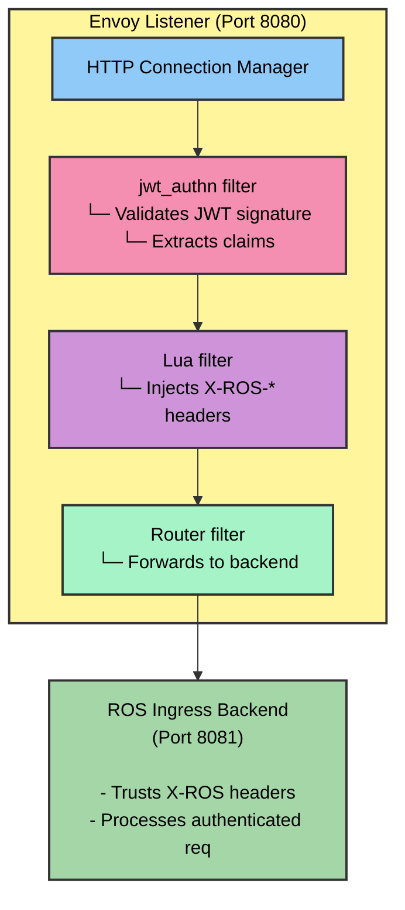

# Helm Templates & Manifests Reference

Technical reference for ROS Helm chart templates, focusing on JWT authentication and TLS certificate handling.

## Overview

This document provides detailed information about the Helm templates used in the ROS chart, particularly those related to JWT authentication with Envoy's native JWT filter.

## JWT Authentication Templates

### Overview

**Two backend services** are deployed with Envoy proxy sidecars on OpenShift:

| Template File | Service | Purpose |
|---------------|---------|---------|
| `deployment-ingress.yaml` | Ingress | JWT validation from Cost Management Operator |
| `deployment-rosocp-api.yaml` | ROS-OCP API | X-Rh-Identity authentication for API requests |

**Services without Envoy sidecars** (protected by network policies):

| Template File | Service | Authentication Method |
|---------------|---------|----------------------|
| `deployment-sources-api.yaml` | Sources API | Mixed: X-Rh-Identity middleware for protected endpoints, some endpoints unauthenticated for internal use |
| `deployment-kruize.yaml` | Kruize | Internal service accessed via ROS-OCP API |

**Common Sidecar Configuration:**
- Envoy listens on port **8080** (public-facing, authenticated)
- Application container listens on internal port (**8001** for ROS-OCP API, **8081** for Ingress)
- Network policies provide defense-in-depth for services without sidecars
- Metrics endpoints remain accessible to Prometheus

### `ros-ocp/templates/deployment-ingress.yaml`

**Purpose**: Enhanced ingress deployment with Envoy sidecar for native JWT authentication from Cost Management Operator.

**Key Features**:
- Envoy proxy sidecar with native JWT filter
- Inline JWT validation (no external authorization service)
- Lua filter for JWT claims extraction
- Port configuration for sidecar routing
- Health probe adjustments

**Container Configuration**:

When JWT authentication is enabled (automatic on OpenShift):
- **Ingress container**: Listens on port `8081` (internal)
- **Envoy sidecar**: Listens on port `8080` (public-facing)
- **Flow**: Client → Envoy (8080) → JWT validation → Ingress (8081)

**Key Environment Variables**:
| Variable | Value (JWT enabled) | Description |
|----------|---------------------|-------------|
| `AUTH_ENABLED` | `"true"` | Ingress trusts X-ROS headers from Envoy |
| `SERVER_PORT` | `8081` | Ingress listens on internal port |
| `UPLOAD_REQUIRE_AUTH` | `"true"` | Upload endpoint requires authentication |

**Volume Mounts**:
- `envoy-config`: Mounted at `/etc/envoy/envoy.yaml` (Envoy configuration)

**Example Template Snippet**:
```yaml
{{- if .Values.jwt_auth.enabled }}
- name: envoy-proxy
  image: "{{ .Values.jwt_auth.envoy.image.repository }}:{{ .Values.jwt_auth.envoy.image.tag }}"
  ports:
    - name: http
      containerPort: {{ .Values.jwt_auth.envoy.port }}
    - name: admin
      containerPort: {{ .Values.jwt_auth.envoy.adminPort }}
  volumeMounts:
    - name: envoy-config
      mountPath: /etc/envoy
      readOnly: true
{{- end }}
```

---

### `ros-ocp/templates/envoy-config.yaml`

**Purpose**: Envoy proxy configuration with native JWT authentication filter.

**Architecture**:


**Key Components**:

#### 1. JWT Authentication Filter (`jwt_authn`)
- **Provider**: `keycloak`
- **Issuer**: `{{ .Values.jwt_auth.keycloak.url }}/auth/realms/{{ .Values.jwt_auth.keycloak.realm }}`
- **JWKS URI**: `/protocol/openid-connect/certs` endpoint
- **Cache Duration**: 300 seconds (5 minutes)
- **Payload Storage**: Stores JWT payload in metadata as `jwt_payload`

**Configuration Options**:
| Helm Value | Description | Default |
|------------|-------------|---------|
| `jwt_auth.keycloak.url` | Keycloak base URL | Auto-detected |
| `jwt_auth.keycloak.realm` | Keycloak realm name | `kubernetes` |
| `jwt_auth.keycloak.audiences` | Expected JWT audiences | `[account, cost-management-operator]` |

**Authentication Rules**:
- `/api/ingress/*` - Requires JWT authentication
- `/health` - Public (health checks)
- `/ready` - Public (readiness checks)

#### 2. Lua Filter (Claims Extraction)
- **Purpose**: Extracts JWT claims from Envoy metadata and injects X-ROS headers
- **Language**: Lua (inline script)
- **Execution**: On every authenticated request

**Header Mapping**:
| JWT Claim | HTTP Header | Description |
|-----------|-------------|-------------|
| `sub` | `X-ROS-User-ID` | User/service account ID |
| `preferred_username` | `X-ROS-User-Name` | Username |
| `azp` or `client_id` | `X-Client-ID` | Client ID |
| (authentication) | `X-ROS-Authenticated` | Always `"true"` |
| (method) | `X-ROS-Auth-Method` | `"Envoy-Native-JWT"` |
| Authorization header | `X-Bearer-Token` | JWT token (without "Bearer" prefix) |

**Lua Script Example**:
```lua
function envoy_on_request(request_handle)
  local metadata = request_handle:streamInfo():dynamicMetadata()
  local jwt_data = metadata:get("envoy.filters.http.jwt_authn")

  if jwt_data ~= nil then
    local payload = jwt_data["jwt_payload"]
    if payload ~= nil then
      request_handle:headers():add("X-ROS-Authenticated", "true")
      request_handle:headers():add("X-ROS-User-ID", tostring(payload["sub"]))
      -- ... additional header extractions
    end
  end
end
```

#### 3. Cluster Configuration

**Backend Cluster** (`ros-ingress-backend`):
- **Type**: STATIC
- **Address**: `127.0.0.1:8081` (same pod, different port)
- **Timeout**: 5 seconds

**JWKS Cluster** (`keycloak_jwks`):
- **Type**: STRICT_DNS
- **Address**: Keycloak hostname (extracted from `jwt_auth.keycloak.url`)
- **Port**: 443 (HTTPS)
- **TLS**: UpstreamTlsContext with SNI
- **Timeout**: 5 seconds

**TLS Configuration**:
```yaml
transport_socket:
  name: envoy.transport_sockets.tls
  typed_config:
    "@type": type.googleapis.com/envoy.extensions.transport_sockets.tls.v3.UpstreamTlsContext
    sni: {{ .Values.jwt_auth.keycloak.url | replace "https://" "" }}
```

---

### `ros-ocp/templates/service-ingress.yaml`

**Purpose**: Kubernetes Service for ingress with Envoy proxy endpoints.

**Port Configuration**:

When JWT is enabled:
```yaml
ports:
  - name: http
    port: 80
    targetPort: {{ .Values.jwt_auth.envoy.port }}  # 8080 (Envoy)
  - name: http-ingress
    port: 8081
    targetPort: 8081  # Direct ingress access (internal)
```

When JWT is disabled:
```yaml
ports:
  - name: http
    port: 80
    targetPort: 8080  # Direct ingress access
```

**Service Discovery**:
- **Selector**: `app.kubernetes.io/name: ingress`
- **Type**: ClusterIP (internal) or LoadBalancer (if configured)

---

### `ros-ocp/templates/_helpers.tpl`

**Purpose**: Helm template helper functions for configuration logic.

**Key Functions**:

#### `ros-ocp.jwt.shouldEnable`
Determines if JWT authentication should be enabled based on platform detection.

**Logic**:
```go
{{- define "ros-ocp.jwt.shouldEnable" -}}
{{- include "ros-ocp.isOpenShift" . -}}
{{- end -}}
```

**Behavior**:
- **Automatic platform detection** - No configuration needed
- Returns `true` on OpenShift (Keycloak available)
- Returns `false` on KIND/Vanilla K8s (Keycloak not deployed)
- Uses Helm's `Capabilities.APIVersions` to detect `route.openshift.io/v1` API

#### `ros-ocp.isOpenShift`
Detects if running on OpenShift.

**Detection Method**:
- Checks for OpenShift-specific API groups (e.g., `route.openshift.io`)

---

## Security & Certificate Templates

### `ros-ocp/templates/ca-configmap.yaml`

**Purpose**: ConfigMap for CA certificate bundle injection.

**Use Case**: Required when Keycloak uses self-signed certificates or internal CA.

**Features**:
- Automatic CA certificate extraction from cluster
- Mount point for backend services
- Support for multiple CA sources

**Data**:
```yaml
data:
  ca-bundle.crt: |
    # Consolidated CA certificates
    # - OpenShift ingress router CA
    # - Keycloak route CA
    # - System CAs
    # - Custom CAs
```

**Mount Path**: Typically mounted at `/etc/ssl/certs/custom-ca-bundle.crt`

---

## Configuration Files & Examples

### `ros-ocp/values-jwt-auth-complete.yaml`

**Purpose**: Complete JWT authentication configuration for production deployments.

**Key Sections**:

```yaml
jwt_auth:

  envoy:
    image:
      repository: registry.redhat.io/openshift-service-mesh/proxyv2-rhel9
      tag: "2.6"
    port: 8080
    adminPort: 9901
    logLevel: info

  keycloak:
    url: ""  # Auto-detected from cluster
    realm: kubernetes
    audiences:
      - account
      - cost-management-operator
    tls:
      insecureSkipVerify: false
```

**Usage**:
```bash
helm upgrade ros-ocp ./ros-ocp \
  -f ros-ocp/values-jwt-auth-complete.yaml \
  --namespace ros-ocp \
  --create-namespace
```

---

## Template Lifecycle

### Installation Flow

1. **Pre-Install**: Helm validates values schema
2. **Template Rendering**:
   - Conditionals evaluate (`jwt_auth.enabled`)
   - Helpers execute (`ros-ocp.jwt.shouldEnable`)
   - Templates generate manifests
3. **Manifest Application**:
   - ConfigMaps (Envoy config)
   - Deployments (Ingress + Envoy sidecar)
   - Services (Port configuration)
4. **Post-Install**: Health checks and validation

### Upgrade Flow

1. **Diff Calculation**: Helm compares current vs new manifests
2. **Rolling Update**: Pods restart with new configuration
3. **Zero-Downtime**: Service maintains availability during upgrade

---

## Debugging Templates

### View Rendered Templates

```bash
# Render templates without installing
helm template ros-ocp ./ros-ocp \
  -f values-jwt-auth-complete.yaml \
  --namespace ros-ocp \
  --debug

# Filter specific template
helm template ros-ocp ./ros-ocp \
  -f values-jwt-auth-complete.yaml \
  -s templates/deployment-ingress.yaml
```

### Validate Template Syntax

```bash
# Lint chart
helm lint ./ros-ocp -f values-jwt-auth-complete.yaml

# Dry-run installation
helm upgrade ros-ocp ./ros-ocp \
  -f values-jwt-auth-complete.yaml \
  --dry-run --debug
```

### Check Applied Configuration

```bash
# Get live manifest
helm get manifest ros-ocp -n ros-ocp

# Get specific resource
kubectl get deployment ros-ocp-ingress -n ros-ocp -o yaml

# Get values used
helm get values ros-ocp -n ros-ocp
```

---

## Performance Considerations

### JWT Validation Latency

- **JWKS Caching**: 5-minute cache reduces remote calls
- **Inline Validation**: <1ms overhead per request
- **Lua Execution**: Negligible overhead (<0.1ms)

### Resource Usage

**Envoy Sidecar**:
```yaml
resources:
  requests:
    cpu: 100m
    memory: 128Mi
  limits:
    cpu: 500m
    memory: 256Mi
```

**Typical Usage**:
- CPU: 50-100m (idle), 200-300m (moderate load)
- Memory: 100-150Mi (stable)

---

## References

- [Envoy JWT Authentication](https://www.envoyproxy.io/docs/envoy/latest/api-v3/extensions/filters/http/jwt_authn/v3/config.proto)
- [Envoy Lua Filter](https://www.envoyproxy.io/docs/envoy/latest/configuration/http/http_filters/lua_filter)
- [Helm Template Guide](https://helm.sh/docs/chart_template_guide/)
- [Kubernetes Service Mesh Patterns](https://www.envoyproxy.io/docs/envoy/latest/intro/arch_overview/security/jwt_authn_filter)

---

**Last Updated**: October 2025
**Maintainer**: ROS Engineering Team

