# Keycloak JWT Authentication Setup for Cost Management Operator and ROS Backend

**Technical Guide for Production Deployment**

## Overview

This document describes how to configure Red Hat Single Sign-On (RH SSO) / Keycloak to provide JWT authentication for the Cost Management Metrics Operator with proper `org_id` claim support required by the ROS (Resource Optimization Service) backend.

### Architecture

```mermaid
graph TB
    Operator["<b>Cost Management Operator</b><br/>Uploads metrics with JWT"]
    Keycloak["<b>Keycloak / RH SSO</b><br/><br/>• Realm: kubernetes<br/>• Client: cost-management-operator<br/>• org_id claim mapper"]
    Envoy["<b>Envoy Sidecar</b><br/>(Port 8080)<br/><br/>• JWT signature validation<br/>• Transform JWT to XRHID<br/>• Inject X-Rh-Identity header"]
    Ingress["<b>Ingress Service</b><br/>(Port 8081)<br/><br/>• Decode XRHID<br/>• Extract org_id<br/>• Process upload<br/>• Publish to Kafka"]
    Kafka["<b>Kafka</b><br/><br/>• Topic: platform.upload.ros<br/>• Message includes org_id"]
    Backend["<b>ROS Backend Processor</b><br/><br/>• Consumes from Kafka<br/>• Uses org_id for data isolation<br/>• Sends to Kruize"]

    Operator -->|"① Get JWT<br/>(client_credentials)"| Keycloak
    Operator -->|"② Upload<br/>Authorization: Bearer &lt;JWT&gt;"| Envoy
    Envoy -->|"③ Validate JWT<br/>Transform to XRHID<br/>X-Rh-Identity: &lt;base64&gt;"| Ingress
    Ingress -->|"④ Extract org_id<br/>Publish message"| Kafka
    Kafka -->|"⑤ Message with<br/>org_id metadata"| Backend

    style Operator fill:#e1f5ff,stroke:#01579b,stroke-width:2px,color:#000
    style Keycloak fill:#fff9c4,stroke:#f57f17,stroke-width:2px,color:#000
    style Envoy fill:#f3e5f5,stroke:#4a148c,stroke-width:2px,color:#000
    style Ingress fill:#e8f5e9,stroke:#1b5e20,stroke-width:2px,color:#000
    style Kafka fill:#fff3e0,stroke:#e65100,stroke-width:2px,color:#000
    style Backend fill:#fce4ec,stroke:#880e4f,stroke-width:2px,color:#000
```



**Authentication Flow**:
- **Operator** → Envoy: `Authorization: Bearer <JWT>` (Standard OAuth 2.0)
- **Envoy** → Ingress/Backend: `X-Rh-Identity: <base64-XRHID>` + `X-ROS-*` headers (RHSSO format)
- **Ingress** → Kafka: Message with `org_id` extracted from XRHID
- **Backend** consumes Kafka messages (async processing) or receives direct API calls with XRHID

**Key Points**:
- **Envoy** validates JWT signature and transforms it to `X-Rh-Identity` header in XRHID format
- **XRHID Format**: `{"identity":{"org_id":"...","account_number":"...","type":"User"}}` (base64-encoded)
- **Ingress Service** and **ROS Backend API** both expect the same `X-Rh-Identity` header format
- The `org_id` claim from JWT is required and embedded in the XRHID structure

### Key Requirements

1. **JWT Token** must contain:
   - Standard OIDC claims (`sub`, `iat`, `exp`, `iss`, `aud`)
   - **`org_id`** claim (String) - Required by ROS backend
   - Optionally: `account_number` claim for account identification

2. **Supported org_id Claim Names** (Ingress Service supports multiple alternatives):
   - `org_id` (preferred)
   - `organization_id` (fallback)
   - `tenant_id` (second fallback)

   **Implementation Reference**: See `insights-ros-ingress/internal/upload/handler.go` line 434

3. **Keycloak Configuration**:
   - Service account client (client_credentials grant type)
   - Hardcoded claim mapper for `org_id`
   - Proper audience and scope configuration

4. **Operator Configuration**:
   - Secret with client_id and client_secret
   - Token URL pointing to Keycloak realm

### How org_id is Extracted (Technical Details)

The authentication flow has two stages:

#### Stage 1: Envoy JWT Validation and XRHID Transformation

**Location**: `ros-ocp/templates/envoy-config.yaml`

Envoy's `jwt_authn` filter:
1. Validates JWT signature against Keycloak JWKS endpoint
2. Verifies `issuer` and `audience` claims
3. Stores JWT payload in metadata for Lua filter

**Envoy Lua Filter** (lines 76-161): Transforms JWT to XRHID format
1. Extracts `org_id` from JWT claims with fallback logic:
   ```lua
   -- Tries: org_id → organization_id → tenant_id
   local org_id = get_claim(payload, "org_id", "organization_id", "tenant_id")
   ```
2. Extracts `account_number` from JWT claims:
   ```lua
   -- Tries: account_number → account_id → account
   local account_number = get_claim(payload, "account_number", "account_id", "account")
   ```
3. Builds XRHID JSON structure:
   ```lua
   {"identity":{"org_id":"...","account_number":"...","type":"User"}}
   ```
4. Base64 encodes the JSON
5. Injects `X-Rh-Identity` header (RHSSO format)
6. Also adds debugging headers: `X-ROS-Authenticated`, `X-ROS-User-ID`, etc.

**Default Values**:
- If `org_id` is missing: defaults to `"1"` (with warning log)
- If `account_number` is missing: defaults to `org_id` value

#### Stage 2: Backend Services Parse XRHID

**Ingress Service** (`insights-ros-ingress`):
- Can accept either JWT (via `Authorization` header) OR XRHID (via `X-Rh-Identity`)
- When Envoy is present, receives XRHID format
- Decodes base64 XRHID to extract `org_id` and `account_number`
- Uses `org_id` for Kafka message metadata and storage paths

**ROS Backend API** (`ros-ocp-backend`):
- **Location**: `internal/api/middleware/identity.go`
- Expects `X-Rh-Identity` header (line 26: `RHSSOIdentityHeader`)
- Decodes base64 XRHID structure
- Extracts `org_id` for multi-tenancy and data isolation
- Uses in database queries: `WHERE org_id = '...'`

**Why Two Stages?**
- **Envoy**: Fast JWT validation + XRHID transformation (C++ performance, no backend changes needed)
- **Backends**: Consistent XRHID format across all services (simplified authentication logic)

---

## Part 1: Red Hat Single Sign-On Installation

### Prerequisites

- OpenShift cluster with admin access (version 4.10 or later)
- Cluster admin permissions
- `oc` CLI installed and logged in

### Installation Options

#### Option A: Red Hat Single Sign-On Operator (Recommended)

Follow the official Red Hat documentation to install RH SSO on OpenShift:

**📖 Official Documentation:**
- [Red Hat Single Sign-On for OpenShift](https://access.redhat.com/documentation/en-us/red_hat_single_sign-on/7.6/html/red_hat_single_sign-on_for_openshift_on_openjdk)
- [Installing the RH-SSO Operator](https://access.redhat.com/documentation/en-us/red_hat_single_sign-on/7.6/html/server_installation_and_configuration_guide/operator)

**Quick Installation Steps:**

1. Install the Red Hat Single Sign-On Operator from OperatorHub
2. Create a namespace for RH SSO (e.g., `rhsso`)
3. Deploy a Keycloak instance
4. Create a Keycloak realm

#### Option B: Automated Script (Quick Start)

For testing or development environments, use the provided automation script:

```bash
cd scripts/
./deploy-rhsso.sh
```

This script automates the operator installation and basic configuration.

### Post-Installation Verification

Verify that RH SSO is running:

```bash
# Check Keycloak instance status
oc get keycloak -n rhsso

# Get Keycloak URL
oc get keycloak rhsso-keycloak -n rhsso -o jsonpath='{.status.externalURL}'

# Get admin credentials (if using the operator-created secret)
oc get secret credential-rhsso-keycloak -n rhsso \
  -o jsonpath='{.data.ADMIN_USERNAME}' | base64 -d
oc get secret credential-rhsso-keycloak -n rhsso \
  -o jsonpath='{.data.ADMIN_PASSWORD}' | base64 -d
```

---

## Part 2: Keycloak Configuration for Cost Management Operator

This section shows how to configure an existing RH SSO / Keycloak instance to work with the Cost Management Operator.

### Overview

The Cost Management Operator requires:
1. **Realm**: A Keycloak realm (e.g., `kubernetes`)
2. **Client**: A service account client with specific configuration
3. **org_id Claim Mapper**: Critical for ROS backend compatibility

### 2.1: Create or Verify Realm

If you don't already have a realm, create one using a `KeycloakRealm` CR:

```yaml
apiVersion: keycloak.org/v1alpha1
kind: KeycloakRealm
metadata:
  name: kubernetes-realm
  namespace: rhsso
  labels:
    app: sso
spec:
  instanceSelector:
    matchLabels:
      app: sso
  realm:
    id: kubernetes
    realm: kubernetes
    enabled: true
    displayName: "Kubernetes Realm"

    # Token settings
    accessTokenLifespan: 300              # 5 minutes

    # Security settings
    bruteForceProtected: true
    failureFactor: 30                     # Allow 30 failed attempts
    maxFailureWaitSeconds: 900            # 15 minutes wait after max failures
    maxDeltaTimeSeconds: 43200            # 12 hours

    # User management
    registrationAllowed: false
    rememberMe: true
    resetPasswordAllowed: true
    verifyEmail: false

    # Client Scopes - IMPORTANT: defines api.console scope
    clientScopes:
      - name: api.console
        description: "API Console access scope for cost management"
        protocol: openid-connect
        attributes:
          include.in.token.scope: "true"
          display.on.consent.screen: "false"

    # Default client scopes - automatically included for all clients
    defaultDefaultClientScopes:
      - api.console
```

**📝 Configuration Notes:**
- `accessTokenLifespan: 300` - JWT tokens expire after 5 minutes
- `bruteForceProtected: true` - Protects against brute force attacks
- `registrationAllowed: false` - Disable self-registration for security
- **`clientScopes`**: Defines the `api.console` scope at the realm level
  - `include.in.token.scope: "true"` - Includes this scope in the token's scope claim
  - `display.on.consent.screen: "false"` - Don't show to users (service account clients)
- **`defaultDefaultClientScopes`**: Automatically includes `api.console` in all clients
  - This makes the `api.console` scope available to all clients in this realm by default
  - Clients can still explicitly reference it in their `defaultClientScopes` array

> **ℹ️ Session Configuration Note:**
> The RH SSO 7 Keycloak Operator CRD does not support `clientSessionMaxLifespan` or `ssoSessionMaxLifespan` fields.
> If you need to configure session timeouts beyond the access token lifespan, you must set them via:
> - The Keycloak Admin Console UI (`Realm Settings` → `Sessions`)
> - The Keycloak Admin REST API
>
> The `accessTokenLifespan` setting controls how long JWT tokens remain valid.

Apply the realm:

```bash
oc apply -f keycloak-realm.yaml -n rhsso

# Wait for realm to be ready
oc wait --for=condition=ready keycloakrealm/kubernetes-realm -n rhsso --timeout=120s
```

### 2.2: Create Cost Management Client with org_id Support (CRITICAL)

**⚠️ IMPORTANT**: The `org_id` claim is **REQUIRED** by the ROS backend. Without it, all uploads will be rejected.

#### Why org_id is Required

The ROS backend (`ros-ocp-backend`) requires the `org_id` claim to:
- Identify which organization the data belongs to
- Enforce multi-tenancy boundaries
- Route data to correct storage partitions
- Apply organization-specific policies

#### Complete KeycloakClient Custom Resource

Create a `KeycloakClient` CR with the `org_id` mapper included:

```yaml
apiVersion: keycloak.org/v1alpha1
kind: KeycloakClient
metadata:
  name: cost-management-service-account
  namespace: rhsso
  labels:
    app: sso
spec:
  realmSelector:
    matchLabels:
      app: sso
  client:
    clientAuthenticatorType: client-secret
    clientId: cost-management-operator
    name: Cost Management Operator Service Account
    description: Service account client for Cost Management Metrics Operator
    enabled: true
    protocol: openid-connect

    # Service account configuration
    serviceAccountsEnabled: true
    publicClient: false
    standardFlowEnabled: false
    implicitFlowEnabled: false
    directAccessGrantsEnabled: false

    # Default scopes - IMPORTANT: includes api.console
    defaultClientScopes:
      - openid
      - profile
      - email
      - api.console

    # Protocol Mappers - INCLUDES org_id and api.console scope
    protocolMappers:
      # org_id mapper (CRITICAL - REQUIRED BY ROS BACKEND)
      - name: org-id-mapper
        protocol: openid-connect
        protocolMapper: oidc-hardcoded-claim-mapper
        config:
          claim.name: "org_id"
          claim.value: "1"                    # CHANGE THIS to your organization ID
          jsonType.label: "String"
          access.token.claim: "true"
          id.token.claim: "false"
          userinfo.token.claim: "false"

      # account_number mapper (optional, but recommended)
      - name: account-number-mapper
        protocol: openid-connect
        protocolMapper: oidc-hardcoded-claim-mapper
        config:
          claim.name: "account_number"
          claim.value: "1"                    # CHANGE THIS to your account number
          jsonType.label: "String"
          access.token.claim: "true"
          id.token.claim: "false"
          userinfo.token.claim: "false"

      # Audience mapper (validates JWT audience)
      - name: audience-mapper
        protocol: openid-connect
        protocolMapper: oidc-audience-mapper
        config:
          included.client.audience: "cost-management-operator"
          access.token.claim: "true"
          id.token.claim: "false"

      # Client ID mapper (adds clientId claim)
      - name: client-id-mapper
        protocol: openid-connect
        protocolMapper: oidc-usersessionmodel-note-mapper
        config:
          access.token.claim: "true"
          claim.name: "clientId"
          id.token.claim: "true"
          user.session.note: "clientId"

      # api.console scope mapper (adds api.console to scope claim)
      - name: api-console-mock
        protocol: openid-connect
        protocolMapper: oidc-hardcoded-claim-mapper
        config:
          access.token.claim: "true"
          claim.name: "scope"
          claim.value: "api.console"
          id.token.claim: "false"
```

**📝 Important Configuration Notes:**

1. **Change `claim.value: "1"`** to your actual organization ID in the `org-id-mapper`
2. **Change `claim.value: "1"`** to your actual account number in the `account-number-mapper` (optional)
3. **api.console scope**: Included in `defaultClientScopes` and added via `api-console-mock` mapper
4. **Labels**: Use `app: sso` labels to match with Keycloak instance selector
5. **Multi-Organization Support**: The system will extract `org_id` from the `clientId` claim
   - The `clientId` is automatically included in JWT tokens by the `client-id-mapper`
   - Backend services can parse the `clientId` to derive the organization identifier
   - This allows flexible multi-tenancy without hardcoding `org_id` values

**Protocol Mappers Explained:**
- **org-id-mapper**: Adds `org_id` claim (REQUIRED by ROS backend) - for explicit org identification
- **account-number-mapper**: Adds `account_number` claim (recommended for tenant identification)
- **audience-mapper**: Adds audience validation for JWT
- **client-id-mapper**: Adds `clientId` claim to tokens - used for org_id extraction in multi-tenant setups
- **api-console-mock**: Adds `api.console` to the `scope` claim (required for OpenShift integration)

**Multi-Organization Architecture:**
- The `clientId` claim can be used to derive `org_id` dynamically
- Example: `clientId: "cost-management-operator-org123"` → `org_id: "org123"`
- This eliminates the need for separate Keycloak clients per organization
- Backend services parse the `clientId` to determine the organization context

#### Apply the Client Configuration

```bash
# Save the YAML above to a file
vi cost-management-client.yaml

# Apply the KeycloakClient CR
oc apply -f cost-management-client.yaml -n rhsso

# Wait for client to be ready
oc wait --for=condition=ready keycloakclient/cost-management-service-account -n rhsso --timeout=120s

# Verify the client was created
oc get keycloakclient -n rhsso cost-management-service-account

# Verify the client secret was created
oc get secret keycloak-client-secret-cost-management-service-account -n rhsso

# Get the client secret value
CLIENT_SECRET=$(oc get secret keycloak-client-secret-cost-management-service-account -n rhsso \
  -o jsonpath='{.data.CLIENT_SECRET}' | base64 -d)
echo "Client Secret: $CLIENT_SECRET"
```

#### Alternative: Update Existing Client (Patch Method)

If you already have a client without `org_id`, patch it:

```bash
# Set your organization ID
ORG_ID="1"  # Change to your actual org_id

# Patch the existing KeycloakClient
oc patch keycloakclient cost-management-service-account -n rhsso --type=json -p='[
  {
    "op": "add",
    "path": "/spec/client/protocolMappers/-",
    "value": {
      "name": "org-id-mapper",
      "protocol": "openid-connect",
      "protocolMapper": "oidc-hardcoded-claim-mapper",
      "config": {
        "claim.name": "org_id",
        "claim.value": "'$ORG_ID'",
        "jsonType.label": "String",
        "access.token.claim": "true",
        "id.token.claim": "false"
      }
    }
  }
]'

# Wait for Keycloak to reconcile
sleep 10
```

#### Alternative: Add org_id via Keycloak Admin Console (Manual Method)

If you prefer to use the Keycloak web UI:

1. **Log into Keycloak Admin Console**
   ```bash
   # Get URL and credentials
   KEYCLOAK_URL=$(oc get keycloak rhsso-keycloak -n rhsso -o jsonpath='{.status.externalURL}')
   echo "Admin Console: $KEYCLOAK_URL/auth/admin/"
   ```

2. **Navigate to the Client**
   - Realms → `kubernetes`
   - Clients → `cost-management-operator`
   - Mappers tab

3. **Create org_id Mapper**
   - Click "Create"
   - **Name**: `org-id-mapper`
   - **Mapper Type**: `Hardcoded claim`
   - **Token Claim Name**: `org_id`
   - **Claim value**: `1` (your organization ID)
   - **Claim JSON Type**: `String`
   - **Add to ID token**: OFF
   - **Add to access token**: ON ✅
   - **Add to userinfo**: OFF
   - Click "Save"

---

## Part 3: Operator Configuration and Verification

### 3.1: Verify JWT Contains org_id

```bash
# Get Keycloak URL
KEYCLOAK_URL=$(oc get route keycloak -n rhsso -o jsonpath='{.spec.host}')

# Get client credentials
CLIENT_ID="cost-management-operator"
CLIENT_SECRET=$(oc get secret keycloak-client-secret-cost-management-service-account \
  -n rhsso -o jsonpath='{.data.CLIENT_SECRET}' | base64 -d)

# Get JWT token
TOKEN=$(curl -k -s -X POST \
  "https://${KEYCLOAK_URL}/auth/realms/kubernetes/protocol/openid-connect/token" \
  -d "grant_type=client_credentials" \
  -d "client_id=${CLIENT_ID}" \
  -d "client_secret=${CLIENT_SECRET}" \
  | jq -r '.access_token')

# Decode JWT and check for org_id
echo "JWT Header:"
echo $TOKEN | cut -d'.' -f1 | base64 -d 2>/dev/null | jq .

echo ""
echo "JWT Payload:"
echo $TOKEN | cut -d'.' -f2 | base64 -d 2>/dev/null | jq .

echo ""
echo "org_id claim:"
echo $TOKEN | cut -d'.' -f2 | base64 -d 2>/dev/null | jq -r '.org_id'
```

**Expected Output:**
```json
{
  "exp": 1760628776,
  "iat": 1760628476,
  "jti": "5a1e42a0-6de5-4722-af84-de7170f2b4b0",
  "iss": "https://keycloak-rhsso.apps.example.com/auth/realms/kubernetes",
  "aud": "cost-management-operator",
  "sub": "27f3c0e2-37c3-4207-9adc-691351165d9b",
  "typ": "Bearer",
  "azp": "cost-management-operator",
  "scope": "api.console email profile",
  "org_id": "1",      <-- MUST BE PRESENT
  "clientId": "cost-management-operator",
  "email_verified": false,
  "clientHost": "192.168.122.217",
  "preferred_username": "service-account-cost-management-operator",
  "clientAddress": "192.168.122.217"
}
```

### 3.2: Configure Operator Secret

Create the authentication secret in the operator namespace:

```bash
# Get credentials
CLIENT_ID="cost-management-operator"
CLIENT_SECRET=$(oc get secret keycloak-client-secret-cost-management-service-account \
  -n rhsso -o jsonpath='{.data.CLIENT_SECRET}' | base64 -d)

# Create operator secret
oc create secret generic cost-management-auth-secret \
  -n costmanagement-metrics-operator \
  --from-literal=client_id=${CLIENT_ID} \
  --from-literal=client_secret=${CLIENT_SECRET} \
  --dry-run=client -o yaml | oc apply -f -
```

### 3.3: Configure Operator

Update the `CostManagementMetricsConfig` to use JWT authentication:

```bash
KEYCLOAK_URL=$(oc get route keycloak -n rhsso -o jsonpath='{.spec.host}')

oc patch costmanagementmetricsconfig costmanagementmetricscfg-tls \
  -n costmanagement-metrics-operator \
  --type merge -p '{
  "spec": {
    "authentication": {
      "type": "service-account",
      "secret_name": "cost-management-auth-secret",
      "token_url": "https://'${KEYCLOAK_URL}'/auth/realms/kubernetes/protocol/openid-connect/token"
    }
  }
}'
```

### 3.4: Verify Operator Authentication

Monitor operator logs to ensure JWT acquisition is working:

```bash
oc logs -n costmanagement-metrics-operator \
  deployment/costmanagement-metrics-operator \
  --tail=50 -f | grep -E "token|auth|jwt"
```

**Expected log entries:**
```
INFO crc_http.GetAccessToken requesting service-account access token
INFO crc_http.GetAccessToken successfully retrieved and set access token for subsequent requests
```

### 3.5: Verify End-to-End Flow

Test the complete flow from operator to ROS backend:

```bash
# Trigger an upload (or wait for scheduled upload)
# Check operator status
oc get costmanagementmetricsconfig -n costmanagement-metrics-operator \
  -o jsonpath='{.status.upload.last_upload_status}'

# Should show: "202 Accepted" (not 401 Unauthorized)

# Check ingress logs for org_id extraction
oc logs -n ros-ocp deployment/ros-ocp-ingress -c ingress --tail=50 | \
  grep -E "org_id|account"

# Expected: account="1", org_id="1"
```

---

## Part 4: Multi-Organization Setup

### Overview

The ROS backend can extract `org_id` from the `clientId` claim in JWT tokens, enabling flexible multi-tenant deployments without requiring multiple Keycloak clients.

### Recommended Approach: Dynamic org_id from clientId

**How It Works:**
1. The `client-id-mapper` protocol mapper adds the `clientId` claim to JWT tokens
2. Backend services parse the `clientId` to extract the organization identifier
3. Example: `cost-management-operator-org123` → extracts `org_id: "org123"`

**Benefits:**
- ✅ Single Keycloak client handles multiple organizations
- ✅ Simplified Keycloak administration
- ✅ Easy to onboard new organizations
- ✅ Reduced operational overhead

### Implementation

#### Option 1: Naming Convention (Recommended)

Use a consistent `clientId` naming pattern that embeds the org_id:

```yaml
# Client for Organization "12345"
apiVersion: keycloak.org/v1alpha1
kind: KeycloakClient
metadata:
  name: cost-management-org-12345
  namespace: rhsso
spec:
  client:
    clientId: cost-management-operator-12345  # org_id embedded
    # ... rest of configuration
    protocolMappers:
      - name: client-id-mapper
        protocol: openid-connect
        protocolMapper: oidc-usersessionmodel-note-mapper
        config:
          claim.name: "clientId"
          # Backend extracts "12345" from "cost-management-operator-12345"
```

**Backend Parsing Logic** (to be implemented):
```go
// Example: Extract org_id from clientId
clientId := claims["clientId"]  // "cost-management-operator-12345"
orgId := extractOrgId(clientId) // "12345"
```

#### Option 2: Explicit org_id Claim (Current Implementation)

Continue using the hardcoded `org_id` mapper for explicit organization identification:

```yaml
protocolMappers:
  - name: org-id-mapper
    protocolMapper: oidc-hardcoded-claim-mapper
    config:
      claim.name: "org_id"
      claim.value: "12345"  # Explicit org_id
```

**When to Use:**
- Transitioning to the new architecture
- Need explicit org_id validation
- Legacy system compatibility

#### Option 3: Multiple Clients (Legacy Approach)

Create separate clients for each organization (not recommended for new deployments):

```bash
# Organization 1
ORG_ID="1" CLIENT_ID="cost-management-operator-1"
# Apply KeycloakClient with org_id="1"

# Organization 2
ORG_ID="2" CLIENT_ID="cost-management-operator-2"
# Apply KeycloakClient with org_id="2"
```

**Drawbacks:**
- More Keycloak clients to manage
- Separate secrets per organization
- Increased operational complexity

---

## Part 5: Troubleshooting

### Issue: "Invalid or missing identity" (401 Unauthorized)

**Symptoms:**
- Operator logs: `upload failed | error: status: 401`
- Ingress logs: `"error":"Invalid or missing identity"`

**Root Cause:**
- JWT doesn't contain `org_id`
- Envoy not deployed or misconfigured

**Fix:**
1. Verify `org_id` in JWT (see Part 3, Step 1)
2. Check Envoy sidecar is running:
   ```bash
   oc get pod -n ros-ocp -l app.kubernetes.io/component=ingress \
     -o jsonpath='{.items[0].spec.containers[*].name}'
   # Should show: envoy-proxy ingress
   ```
3. Verify Helm chart version includes JWT support (v0.1.5+)

### Issue: JWT Contains org_id but Still Rejected

**Symptoms:**
- JWT has `org_id` claim
- Still get 401 Unauthorized

**Root Cause:**
- Envoy JWT filter not recognizing the token
- Wrong issuer or audience

**Fix:**
1. Check Envoy configuration:
   ```bash
   oc get configmap ros-ocp-envoy-config -n ros-ocp -o yaml
   ```
2. Verify `issuer` matches Keycloak:
   ```yaml
   issuer: "https://keycloak-rhsso.apps.example.com/auth/realms/kubernetes"
   ```
3. Verify `audiences` includes your client_id:
   ```yaml
   audiences:
     - "cost-management-operator"
   ```

### Issue: Operator Can't Get JWT

**Symptoms:**
- Operator logs: `failed to get access token`
- Operator logs: `connection refused` or `timeout`

**Root Cause:**
- Network connectivity issue
- Wrong token URL
- Missing CA certificates

**Fix:**
1. Test connectivity from operator pod:
   ```bash
   oc exec -n costmanagement-metrics-operator \
     deployment/costmanagement-metrics-operator -- \
     curl -k -I https://keycloak-rhsso.apps.example.com
   ```
2. Verify CA certificates are mounted:
   ```bash
   oc get deployment costmanagement-metrics-operator \
     -n costmanagement-metrics-operator \
     -o jsonpath='{.spec.template.spec.volumes[?(@.name=="ca-bundle")]}'
   ```
3. Check token URL is correct:
   ```bash
   oc get costmanagementmetricsconfig \
     -o jsonpath='{.items[0].spec.authentication.token_url}'
   ```

### Issue: Wrong org_id Value

**Symptoms:**
- Data appears in wrong organization
- ROS backend accepts upload but stores in wrong partition

**Fix:**
1. Verify org_id in JWT matches expected value
2. Update mapper in Keycloak:
   - Admin Console → Clients → Mappers → org-id-mapper
   - Change "Claim value" to correct org_id
3. Delete operator pod to force new token acquisition

---

## Part 6: Security Considerations

### Token Lifespan

Default token lifespan is 5 minutes (300 seconds). The operator caches tokens and refreshes automatically.

To adjust:
```bash
oc patch keycloakrealm kubernetes-realm -n rhsso --type=merge -p '{
  "spec": {
    "realm": {
      "accessTokenLifespan": 300
    }
  }
}'
```

### Client Secret Rotation

Rotate client secrets periodically:

```bash
# Keycloak will regenerate the secret
oc delete secret keycloak-client-secret-cost-management-service-account -n rhsso

# Wait for regeneration (handled by operator)
sleep 30

# Update operator secret
NEW_SECRET=$(oc get secret keycloak-client-secret-cost-management-service-account \
  -n rhsso -o jsonpath='{.data.CLIENT_SECRET}' | base64 -d)

oc patch secret cost-management-auth-secret \
  -n costmanagement-metrics-operator \
  --type=json -p='[{
    "op": "replace",
    "path": "/data/client_secret",
    "value": "'$(echo -n $NEW_SECRET | base64)'"
  }]'

# Restart operator
oc delete pod -n costmanagement-metrics-operator \
  -l app=costmanagement-metrics-operator
```

### TLS/SSL Configuration

Always use HTTPS for token endpoints:

```bash
# Good
token_url: "https://keycloak-rhsso.apps.example.com/auth/realms/kubernetes/protocol/openid-connect/token"

# Bad (insecure)
token_url: "http://keycloak-rhsso.apps.example.com/auth/realms/kubernetes/protocol/openid-connect/token"
```

Ensure CA certificates are properly configured for self-signed certs.

---

## Part 7: Complete Example

Here's a complete end-to-end setup script:

```bash
#!/bin/bash
set -e

# Configuration
ORG_ID="1"
CLIENT_ID="cost-management-operator"
KEYCLOAK_NAMESPACE="rhsso"
OPERATOR_NAMESPACE="costmanagement-metrics-operator"

echo "=== Step 1: Deploy Keycloak ==="
./scripts/deploy-rhsso.sh

echo "=== Step 2: Add org_id mapper ==="
oc patch keycloakclient cost-management-service-account \
  -n $KEYCLOAK_NAMESPACE --type=json -p='[
  {
    "op": "add",
    "path": "/spec/client/protocolMappers/-",
    "value": {
      "name": "org-id-mapper",
      "protocol": "openid-connect",
      "protocolMapper": "oidc-hardcoded-claim-mapper",
      "config": {
        "claim.name": "org_id",
        "claim.value": "'$ORG_ID'",
        "jsonType.label": "String",
        "access.token.claim": "true"
      }
    }
  }
]'

echo "Waiting for Keycloak to reconcile..."
sleep 15

echo "=== Step 3: Verify JWT contains org_id ==="
KEYCLOAK_URL=$(oc get route keycloak -n $KEYCLOAK_NAMESPACE -o jsonpath='{.spec.host}')
CLIENT_SECRET=$(oc get secret keycloak-client-secret-cost-management-service-account \
  -n $KEYCLOAK_NAMESPACE -o jsonpath='{.data.CLIENT_SECRET}' | base64 -d)

TOKEN=$(curl -k -s -X POST \
  "https://${KEYCLOAK_URL}/auth/realms/kubernetes/protocol/openid-connect/token" \
  -d "grant_type=client_credentials" \
  -d "client_id=${CLIENT_ID}" \
  -d "client_secret=${CLIENT_SECRET}" \
  | jq -r '.access_token')

ORG_ID_IN_TOKEN=$(echo $TOKEN | cut -d'.' -f2 | base64 -d 2>/dev/null | jq -r '.org_id')

if [ "$ORG_ID_IN_TOKEN" = "$ORG_ID" ]; then
  echo "✅ JWT contains correct org_id: $ORG_ID"
else
  echo "❌ JWT org_id mismatch. Expected: $ORG_ID, Got: $ORG_ID_IN_TOKEN"
  exit 1
fi

echo "=== Step 4: Create operator secret ==="
oc create secret generic cost-management-auth-secret \
  -n $OPERATOR_NAMESPACE \
  --from-literal=client_id=${CLIENT_ID} \
  --from-literal=client_secret=${CLIENT_SECRET} \
  --dry-run=client -o yaml | oc apply -f -

echo "=== Step 5: Configure operator ==="
oc patch costmanagementmetricsconfig costmanagementmetricscfg-tls \
  -n $OPERATOR_NAMESPACE \
  --type merge -p '{
  "spec": {
    "authentication": {
      "type": "service-account",
      "secret_name": "cost-management-auth-secret",
      "token_url": "https://'${KEYCLOAK_URL}'/auth/realms/kubernetes/protocol/openid-connect/token"
    }
  }
}'

echo "=== Setup Complete! ==="
echo ""
echo "Next steps:"
echo "  1. Wait for next operator upload cycle"
echo "  2. Verify upload status: oc get costmanagementmetricsconfig -o jsonpath='{.status.upload}'"
echo "  3. Check ingress logs: oc logs -n ros-ocp deployment/ros-ocp-ingress -c ingress"
```

---

## Summary

**Critical Steps:**
1. ✅ Deploy Keycloak using `deploy-rhsso.sh`
2. ✅ Add `org_id` mapper to client (REQUIRED for ROS backend)
3. ✅ Verify JWT contains `org_id` claim
4. ✅ Configure operator with client credentials
5. ✅ Verify end-to-end flow (operator → envoy → ingress → backend)

**Key Takeaway:** The `org_id` claim is **mandatory** for ROS backend compatibility. The basic Keycloak deployment does not include it by default, so it must be added as a post-deployment step.

For questions or issues, refer to:
- `scripts/deploy-rhsso.sh` - Automated deployment
- `scripts/test-ocp-dataflow-jwt.sh` - JWT testing
- `docs/troubleshooting.md` - Common issues

