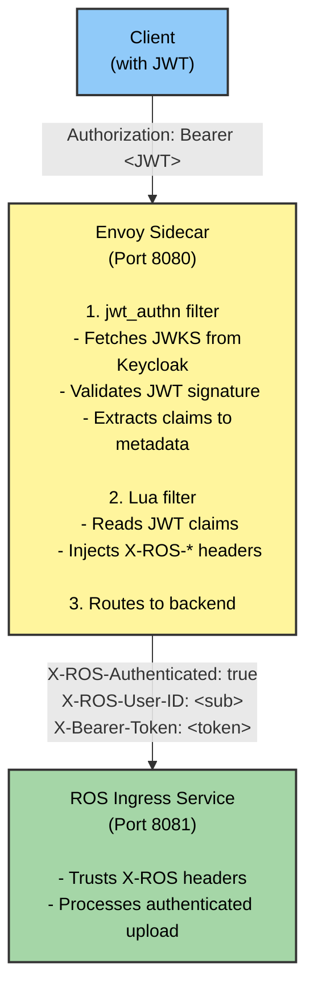

# Native JWT Authentication

## Overview

The ROS Helm Chart uses **Envoy's native JWT authentication filter** for validating JWT tokens from Keycloak (RHBK). This provides secure, low-latency authentication for file uploads and API requests.

## Architecture

### Single Service Authentication Flow



### Services with Envoy Sidecars

**Two services** are deployed with Envoy sidecars on OpenShift for authentication:

| Service | Main Port | Envoy Port | Authentication Method |
|---------|-----------|------------|----------------------|
| **Ingress** | 8081 | 8080 | ✅ JWT validation (from Cost Management Operator) |
| **ROS-OCP API** | 8001 | 8080 | ✅ X-Rh-Identity header validation |

**Services without Envoy sidecars** (direct authentication):

| Service | Port | Authentication Method |
|---------|------|----------------------|
| **Sources API** | 8000 | Mixed: ROS endpoints are unauthenticated, but Cost Management require X-Rh-Identity|
| **Kruize** | 8080 | Internal service (accessed via ROS-OCP API) |
| **ROS-OCP Processor** | N/A | Kafka consumer (no HTTP API) |
| **ROS-OCP Recommendation Poller** | N/A | Internal service (no external API) |
| **ROS-OCP Housekeeper** | N/A | Internal service (no external API) |

**How It Works:**
1. **Ingress Service (Envoy sidecar)**: Validates JWT from Cost Management Operator and transforms it to `X-Rh-Identity` header
2. **ROS-OCP API (Envoy sidecar)**: Accepts `X-Rh-Identity` header from authenticated clients and forwards to application container
3. **Sources API (no sidecar)**: Has X-Rh-Identity validation middleware for protected endpoints; certain endpoints (e.g., `/application_types`) are unauthenticated for internal service access
4. **Internal Services**: Communicate with each other using service accounts or inherit authentication context, accessing unauthenticated endpoints where appropriate

**Network Security:**
- Network policies restrict external access to backend services
- Envoy sidecars provide an additional authentication layer for external-facing APIs
- Metrics endpoints remain accessible to Prometheus on dedicated ports (see Network Policies section below)

## Why Native JWT?

Envoy's native JWT authentication provides:

- ✅ **Multipart upload support** - Inline validation works with all request types including file uploads
- ✅ **Low latency** - Sub-millisecond authentication overhead (<1ms)
- ✅ **Simple architecture** - Single sidecar component with no external dependencies
- ✅ **Easy debugging** - All authentication configuration in one place
- ✅ **Battle-tested** - Envoy's JWT filter is production-ready and widely used
- ✅ **Secure TLS validation** - Full certificate verification prevents MITM attacks

## TLS Certificate Validation

### Overview

Envoy validates Keycloak's TLS certificate when fetching JWKS (JSON Web Key Set) to prevent Man-in-the-Middle (MITM) attacks.

**Why This Matters:**
- JWKS contains public keys used to verify JWT signatures
- Without certificate validation, an attacker could intercept the JWKS request
- Attacker could provide fake public keys
- Attacker could then forge JWT tokens that would be accepted as valid
- **Result**: Complete authentication bypass

### How It Works

**1. CA Bundle Preparation (Init Container)**

An init container (`prepare-ca-bundle`) runs before Envoy starts and combines multiple CA sources:

```bash
# Combined from:
- System CA bundle (/etc/ssl/certs/ca-bundle.crt)
- Kubernetes service account CA
- OpenShift service CA (if available)
- Custom Keycloak CA (for self-signed certificates)

# Output: /etc/ssl/certs/ca-bundle.crt (mounted to Envoy)
```

**2. Envoy TLS Configuration**

```yaml
transport_socket:
  name: envoy.transport_sockets.tls
  typed_config:
    "@type": ...UpstreamTlsContext
    sni: keycloak.example.com                    # Server Name Indication
    common_tls_context:
      validation_context:                        # Certificate validation
        trusted_ca:
          filename: /etc/ssl/certs/ca-bundle.crt # Trust anchor
        match_typed_subject_alt_names:           # Hostname verification
          - san_type: DNS
            matcher:
              exact: keycloak.example.com
```

**3. Certificate Validation Steps**

When Envoy connects to Keycloak to fetch JWKS:

1. ✅ **Certificate Chain Validation**: Verify certificate is signed by a trusted CA
2. ✅ **Hostname Verification**: Verify certificate's SAN matches Keycloak hostname
3. ✅ **Expiration Check**: Verify certificate is not expired
4. ✅ **Revocation Check**: Verify certificate has not been revoked
5. ✅ **TLS Handshake**: Establish encrypted connection only if all checks pass

**Without validation_context:**
```
❌ Envoy accepts ANY certificate (self-signed, expired, wrong hostname)
❌ Attacker can intercept and provide fake JWKS
❌ Attacker can forge JWT tokens
❌ Complete authentication bypass
```

**With validation_context:**
```
✅ Envoy only accepts certificates from trusted CAs
✅ Envoy verifies hostname matches
✅ MITM attacks are prevented
✅ JWKS authenticity guaranteed
✅ JWT validation is trustworthy
```

### Custom CA Certificates

For self-signed or internal CA certificates, add your CA certificate to the Helm values:

```yaml
jwt_auth:
  keycloak:
    tls:
      caCert: |
        -----BEGIN CERTIFICATE-----
        MIIDXTCCAkWgAwIBAgIJAKLnUhVP3GVDMA0GCSqGSIb3DQEBCwUAMEUxCzAJBgNV
        ... (your CA certificate) ...
        -----END CERTIFICATE-----
```

This certificate will be included in the CA bundle used by Envoy for validation.

### Troubleshooting TLS Validation

**Issue**: Envoy fails to validate Keycloak certificate

**Symptoms**:
```
upstream connect error or disconnect/reset before headers. TLS error:
268435581:SSL routines:OPENSSL_internal:CERTIFICATE_VERIFY_FAILED
```

**Solutions**:

1. **For self-signed certificates**: Add the CA certificate to `jwt_auth.keycloak.tls.caCert`

2. **For OpenShift service CA certificates**: Ensure the annotation is present:
   ```yaml
   metadata:
     annotations:
       service.beta.openshift.io/inject-cabundle: "true"
   ```

3. **For hostname mismatch**: Verify Keycloak URL matches certificate SAN:
   ```bash
   # Check certificate SAN
   echo | openssl s_client -connect keycloak.example.com:443 2>/dev/null | \
     openssl x509 -noout -text | grep -A1 "Subject Alternative Name"
   ```

4. **Debug CA bundle**: Check what CAs are included:
   ```bash
   kubectl exec -n ros-ocp deployment/ros-ocp-rosocp-api -c envoy-proxy -- \
     cat /etc/ssl/certs/ca-bundle.crt | grep -c "BEGIN CERTIFICATE"
   ```

## Configuration

### Automatic Platform Detection

JWT authentication is **automatically enabled on OpenShift** and **disabled on KIND/K8s**. No configuration needed!

The Helm chart detects the platform by checking for OpenShift-specific APIs (`route.openshift.io/v1`).

### Helm Values

```yaml
jwt_auth:

  envoy:
    image:
      repository: registry.redhat.io/openshift-service-mesh/proxyv2-rhel9
      tag: "2.6"
    port: 8080
    adminPort: 9901

  keycloak:
    url: ""  # Leave empty for auto-detection (recommended)
    realm: kubernetes
    audiences:
      - account
      - cost-management-operator
```

**Automatic Configuration:**
- **JWT Enabled/Disabled**: Auto-detected by platform (OpenShift vs K8s)
- **Keycloak URL**: Auto-detected from Keycloak routes/ingresses
- **Override**: Set `jwt_auth.keycloak.url` only for custom/external Keycloak

**Platform Behavior:**
- **OpenShift**: JWT auth enabled automatically (Keycloak required)
- **KIND/K8s**: JWT auth disabled automatically (no Keycloak)

### JWT Claims to Headers Mapping

The Lua filter extracts JWT claims and injects these headers:

| JWT Claim            | HTTP Header         | Description                |
|----------------------|---------------------|----------------------------|
| `sub`                | `X-ROS-User-ID`     | User/service account ID    |
| `preferred_username` | `X-ROS-User-Name`   | Username                   |
| `azp` or `client_id` | `X-Client-ID`       | Client ID                  |
| (authentication)     | `X-ROS-Authenticated` | Always "true" when valid   |
| (method)             | `X-ROS-Auth-Method` | "Envoy-Native-JWT"         |
| Authorization header | `X-Bearer-Token`    | JWT token without "Bearer" |

## Testing

### Upload with JWT

```bash
# Get JWT token from Keycloak
TOKEN=$(curl -s -k -X POST \
  "https://keycloak-keycloak.apps.example.com/auth/realms/kubernetes/protocol/openid-connect/token" \
  -H "Content-Type: application/x-www-form-urlencoded" \
  -d "grant_type=client_credentials" \
  -d "client_id=cost-management-operator" \
  -d "client_secret=$CLIENT_SECRET" \
  | jq -r '.access_token')

# Upload file with JWT
curl -F "file=@payload.tar.gz;type=application/vnd.redhat.hccm.filename+tgz" \
  -H "Authorization: Bearer $TOKEN" \
  "http://ros-ocp-ingress-ros-ocp.apps.example.com/api/ingress/v1/upload"
```

### Automated Test Script

Use the provided test script to verify end-to-end JWT authentication:

```bash
cd scripts
./test-ocp-dataflow-jwt.sh
```

This script:
1. Auto-detects Red Hat Build of Keycloak configuration
2. Obtains JWT token using client credentials
3. Creates test payload with `manifest.json` and CSV data
4. Uploads using JWT Bearer authentication
5. Verifies processing in ingress and backend services

## Payload Requirements

The ROS ingress service expects tar.gz archives with:

1. **manifest.json** (required):
```json
{
  "uuid": "<unique-id>",
  "cluster_id": "<cluster-id>",
  "cluster_alias": "test-cluster",
  "date": "2025-10-14T00:00:00Z",
  "files": ["openshift_usage_report.csv"],
  "resource_optimization_files": ["openshift_usage_report.csv"],
  "certified": true,
  "operator_version": "1.0.0"
}
```

2. **CSV file(s)**: Listed in `resource_optimization_files`

## Network Policies

### Overview

Network policies are automatically deployed on OpenShift to secure service-to-service communication and restrict unauthorized access to backend services.

### Purpose

1. **Enforce Authentication**: Only traffic through Envoy sidecars (port 8080) is allowed for external requests
2. **Isolate Backend Ports**: Direct access to application containers (ports 8000, 8001, 8081) is restricted
3. **Enable Metrics Collection**: Prometheus can access metrics endpoints without authentication
4. **Service Communication**: Internal services can communicate with each other as needed

### Network Policy Impact

| Service | Port | Access Policy |
|---------|------|---------------|
| **Envoy Sidecar** | 8080 | ✅ External access allowed (authenticated) |
| **Application Container** | 8000-8001, 8081 | ⚠️ Restricted to same namespace only |
| **Metrics Endpoint** | 8000, 8080 `/metrics` | ✅ Prometheus access allowed |
| **Database** | 5432 | ⚠️ Backend services only |
| **Kafka** | 29092 | ⚠️ Backend services only |

### Key Network Policies

#### 1. Kruize Network Policy

**File**: `ros-ocp/templates/networkpolicy-kruize.yaml`

- **Allows**:
  - Ingress from `ros-ocp` namespace (for internal service communication)
  - Ingress from `openshift-monitoring` namespace (for Prometheus metrics scraping on port 8080)
- **Blocks**:
  - All other external ingress traffic

#### 2. Ingress Service Network Policy

**File**: `ros-ocp/templates/networkpolicy-ingress.yaml`

- **Allows**:
  - Ingress from `openshift-ingress` namespace (for external file uploads via Envoy sidecar on port 9080)
- **Applies to**: Ingress service (file uploads from Cost Management Operator)

#### 3. ROS-OCP Metrics Network Policies

**File**: `ros-ocp/templates/networkpolicy-rosocp-metrics.yaml`

- **Allows**:
  - Ingress from `openshift-monitoring` namespace (for Prometheus metrics scraping on port 9000)
- **Applies to**: ROS-OCP API, Processor, Recommendation Poller (separate policies for each)

#### 4. ROS-OCP API Access Network Policy

**File**: `ros-ocp/templates/networkpolicy-rosocp-metrics.yaml`

- **Allows**:
  - Ingress from OpenShift router/ingress (for external REST API access via Envoy sidecar on port 9080)
- **Applies to**: ROS-OCP API

#### 5. Sources API Network Policy

**File**: `ros-ocp/templates/networkpolicy-sources-api.yaml`

- **Allows**:
  - Ingress from `ros-ocp` namespace (for internal service communication on port 8000)
- **Applies to**: Sources API (accessed by ros-ocp-housekeeper)

### Prometheus Metrics Access

**Important**: Network policies specifically allow Prometheus (running in `openshift-monitoring` namespace) to scrape metrics endpoints:

```yaml
# Example: Allow Prometheus to access metrics
- namespaceSelector:
    matchLabels:
      name: openshift-monitoring
  podSelector:
    matchLabels:
      app.kubernetes.io/name: prometheus
```

**Metrics Endpoints**:
- **ROS-OCP API**: `http://rosocp-api:9000/metrics`
- **ROS-OCP Processor**: `http://rosocp-processor:9000/metrics`
- **ROS-OCP Recommendation Poller**: `http://rosocp-recommendation-poller:9000/metrics`

### Platform Differences

| Platform | Network Policies | Envoy Sidecars | JWT Auth |
|----------|------------------|----------------|----------|
| **OpenShift** | ✅ Enabled | ✅ Enabled | ✅ Enabled |
| **Kubernetes/KIND** | ❌ Disabled | ❌ Disabled | ❌ Disabled |

**Note**: Network policies are only deployed on OpenShift where JWT authentication is enabled. On Kubernetes/KIND, services are directly accessible without network restrictions.

### Sources API Authentication Details

**Architecture**: Sources API is a Go application using the Echo web framework with middleware-based authentication.

**Authentication Model**:
- **Has X-Rh-Identity validation middleware**: The application includes middleware to parse and validate `X-Rh-Identity` headers for protected endpoints
- **Per-endpoint protection**: Authentication is applied selectively via middleware configuration in `routes.go`
- **BYPASS_RBAC configuration**: When `BYPASS_RBAC=true`, RBAC authorization checks are skipped (useful for development)

**Endpoint Categories**:

1. **Protected Endpoints** (require `X-Rh-Identity` header):
   - Source management: `POST/PATCH/DELETE /sources`
   - Application management: `POST/PATCH/DELETE /applications`
   - Authentication management: `POST/PATCH/DELETE /authentications`
   - Uses `permissionMiddleware` and `tenancyMiddleware`

2. **Unauthenticated Endpoints** (no header required):
   - Application types: `GET /application_types` - Used by ros-ocp-housekeeper for internal lookups
   - Source types: `GET /source_types`
   - Metadata: `GET /app_meta_data`
   - Health check: `GET /health`

**Internal Service Communication**:
- **ros-ocp-housekeeper** → Sources API: Calls unauthenticated `/application_types` endpoint to look up cost-management application type ID
- No `X-Rh-Identity` header needed for this specific endpoint
- Network policies restrict access to internal `ros-ocp` namespace

### Troubleshooting Network Policies

#### Check Active Network Policies

```bash
# List all network policies
oc get networkpolicies -n ros-ocp

# Describe specific policy
oc describe networkpolicy kruize-allow-ingress -n ros-ocp
```

#### Test Connectivity

```bash
# From within the namespace (should work)
oc exec -n ros-ocp deployment/ros-ocp-rosocp-processor -- \
  curl -s http://ros-ocp-kruize:8080/listApplications

# From outside the namespace (should be blocked to main port, allowed to Envoy)
oc exec -n default deployment/test-pod -- \
  curl -s http://ros-ocp-kruize.ros-ocp.svc:8081/listApplications  # Blocked

oc exec -n default deployment/test-pod -- \
  curl -s -H "X-Rh-Identity: ..." http://ros-ocp-kruize.ros-ocp.svc:8080/listApplications  # Allowed via Envoy
```

#### Verify Prometheus Metrics Access

```bash
# Check if Prometheus can scrape metrics
oc exec -n openshift-monitoring prometheus-k8s-0 -- \
  curl -s http://ros-ocp-kruize.ros-ocp.svc:8080/metrics

# Expected: Prometheus metrics output
```

#### Common Issues

**Issue**: Service-to-service communication failing
- **Cause**: Network policy blocking legitimate traffic
- **Fix**: Verify both services are in the `ros-ocp` namespace and network policy allows same-namespace traffic

**Issue**: Prometheus not scraping metrics
- **Cause**: Network policy missing `openshift-monitoring` namespace selector
- **Fix**: Verify network policy includes `namespaceSelector` for `openshift-monitoring`

**Issue**: External access to Envoy sidecar failing
- **Cause**: Route or ingress not configured correctly
- **Fix**: Check OpenShift routes are pointing to port 8080 (Envoy) not application ports

## Troubleshooting

### Check Envoy logs

```bash
oc logs -n ros-ocp -l app.kubernetes.io/name=ingress -c envoy-proxy
```

Look for:
- `JWT authenticated: <user-id>` - Successful authentication
- `Jwt verification fails` - Invalid token or signature
- `Jwks remote fetch is failed` - Cannot reach Keycloak JWKS endpoint

### Check ingress logs

```bash
oc logs -n ros-ocp -l app.kubernetes.io/name=ingress -c ingress
```

Look for:
- `"account":"<id>","org_id":"<id>"` - Authentication headers received
- `"X-ROS-Authenticated header missing"` - Envoy didn't inject headers
- `"no JWT token found"` - Token not forwarded

### Verify JWKS connectivity

```bash
# Port-forward to Envoy admin
oc port-forward -n ros-ocp deployment/ros-ocp-ingress 9901:9901

# Check cluster status
curl http://localhost:9901/clusters | grep keycloak_jwks
```

Should show `cx_active` connections to Keycloak.

### Test JWT manually

```bash
# Decode JWT to check claims
echo "$TOKEN" | cut -d'.' -f2 | base64 -d | jq

# Verify audience matches configuration
# Should contain "account" or "cost-management-operator"
```

## Security Considerations

### Production Deployments

1. **Use proper TLS certificates** - Don't skip certificate verification
2. **Restrict audiences** - Only allow expected client IDs
3. **Monitor token expiry** - Default is 5 minutes (300 seconds)
4. **Rotate client secrets** - Regularly update Keycloak client credentials

### Development/Testing

- The current configuration accepts self-signed certificates from Keycloak
- In production, use properly signed certificates from your PKI

## References

- [Helm Templates Reference](./helm-templates-reference.md) - Technical details about Envoy and JWT templates
- [Envoy JWT Authentication](https://www.envoyproxy.io/docs/envoy/latest/api-v3/extensions/filters/http/jwt_authn/v3/config.proto)
- [Envoy Lua Filter](https://www.envoyproxy.io/docs/envoy/latest/configuration/http/http_filters/lua_filter)
- [Keycloak Client Credentials Flow](https://www.keycloak.org/docs/latest/securing_apps/index.html#_client_credentials_grant)

