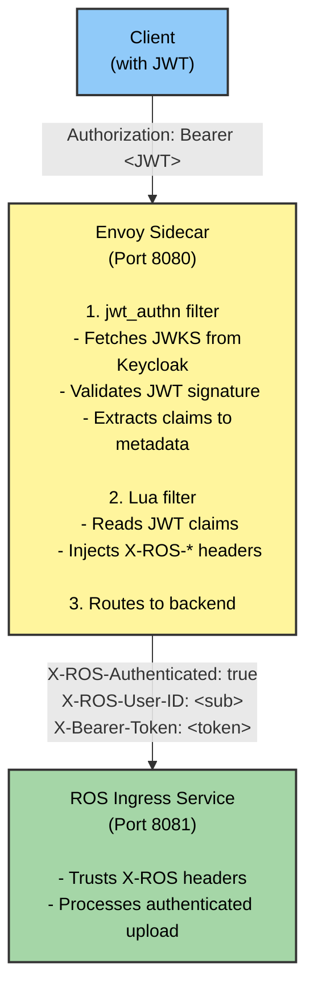

# Native JWT Authentication

## Overview

The ROS Helm Chart uses **Envoy's native JWT authentication filter** for validating JWT tokens from Keycloak/RHSSO. This provides secure, low-latency authentication for file uploads and API requests.

## Architecture



## Why Native JWT?

Envoy's native JWT authentication provides:

- ✅ **Multipart upload support** - Inline validation works with all request types including file uploads
- ✅ **Low latency** - Sub-millisecond authentication overhead (<1ms)
- ✅ **Simple architecture** - Single sidecar component with no external dependencies
- ✅ **Easy debugging** - All authentication configuration in one place
- ✅ **Battle-tested** - Envoy's JWT filter is production-ready and widely used

## Configuration

### Automatic Platform Detection

JWT authentication is **automatically enabled on OpenShift** and **disabled on KIND/K8s**. No configuration needed!

The Helm chart detects the platform by checking for OpenShift-specific APIs (`route.openshift.io/v1`).

### Helm Values

```yaml
jwt_auth:

  envoy:
    image:
      repository: registry.redhat.io/openshift-service-mesh/proxyv2-rhel9
      tag: "2.6"
    port: 8080
    adminPort: 9901

  keycloak:
    url: ""  # Leave empty for auto-detection (recommended)
    realm: kubernetes
    audiences:
      - account
      - cost-management-operator
```

**Automatic Configuration:**
- **JWT Enabled/Disabled**: Auto-detected by platform (OpenShift vs K8s)
- **Keycloak URL**: Auto-detected from Keycloak routes/ingresses
- **Override**: Set `jwt_auth.keycloak.url` only for custom/external Keycloak

**Platform Behavior:**
- **OpenShift**: JWT auth enabled automatically (Keycloak required)
- **KIND/K8s**: JWT auth disabled automatically (no Keycloak)

### JWT Claims to Headers Mapping

The Lua filter extracts JWT claims and injects these headers:

| JWT Claim            | HTTP Header         | Description                |
|----------------------|---------------------|----------------------------|
| `sub`                | `X-ROS-User-ID`     | User/service account ID    |
| `preferred_username` | `X-ROS-User-Name`   | Username                   |
| `azp` or `client_id` | `X-Client-ID`       | Client ID                  |
| (authentication)     | `X-ROS-Authenticated` | Always "true" when valid   |
| (method)             | `X-ROS-Auth-Method` | "Envoy-Native-JWT"         |
| Authorization header | `X-Bearer-Token`    | JWT token without "Bearer" |

## Testing

### Upload with JWT

```bash
# Get JWT token from Keycloak
TOKEN=$(curl -s -k -X POST \
  "https://keycloak-rhsso.apps.example.com/auth/realms/kubernetes/protocol/openid-connect/token" \
  -H "Content-Type: application/x-www-form-urlencoded" \
  -d "grant_type=client_credentials" \
  -d "client_id=cost-management-operator" \
  -d "client_secret=$CLIENT_SECRET" \
  | jq -r '.access_token')

# Upload file with JWT
curl -F "file=@payload.tar.gz;type=application/vnd.redhat.hccm.filename+tgz" \
  -H "Authorization: Bearer $TOKEN" \
  "http://ros-ocp-ingress-ros-ocp.apps.example.com/api/ingress/v1/upload"
```

### Automated Test Script

Use the provided test script to verify end-to-end JWT authentication:

```bash
cd scripts
./test-ocp-dataflow-jwt.sh
```

This script:
1. Auto-detects Keycloak configuration
2. Obtains JWT token using client credentials
3. Creates test payload with `manifest.json` and CSV data
4. Uploads using JWT Bearer authentication
5. Verifies processing in ingress and backend services

## Payload Requirements

The ROS ingress service expects tar.gz archives with:

1. **manifest.json** (required):
```json
{
  "uuid": "<unique-id>",
  "cluster_id": "<cluster-id>",
  "cluster_alias": "test-cluster",
  "date": "2025-10-14T00:00:00Z",
  "files": ["openshift_usage_report.csv"],
  "resource_optimization_files": ["openshift_usage_report.csv"],
  "certified": true,
  "operator_version": "1.0.0"
}
```

2. **CSV file(s)**: Listed in `resource_optimization_files`

## Troubleshooting

### Check Envoy logs

```bash
oc logs -n ros-ocp -l app.kubernetes.io/name=ingress -c envoy-proxy
```

Look for:
- `JWT authenticated: <user-id>` - Successful authentication
- `Jwt verification fails` - Invalid token or signature
- `Jwks remote fetch is failed` - Cannot reach Keycloak JWKS endpoint

### Check ingress logs

```bash
oc logs -n ros-ocp -l app.kubernetes.io/name=ingress -c ingress
```

Look for:
- `"account":"<id>","org_id":"<id>"` - Authentication headers received
- `"X-ROS-Authenticated header missing"` - Envoy didn't inject headers
- `"no JWT token found"` - Token not forwarded

### Verify JWKS connectivity

```bash
# Port-forward to Envoy admin
oc port-forward -n ros-ocp deployment/ros-ocp-ingress 9901:9901

# Check cluster status
curl http://localhost:9901/clusters | grep keycloak_jwks
```

Should show `cx_active` connections to Keycloak.

### Test JWT manually

```bash
# Decode JWT to check claims
echo "$TOKEN" | cut -d'.' -f2 | base64 -d | jq

# Verify audience matches configuration
# Should contain "account" or "cost-management-operator"
```

## Security Considerations

### Production Deployments

1. **Use proper TLS certificates** - Don't skip certificate verification
2. **Restrict audiences** - Only allow expected client IDs
3. **Monitor token expiry** - Default is 5 minutes (300 seconds)
4. **Rotate client secrets** - Regularly update Keycloak client credentials

### Development/Testing

- The current configuration accepts self-signed certificates from Keycloak
- In production, use properly signed certificates from your PKI

## References

- [Helm Templates Reference](./helm-templates-reference.md) - Technical details about Envoy and JWT templates
- [Envoy JWT Authentication](https://www.envoyproxy.io/docs/envoy/latest/api-v3/extensions/filters/http/jwt_authn/v3/config.proto)
- [Envoy Lua Filter](https://www.envoyproxy.io/docs/envoy/latest/configuration/http/http_filters/lua_filter)
- [Keycloak Client Credentials Flow](https://www.keycloak.org/docs/latest/securing_apps/index.html#_client_credentials_grant)

