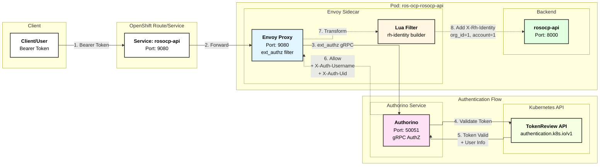
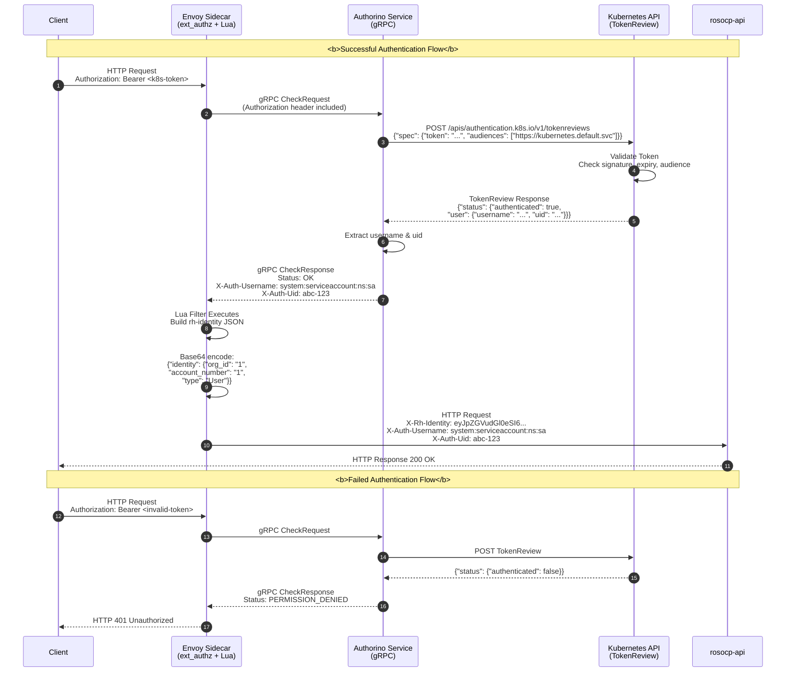

# OAuth2 TokenReview Authentication for ROS OCP Backend

## Overview

The ROS OCP Backend (`ros-ocp-api`) uses OAuth2 token authentication via Kubernetes TokenReview API through Authorino. This allows service accounts and users within the same cluster to authenticate directly using their Kubernetes tokens.

### Quick Reference

| Component | Purpose | Location | Port |
|-----------|---------|----------|------|
| **Envoy Proxy** | HTTP proxy with ext_authz filter | Sidecar in rosocp-api pod | 9080 |
| **Authorino** | External authorization service | Separate deployment | 50051 (gRPC) |
| **Kubernetes API** | Token validation via TokenReview | Cluster control plane | 6443 |
| **rosocp-api** | Backend application | Main container in pod | 8000 |
| **Lua Filter** | Transform headers to rh-identity | Envoy filter chain | N/A |

### Authentication Chain

```
Client Token → Envoy → Authorino → Kubernetes API → Validate
                ↓                                          ↓
            Lua Filter ← X-Auth-Username ← ← ← ← ← Success
                ↓
         X-Rh-Identity
                ↓
         Backend API
```

## Architecture

### Deployment Architecture



### Authentication Flow Sequence



### Components

- **Envoy Proxy**: Sidecar container handling authentication via ext_authz filter
- **Authorino**: External authorization service validating tokens via TokenReview API
- **Lua Filter**: Custom logic in Envoy to transform Authorino response into rh-identity format
- **Kubernetes TokenReview API**: Token validation endpoint
- **Service Accounts**: RBAC permissions for Authorino to call TokenReview API

## Key Changes

### 1. Envoy Configuration (`envoy-config-rosocp-api.yaml`)

- **Removed**: Keycloak JWT authentication filter
- **Removed**: Keycloak JWKS cluster configuration
- **Added**: External Authorization (ext_authz) filter pointing to Authorino
- **Added**: Authorino gRPC cluster configuration (with mTLS)
- **Added**: Lua filter to transform Authorino headers into rh-identity format
- **Added**: Route-level bypass for health check endpoints (`/status`)

### 2. Authorino Configuration (`authorino-authconfig.yaml`)

- **New File**: AuthConfig CRD defining authentication rules
- **Authentication**: Kubernetes TokenReview with audience `https://kubernetes.default.svc`
- **Response Headers**: Injects `X-Auth-Username` and `X-Auth-Uid` from validated token
- **Hosts**: Wildcard matching (validated at Envoy/Route level)

### 3. Authorino RBAC (`authorino-rbac.yaml`)

- **New File**: Service account and ClusterRole for Authorino
- **ClusterRole**: Grants `create` verb on `tokenreviews` resource
- **Binding**: Binds `authorino-authorino` service account to the role

### 4. Deployment Configuration (`deployment-rosocp-api.yaml`)

- **Modified**: Envoy uses ext_authz instead of direct TokenReview calls
- **Removed**: Keycloak CA certificate volumes and init containers
- **Removed**: Service account token environment variable (now handled by Authorino)
- **Added**: Service CA cert mount for Authorino mTLS validation

### 5. Network Policy (`networkpolicy-authorino.yaml`)

- **New File**: Allows rosocp-api pods to connect to Authorino on port 50051 (gRPC)
- **Ingress Rules**: Permits traffic from rosocp-api and monitoring namespaces

### 6. Authorino Deployment Templates

- **Authorino is now automatically deployed by the Helm chart** (as of v0.1.9)
- **No operator dependency**: Standalone Authorino deployment
- **Namespace-scoped**: Deployed to same namespace as ros-ocp chart
- **Templates**:
  - `authorino-deployment.yaml` - Main Authorino deployment
  - `authorino-serviceaccount.yaml` - ServiceAccount for Authorino
  - `authorino-role.yaml` - RBAC for AuthConfig management
  - `authorino-rbac.yaml` - ClusterRole for TokenReview
  - `authorino-services.yaml` - Services for gRPC, metrics, OIDC
  - `authorino-tls-cert.yaml` - TLS certificate via service-ca
  - `authorino-authconfig.yaml` - AuthConfig for OAuth2 TokenReview

## rh-identity Token Format

The generated rh-identity header contains:

```json
{
  "identity": {
    "org_id": "1",
    "account_number": "1",
    "type": "User"
  }
}
```

This JSON is base64-encoded and passed in the `X-Rh-Identity` header.

## Testing

### Prerequisites

1. Deploy the helm chart with JWT authentication enabled (OpenShift only)
2. Ensure service account has TokenReview permissions
3. Have a valid Kubernetes service account token

### Test with Service Account Token

```bash
# Get a service account token
SA_TOKEN=$(oc create token <service-account-name> -n <namespace>)

# Or extract from a running pod
SA_TOKEN=$(oc exec <pod-name> -n <namespace> -- cat /var/run/secrets/kubernetes.io/serviceaccount/token)

# Test the API endpoint
curl -H "Authorization: Bearer $SA_TOKEN" \
     https://<ros-ocp-api-route>/api/ros/v1/status

# Check the response - should return 200 OK if authentication works
```

### Test with User Token

```bash
# Get user token (OpenShift)
USER_TOKEN=$(oc whoami -t)

# Test the API endpoint
curl -H "Authorization: Bearer $USER_TOKEN" \
     https://<ros-ocp-api-route>/api/ros/v1/status
```

### Verify Envoy Logs

```bash
# Check Envoy logs for ext_authz calls
oc logs <rosocp-api-pod> -c envoy-proxy -n <namespace>

# Look for messages like:
# "[ext_authz] ext_authz filter calling authorization service"
# "[lua] X-Auth-Username: system:serviceaccount:namespace:name"
# "[lua] Built rh-identity with org_id: 1, account_number: 1"
```

### Verify Authorino Logs

```bash
# Check Authorino logs for authentication events
oc logs -n <namespace> -l app=authorino --tail=50

# Look for messages like:
# "level=info msg=\"authenticated\" username=\"system:serviceaccount:ros-ocp:sa-name\""
# "level=info msg=\"authconfig evaluated\" host=\"*\" authconfig=\"ros-ocp-rosocp-api-auth\""
```

### Verify Backend Logs

```bash
# Check backend logs to ensure rh-identity header is received
oc logs <rosocp-api-pod> -c rosocp-api -n <namespace>

# The backend should process requests with org_id=1 and account_number=1
```

### Troubleshooting

#### Token Validation Fails

```bash
# Check if Authorino service is running
oc get pods -n <namespace> -l app=authorino

# Check Authorino logs
oc logs -n <namespace> -l app=authorino --tail=50

# Verify Authorino has TokenReview permissions
oc auth can-i create tokenreviews --as=system:serviceaccount:<namespace>:authorino-authorino

# Test TokenReview API directly from Authorino pod
oc exec -n <namespace> <authorino-pod> -- \
  curl -k https://kubernetes.default.svc.cluster.local/apis/authentication.k8s.io/v1/tokenreviews
```

#### Authorino Connection Issues

```bash
# Check if Envoy can reach Authorino
oc exec <rosocp-api-pod> -c envoy-proxy -- \
  nc -zv authorino-authorino-authorization.ros-ocp.svc.cluster.local 50051

# Verify service CA certificate exists
oc exec <rosocp-api-pod> -c envoy-proxy -- \
  cat /var/run/secrets/kubernetes.io/serviceaccount/service-ca.crt

# Check NetworkPolicy allows traffic
oc get networkpolicy -n <namespace>
oc describe networkpolicy ros-ocp-authorino -n <namespace>
```

#### AuthConfig Issues

```bash
# Check if AuthConfig is created
oc get authconfig -n <namespace>

# Verify AuthConfig status
oc describe authconfig ros-ocp-rosocp-api-auth -n <namespace>

# Check AuthConfig logs in Authorino
oc logs -n <namespace> -l app=authorino | grep "ros-ocp-rosocp-api-auth"
```

#### Envoy Configuration Issues

```bash
# Validate Envoy configuration
oc exec <rosocp-api-pod> -c envoy-proxy -- \
  /usr/local/bin/envoy --mode validate -c /etc/envoy/envoy.yaml

# Check Envoy admin interface
oc port-forward <rosocp-api-pod> 9901:9901 -n <namespace>
curl http://localhost:9901/config_dump

# View ext_authz cluster status
curl http://localhost:9901/clusters | grep authorino
```

#### End-to-End Test

```bash
# Get a valid token
TOKEN=$(oc whoami -t)

# Test with verbose output
curl -v -H "Authorization: Bearer $TOKEN" \
  https://<ros-ocp-api-route>/api/ros/v1/status

# Expected flow:
# 1. Envoy receives request
# 2. Envoy calls Authorino via ext_authz
# 3. Authorino validates token with K8s API
# 4. Authorino returns X-Auth-Username header
# 5. Lua filter builds X-Rh-Identity
# 6. Request forwarded to backend
```

## Differences from Keycloak JWT

| Aspect | Keycloak JWT (Old) | OAuth2 TokenReview + Authorino (New) |
|--------|-------------------|-------------------------------------|
| **Token Source** | Keycloak (RHBK) | Kubernetes API Server |
| **Validation** | JWT signature + JWKS | TokenReview API via Authorino |
| **Authorization Service** | None (inline validation) | Authorino (external gRPC service) |
| **Communication** | N/A (local validation) | Envoy ↔ Authorino via gRPC with mTLS |
| **org_id Source** | JWT claims (`ros_organization`) | Hardcoded to "1" in Lua filter |
| **account_number Source** | JWT claims (`ros_account`) | Hardcoded to "1" in Lua filter |
| **External Dependency** | Requires Keycloak (RHBK) | Requires Authorino (embedded in chart) |
| **Token Format** | JWT (3-part token) | Opaque Kubernetes token |
| **Validation Speed** | Fast (local JWKS cache) | Network call (Envoy→Authorino→K8s API) |
| **RBAC Requirements** | None for Envoy | Authorino needs TokenReview permissions |
| **Scalability** | Scales with Envoy | Authorino can be scaled independently |
| **Configuration** | Envoy config only | Envoy config + AuthConfig CRD |

## Security Considerations

1. **mTLS Communication**: Envoy ↔ Authorino communication uses mutual TLS
   - Envoy validates Authorino's certificate using Kubernetes service CA
   - Authorino validates client certificates for secure gRPC communication

2. **TokenReview Permissions**: Limited to Authorino service account only
   - Envoy does NOT have TokenReview permissions
   - Authorino acts as a centralized authentication gateway

3. **Token Validation**: Authorino validates tokens with Kubernetes API
   - Checks token signature and expiry
   - Validates audience claim (`https://kubernetes.default.svc`)
   - Returns authenticated user information (username, UID)

4. **Hardcoded Credentials**: org_id and account_number are hardcoded to "1" for all authenticated requests
   - Suitable for single-tenant deployments
   - Multi-tenancy requires dynamic extraction from token metadata

5. **Health Check Bypass**: `/status` endpoint bypasses authentication
   - Required for Kubernetes liveness/readiness probes
   - Limited to internal cluster traffic via NetworkPolicy

6. **Token Lifetime**: Kubernetes tokens have TTL and can be revoked
   - User tokens: Tied to user session lifecycle
   - Service account tokens: Can be time-bound or legacy (no expiry)

7. **Network Isolation**: NetworkPolicy restricts Authorino access
   - Only rosocp-api pods can connect to Authorino
   - Monitoring allowed for metrics scraping

## Future Enhancements

1. **Dynamic org_id/account_number**: Extract from token metadata, annotations, or ConfigMap
   - Use Authorino's metadata evaluation features
   - Extract from Kubernetes user/group information
   - Support per-namespace org_id mapping

2. **Token Caching**: Authorino can cache authentication results
   - Reduce load on Kubernetes API server
   - Improve response times for repeated requests
   - Configure TTL based on token lifetime

3. **Metrics**: Add Prometheus metrics for authentication
   - Authorino already exports metrics on port 8080
   - Add custom metrics for org_id/account mapping
   - Track authentication success/failure rates

4. **Rate Limiting**: Implement rate limiting via Authorino
   - Protect against token validation DoS
   - Per-user or per-service-account limits
   - Integration with cluster rate limiting policies

5. **Multi-tenancy**: Support for multiple organizations
   - Extract org_id from token annotations or namespace labels
   - Use Authorino's metadata selectors
   - Dynamic mapping configuration via ConfigMap or CRD

6. **Fine-grained Authorization**: Add OPA policies to Authorino
   - Block specific service accounts
   - Implement role-based access control
   - Path-based authorization rules

## Notes

- **insights-ros-ingress** still uses Keycloak JWT authentication (unchanged)
- This implementation is OpenShift-specific
- **Authorino is automatically deployed** by the Helm chart when JWT auth is enabled (OpenShift only)
- No separate Authorino installation required - it's embedded in the Helm chart
- Envoy communicates with Authorino over gRPC with mTLS
- The `/status` health endpoint bypasses authentication for Kubernetes probes
- AuthConfig CRD is automatically created by the Helm chart when JWT auth is enabled

## Installation Steps

1. **Deploy ros-ocp chart** with JWT authentication (automatically enabled on OpenShift):
   ```bash
   helm install ros-ocp ./ros-ocp -f openshift-values.yaml
   ```

   This will automatically deploy:
   - Authorino instance
   - All required RBAC (ServiceAccount, Role, ClusterRole)
   - TLS certificates via service-ca
   - AuthConfig for OAuth2 TokenReview
   - NetworkPolicy for secure communication

2. **Verify Authorino is running**:
   ```bash
   oc get pods -n ros-ocp -l app.kubernetes.io/component=authorino
   oc get authconfig -n ros-ocp
   oc get secret -n ros-ocp | grep authorino-server-cert
   ```

3. **Test authentication**:
   ```bash
   TOKEN=$(oc whoami -t)
   curl -H "Authorization: Bearer $TOKEN" https://<route>/api/ros/v1/status
   ```

## References

- [Kubernetes TokenReview API](https://kubernetes.io/docs/reference/kubernetes-api/authentication-resources/token-review-v1/)
- [Authorino Documentation](https://docs.kuadrant.io/authorino/)
- [Authorino AuthConfig CRD](https://docs.kuadrant.io/authorino/docs/architecture/#the-authorino-authconfig-custom-resource-definition-crd)
- [Envoy External Authorization](https://www.envoyproxy.io/docs/envoy/latest/configuration/http/http_filters/ext_authz_filter)
- [Envoy Lua Filter](https://www.envoyproxy.io/docs/envoy/latest/configuration/http/http_filters/lua_filter)
- [rh-identity Header Format](https://github.com/RedHatInsights/insights-common-golang)


