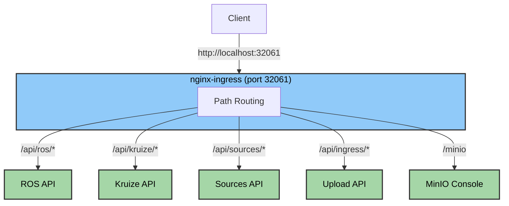
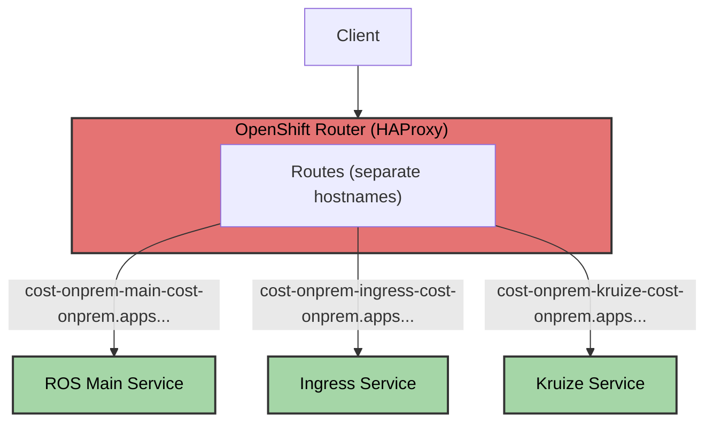

# Cost Management On-Premise Platform Guide

Platform-specific configuration and differences between Kubernetes and OpenShift deployments.

## Table of Contents
- [Platform Overview](#platform-overview)
- [Automatic Platform Detection](#automatic-platform-detection)
- [Kubernetes Deployment](#kubernetes-deployment)
- [OpenShift Deployment](#openshift-deployment)
- [Platform-Specific Troubleshooting](#platform-specific-troubleshooting)

## Platform Overview

The Cost Management On-Premise Helm chart automatically adapts to different Kubernetes platforms, providing optimized configurations for both standard Kubernetes and OpenShift environments.

### Supported Platforms

| Platform | Version | Status | Use Case |
|----------|---------|--------|----------|
| **Kubernetes** | 1.31+ | ✅ Supported | Development, Testing |
| **KIND** | Latest | ✅ Supported | CI/CD, Local Dev |
| **OpenShift** | 4.18+ | ✅ Supported | Production |
| **Single Node OpenShift** | 4.18+ | ✅ Supported | Edge, Development |

> **Note**: Tested with OpenShift 4.18.24 (Kubernetes 1.31.12)

---

## Automatic Platform Detection

The installation script automatically detects the platform and applies appropriate configurations.

### Detection Method

```bash
# Platform detection logic
if kubectl get routes.route.openshift.io >/dev/null 2>&1; then
    PLATFORM="openshift"
    echo "Detected OpenShift platform"
else
    PLATFORM="kubernetes"
    echo "Detected Kubernetes platform"
fi
```

### What Gets Configured Automatically

| Feature | Kubernetes | OpenShift |
|---------|-----------|-----------|
| **Routing** | Ingress resources | Route resources |
| **Storage** | MinIO (deployed) | ODF (existing) |
| **Access** | `localhost:32061` | Route hostnames |
| **TLS** | Optional | Edge termination |
| **Security Context** | Standard | Enhanced |

---

## Kubernetes Deployment

### Architecture



### Networking

**Ingress Configuration:**
```yaml
apiVersion: networking.k8s.io/v1
kind: Ingress
metadata:
  name: cost-onprem-ingress
  annotations:
    nginx.ingress.kubernetes.io/rewrite-target: /$2
spec:
  ingressClassName: nginx
  rules:
  - http:
      paths:
      - path: /api/ros(/|$)(.*)
        pathType: ImplementationSpecific
        backend:
          service:
            name: cost-onprem-ros-api
            port:
              number: 8000
```

**Access URLs:**
```bash
# All services through single ingress
http://localhost:32061/ready
http://localhost:32061/status
http://localhost:32061/api/ros/*
http://localhost:32061/api/kruize/*
http://localhost:32061/api/sources/*
http://localhost:32061/api/ingress/*
http://localhost:32061/minio
```

### Storage

**MinIO Deployment:**
- Automatically deployed as StatefulSet
- S3-compatible object storage
- Web console included
- Default credentials: `minioaccesskey` / `miniosecretkey`

```yaml
minio:
  image:
    repository: quay.io/minio/minio
    tag: "RELEASE.2025-07-23T15-54-02Z"
  storage:
    size: 20Gi
  ports:
    api: 9000
    console: 9990
```

**Storage Class:**
```bash
# Uses default storage class or custom
global:
  storageClass: "standard"  # or empty for default
```

### KIND-Specific Features

**Cluster Setup:**
```bash
# Automated KIND cluster creation
./scripts/deploy-kind.sh
```

**Features:**
- Container runtime support (Docker/Podman)
- Automated ingress controller installation
- Fixed resource allocation (6GB memory)
- Port mapping to `localhost:32061`
- Perfect for CI/CD pipelines

**Configuration:**
```yaml
kind: Cluster
apiVersion: kind.x-k8s.io/v1alpha4
nodes:
- role: control-plane
  extraPortMappings:
  - containerPort: 30080
    hostPort: 32061
    protocol: TCP
```

### Kubernetes-Specific Values

```yaml
# values-kubernetes.yaml
serviceIngress:
  className: nginx
  enabled: true
  hosts:
    - host: localhost
      paths:
        - path: /
          pathType: Prefix

minio:
  enabled: true

serviceRoute:
  enabled: false

global:
  platform:
    openshift: false
```

---

## OpenShift Deployment

### Architecture



### Networking

**Route Configuration:**
```yaml
apiVersion: route.openshift.io/v1
kind: Route
metadata:
  name: cost-onprem-main
  annotations:
    haproxy.router.openshift.io/timeout: "30s"
spec:
  host: ""  # Auto-generated: cost-onprem-main-namespace.apps.cluster.com
  to:
    kind: Service
    name: cost-onprem-ros-api
  port:
    targetPort: 8000
  tls:
    termination: edge
    insecureEdgeTerminationPolicy: Redirect
```

**Access URLs:**
```bash
# Get route hostnames
oc get routes -n cost-onprem

# Example routes
https://cost-onprem-main-cost-onprem.apps.cluster.com
https://cost-onprem-ingress-cost-onprem.apps.cluster.com
https://cost-onprem-kruize-cost-onprem.apps.cluster.com
```

### Storage

**ODF (OpenShift Data Foundation):**
- Uses existing ODF installation
- NooBaa S3 service
- Enterprise-grade storage
- Requires credentials secret

**Prerequisites:**
```bash
# Verify ODF installation
oc get noobaa -n openshift-storage
oc get storagecluster -n openshift-storage

# Create credentials secret
oc create secret generic cost-onprem-odf-credentials \
  --from-literal=access-key=<key> \
  --from-literal=secret-key=<secret> \
  -n cost-onprem
```

**Configuration:**
```yaml
odf:
  endpoint: "s3.openshift-storage.svc.cluster.local"
  region: "us-east-1"
  bucket: "ros-data"
  pathStyle: true
  useSSL: true
  port: 443
  credentials:
    secretName: "cost-onprem-odf-credentials"
```

### Security

**Enhanced Security Context:**
```yaml
# OpenShift SCCs (Security Context Constraints)
securityContext:
  runAsNonRoot: true
  runAsUser: 1001
  fsGroup: 1001
  seccompProfile:
    type: RuntimeDefault

# Automatically uses restricted-v2 SCC
```

**Service Accounts:**
```bash
# View service accounts
oc get sa -n cost-onprem

# View assigned SCCs
oc get pod <pod-name> -n cost-onprem -o yaml | grep scc
```

### TLS Configuration

**Automatic TLS Termination:**
```yaml
serviceRoute:
  tls:
    termination: edge                # TLS at router
    insecureEdgeTerminationPolicy: Redirect  # Redirect HTTP to HTTPS
```

**Options:**
- `edge`: TLS termination at router
- `passthrough`: TLS to pod
- `reencrypt`: TLS at router and pod

### OpenShift-Specific Values

```yaml
# values-openshift.yaml
serviceRoute:
  enabled: true
  annotations:
    haproxy.router.openshift.io/timeout: "30s"
  tls:
    termination: edge
    insecureEdgeTerminationPolicy: Redirect

odf:
  endpoint: "s3.openshift-storage.svc.cluster.local"
  bucket: "ros-data"
  credentials:
    secretName: "cost-onprem-odf-credentials"

minio:
  enabled: false

serviceIngress:
  enabled: false

global:
  platform:
    openshift: true
    domain: "apps.cluster.example.com"
```

---

## Platform-Specific Troubleshooting

### Kubernetes Issues

**Ingress not accessible:**
```bash
# Check ingress controller
kubectl get pods -n ingress-nginx
kubectl logs -n ingress-nginx deployment/ingress-nginx-controller

# Check ingress rules
kubectl describe ingress cost-onprem-ingress -n cost-onprem

# Verify port mapping (KIND)
docker port cost-onprem-cluster-control-plane
```

**MinIO issues:**
```bash
# Check MinIO pods
kubectl get pods -l app=minio -n cost-onprem

# Access MinIO logs
kubectl logs -n cost-onprem statefulset/cost-onprem-minio

# Verify PVC
kubectl get pvc -l app=minio -n cost-onprem
```

### OpenShift Issues

**Routes not accessible:**
```bash
# Check routes
oc get routes -n cost-onprem
oc describe route cost-onprem-main -n cost-onprem

# Check router pods
oc get pods -n openshift-ingress

# Test internal connectivity
oc rsh deployment/cost-onprem-ros-api
curl http://cost-onprem-ros-api:8000/status
```

**ODF issues:**
```bash
# Check ODF status
oc get noobaa -n openshift-storage
oc get cephcluster -n openshift-storage

# Check credentials secret
oc get secret cost-onprem-odf-credentials -n cost-onprem

# Test S3 connectivity
oc rsh deployment/cost-onprem-ingress
aws --endpoint-url https://s3.openshift-storage... s3 ls
```

---

## Next Steps

- **Installation**: See [Installation Guide](installation.md)
- **Configuration**: See [Configuration Guide](configuration.md)
- **Troubleshooting**: See [Troubleshooting Guide](troubleshooting.md)

---

**Related Documentation:**
- [Installation Guide](installation.md)
- [Configuration Guide](configuration.md)
- [Quick Start Guide](quickstart.md)

