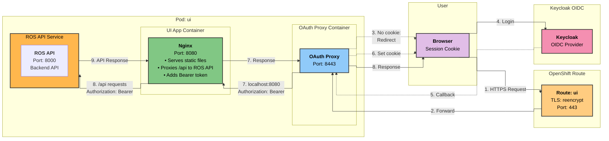
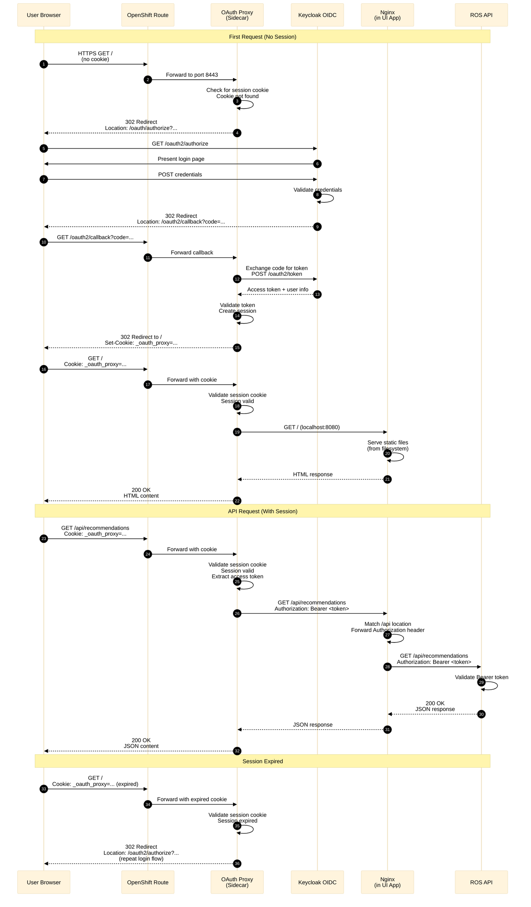

# UI OAuth Authentication for ROS OCP

## Overview

The UI for ROS OCP uses OAuth2 Proxy with Keycloak OIDC as a sidecar container to provide authentication. This allows users to authenticate using Keycloak credentials.

### Quick Reference

| Component | Purpose | Location | Port |
|-----------|---------|----------|------|
| **OAuth2 Proxy** | Authentication proxy with Keycloak OIDC | Sidecar in ui pod | 8443 (HTTPS) |
| **Nginx** | Web server and API proxy | Inside UI app container | 8080 (HTTP) |
| **UI App** | Frontend application | Main container in pod | 8080 (HTTP) |
| **ROS API** | Backend API service | Separate service | 8000 (HTTP) |
| **Keycloak** | OIDC provider for user authentication | External/separate service | 443 (HTTPS) |
| **OpenShift Route** | External access with TLS reencrypt | Route resource | 443 (HTTPS) |
| **Service CA Operator** | Auto-generates TLS certificates | Cluster-wide operator | N/A |

### Authentication Chain

```
User → OpenShift Route → OAuth2 Proxy → Keycloak OIDC → Validate
                              ↓                            ↓
                         localhost:8080 ← Session Cookie ← Success
                              ↓
                           Nginx
                              ↓
                    ┌─────────┴─────────┐
                    ↓                   ↓
                 UI App            ROS API
              (Static files)    (API requests with Bearer token)
```

## Architecture

### Deployment Architecture



### Authentication Flow Sequence



### Components

- **OAuth2 Proxy**: Sidecar container (`quay.io/oauth2-proxy/oauth2-proxy`) handling authentication with Keycloak OIDC
- **Nginx**: Web server running inside the UI app container that serves static files and proxies API requests to ROS API
- **UI App**: Frontend application container serving the web interface with embedded Nginx
- **ROS API**: Backend API service that receives authenticated requests with Bearer tokens
- **Keycloak**: External OIDC provider for user authentication
- **OpenShift Route**: Exposes the service with TLS reencrypt termination
- **Service CA Operator**: Automatically generates and rotates TLS certificates
- **ServiceAccount**: Service account for the UI pods

## Configuration

### Helm Values

```yaml
# UI (OpenShift only - Keycloak OIDC protected frontend)
ui:
  replicaCount: 1
  oauthProxy:
    image:
      repository: quay.io/oauth2-proxy/oauth2-proxy
      pullPolicy: IfNotPresent
      tag: "v7.7.1"
    resources:
      limits:
        cpu: "100m"
        memory: "128Mi"
      requests:
        cpu: "50m"
        memory: "64Mi"

    keycloak:
      # Keycloak issuer URL
      issuerUrl: "https://keycloak.example.com/realms/master"
      # OAuth2 client ID
      clientId: "cost-management-ui"
      # OAuth2 client secret (provide via --set or external secret)
      clientSecretValue: ""
      # Optional: Email domain restriction
      emailDomain: ""
      # Optional: Allowed roles
      allowedRoles: []
      # Optional: Allowed groups
      allowedGroups: []

  app:
    image:
      repository: quay.io/insights-onprem/koku-ui-mfe-on-prem
      tag: "0.0.14"
      pullPolicy: IfNotPresent
    port: 8080
    resources:
      limits:
        cpu: "100m"
        memory: "128Mi"
      requests:
        cpu: "50m"
        memory: "64Mi"
```

### OAuth2 Proxy Arguments

The OAuth2 Proxy is configured with the following arguments:

```yaml
args:
- --https-address=:8443                    # Listen on HTTPS port 8443
- --provider=keycloak-oidc                 # Use Keycloak OIDC provider
- --client-id=<client-id>                  # Keycloak client ID
- --client-secret-file=/etc/proxy/secrets/client-secret  # Client secret
- --cookie-secret-file=/etc/proxy/secrets/session-secret  # Session encryption key
- --oidc-issuer-url=<keycloak-url>/realms/<realm>  # Keycloak issuer URL
- --redirect-url=https://<route>/oauth2/callback  # OAuth callback URL
- --tls-cert=/etc/tls/private/tls.crt     # TLS certificate (auto-generated)
- --tls-key=/etc/tls/private/tls.key      # TLS private key (auto-generated)
- --upstream=http://localhost:8080         # Forward to UI app on localhost
- --pass-host-header=false                 # Don't forward original Host header
- --skip-provider-button                   # Skip provider button
- --skip-auth-preflight                    # Skip OAuth consent screen
- --pass-authorization-header               # Pass Authorization header with Bearer token to upstream
- --code-challenge-method=S256             # Use PKCE for enhanced security
```

Optional authorization arguments:
```yaml
- --email-domain=<domain>                  # Restrict to specific email domain
- --allowed-role=<role>                    # Allow specific Keycloak role
- --allowed-group=<group>                  # Allow specific Keycloak group
```

### Keycloak Client Setup

You need to create an OIDC client in Keycloak with the following configuration:

1. **Client Type**: OpenID Connect
2. **Client ID**: `cost-management-ui` (or your custom value)
3. **Client Authentication**: Enabled (confidential client)
4. **Valid Redirect URIs**: `https://<ui-route-host>/oauth2/callback`
5. **Web Origins**: `https://<ui-route-host>`

**Required Mappers**:
- Create an audience mapper to include the client ID in the `aud` claim

**Optional Configuration**:
- Configure role mappings if using `--allowed-role`
- Configure group mappings if using `--allowed-group`
- Set email domain requirements in Keycloak if needed

### TLS Certificate Auto-Generation

The Service CA Operator automatically generates TLS certificates via annotation:

```yaml
apiVersion: v1
kind: Service
metadata:
  name: <fullname>-ui
  annotations:
    service.beta.openshift.io/serving-cert-secret-name: <fullname>-ui-tls
spec:
  ports:
    - port: 8443
      targetPort: https
      name: https
```

The operator:
- Watches for the `serving-cert-secret-name` annotation
- Generates a TLS certificate signed by the cluster CA
- Creates a Secret with `tls.crt` and `tls.key`
- Automatically rotates certificates before expiry

### Session Secret Persistence

The cookie secret is persisted across Helm upgrades using the `lookup` function:

```yaml
{{- $secret := (lookup "v1" "Secret" .Release.Namespace (printf "%s-ui-cookie-secret" (include "ros-ocp.fullname" .))) -}}
apiVersion: v1
kind: Secret
metadata:
  name: {{ include "ros-ocp.fullname" . }}-ui-cookie-secret
type: Opaque
data:
  session-secret: {{ if $secret }}{{ index $secret.data "session-secret" }}{{ else }}{{ randAlphaNum 32 | b64enc }}{{ end }}
```

This ensures:
- ✅ Users remain logged in across Helm upgrades
- ✅ Existing sessions are not invalidated
- ✅ New secret is only generated on initial install or manual deletion

### Nginx Configuration

Nginx runs inside the UI app container and serves two primary functions:
1. **Static File Serving**: Serves the React application's static files (HTML, CSS, JavaScript)
2. **API Proxy**: Proxies API requests to the ROS API backend with Bearer token authentication

#### Nginx Configuration

The Nginx configuration is embedded in the UI application container. Key configuration:

```nginx
# API proxy location - forwards to ROS API
location /api {
    proxy_pass ${API_PROXY_URL};

    # OAuth2 proxy passes Authorization header with Bearer token via --pass-authorization-header
    # Nginx forwards the Authorization header directly to ROS API
    proxy_set_header Authorization $http_authorization;

    # Standard proxy headers
    proxy_set_header Host $host;
    proxy_set_header X-Real-IP $remote_addr;
    proxy_set_header X-Forwarded-For $proxy_add_x_forwarded_for;

    # HTTP/1.1 connection settings
    proxy_http_version 1.1;
    proxy_set_header Connection "";
}

# Static file serving - React application
location / {
    try_files $uri $uri/ /index.html;
}
```

#### Key Configuration Points

1. **API Proxy URL**:
   - Set via `API_PROXY_URL` environment variable
   - Points to ROS API service: `http://<fullname>-ros-api:8000`
   - Configured in Helm values: `ui.app.env.API_PROXY_URL`

2. **Token Passing**:
   - OAuth2 proxy uses `--pass-authorization-header` flag to pass the `Authorization` header with Bearer token
   - OAuth2 proxy sets `Authorization: Bearer <token>` header when forwarding requests to upstream (Nginx)
   - Nginx explicitly forwards the `Authorization` header to ROS API using `proxy_set_header Authorization $http_authorization`
   - ROS API validates the Bearer token for authentication

3. **Static File Serving**:
   - All non-API requests (`/`) are served as static files
   - `try_files` directive enables client-side routing (React Router)
   - Falls back to `index.html` for all routes (SPA behavior)

#### Request Flow

**Static File Request:**
```
User → Route → OAuth Proxy → Nginx → Serve /index.html → Response
```

**API Request:**
```
User → Route → OAuth2 Proxy (adds Authorization: Bearer <token> via --pass-authorization-header)
  → Nginx (forwards Authorization header)
  → ROS API (validates Bearer token)
  → Response
```

#### Environment Variable

The `API_PROXY_URL` environment variable is set in the UI app container:

```yaml
env:
  - name: API_PROXY_URL
    value: "http://{{ include "cost-onprem.fullname" . }}-ros-api:{{ .Values.ros.api.port }}"
```

This ensures Nginx knows where to proxy API requests.

## Testing

### Prerequisites

1. Deployed on OpenShift cluster (UI is OpenShift-only)
2. Keycloak OIDC server is accessible and configured
3. User has valid Keycloak credentials

### Access the UI

```bash
# Get the UI route URL
UI_ROUTE=$(oc get route -n ros-ocp -l app.kubernetes.io/component=ui -o jsonpath='{.items[0].spec.host}')

# Access in browser
echo "https://$UI_ROUTE"

# Or test with curl (will get redirect)
curl -v "https://$UI_ROUTE"

# Expected: 302 redirect to /oauth2/authorize
```

### Verify Route Configuration

```bash
# Check route exists
oc get route -n ros-ocp -l app.kubernetes.io/component=ui

# Verify TLS reencrypt termination
oc get route -n ros-ocp -l app.kubernetes.io/component=ui -o jsonpath='{.items[0].spec.tls.termination}'
# Expected: reencrypt

# Check route target
oc describe route -n ros-ocp -l app.kubernetes.io/component=ui
```

### Verify TLS Certificate

```bash
# Check if TLS secret exists
oc get secret -n ros-ocp -l app.kubernetes.io/component=ui | grep tls

# View certificate details
oc get secret <fullname>-ui-tls -n ros-ocp -o jsonpath='{.data.tls\.crt}' | base64 -d | openssl x509 -text -noout

# Verify certificate is valid
oc get secret <fullname>-ui-tls -n ros-ocp -o jsonpath='{.data.tls\.crt}' | base64 -d | openssl x509 -noout -dates
```

### Verify OAuth Proxy Health

```bash
# Check OAuth proxy health endpoint
oc exec -n ros-ocp -l app.kubernetes.io/component=ui -c oauth-proxy -- \
  curl -k https://localhost:8443/oauth/healthz

# Expected: "OK"

# Check OAuth proxy logs
oc logs -n ros-ocp -l app.kubernetes.io/component=ui -c oauth-proxy --tail=50

# Look for:
# - "Listening on :8443"
# - "HTTP: serving on :8443"
```

### Verify UI App Health

```bash
# Check UI app health
oc exec -n ros-ocp -l app.kubernetes.io/component=ui -c app -- \
  curl http://localhost:8080/

# Expected: HTML response

# Check UI app logs
oc logs -n ros-ocp -l app.kubernetes.io/component=ui -c app --tail=50
```

### Verify Nginx Configuration

```bash
# Check API_PROXY_URL environment variable
oc exec -n ros-ocp -l app.kubernetes.io/component=ui -c app -- \
  env | grep API_PROXY_URL

# Expected: API_PROXY_URL=http://<fullname>-ros-api:8000

# Test Nginx API proxy (requires authenticated session)
# First, get a valid session cookie, then:
oc exec -n ros-ocp -l app.kubernetes.io/component=ui -c app -- \
  curl -H "Authorization: Bearer <test-token>" \
       http://localhost:8080/api/status

# Check Nginx logs (if available in container)
oc logs -n ros-ocp -l app.kubernetes.io/component=ui -c app --tail=50 | grep nginx

# Verify ROS API is accessible from UI pod
oc exec -n ros-ocp -l app.kubernetes.io/component=ui -c app -- \
  curl http://<fullname>-ros-api:8000/status
```

### Test Authentication Flow

```bash
# 1. Open browser in private/incognito mode
# 2. Navigate to https://<ui-route>
# 3. Should redirect to Keycloak login
# 4. Enter Keycloak credentials
# 5. Should redirect back to UI
# 6. UI should load successfully

# Test session persistence
# 7. Refresh page - should not require login
# 8. Close browser and reopen
# 9. Navigate to https://<ui-route>
# 10. Should still be logged in (if session not expired)
```

## Troubleshooting

### OAuth Redirect Loop

**Symptom**: Continuously redirected between UI and Keycloak OAuth

**Diagnosis**:
```bash
# Check ServiceAccount annotation
oc get serviceaccount -n ros-ocp -l app.kubernetes.io/component=ui -o yaml | grep oauth-redirectreference

# Verify route name matches annotation
oc get route -n ros-ocp -l app.kubernetes.io/component=ui -o jsonpath='{.items[0].metadata.name}'
```

**Solution**:
```bash
# Reinstall to fix annotation mismatch
helm upgrade ros-ocp ./ros-ocp -n ros-ocp --force
```

### TLS Certificate Not Generated

**Symptom**: Pod fails to start with "tls.crt: no such file"

**Diagnosis**:
```bash
# Check if Service CA Operator is running
oc get pods -n openshift-service-ca -l app=service-ca

# Check service annotation
oc get service -n ros-ocp -l app.kubernetes.io/component=ui -o yaml | grep serving-cert-secret-name

# Check if secret was created
oc get secret -n ros-ocp | grep ui-tls
```

**Solution**:
```bash
# Wait for certificate generation (usually < 30 seconds)
oc wait --for=condition=ready secret/<fullname>-ui-tls -n ros-ocp --timeout=60s

# If timeout, check Service CA logs
oc logs -n openshift-service-ca -l app=service-ca

# Restart pod to pick up certificate
oc rollout restart deployment -n ros-ocp -l app.kubernetes.io/component=ui
```

### Keycloak Certificate Not Trusted

**Symptom**: OAuth proxy fails to start with error:
```
ERROR: Failed to initialise OAuth2 Proxy: tls: failed to verify certificate: x509: certificate signed by unknown authority
```

**Cause**: The `keycloak-ca-cert` secret is missing or contains wrong CA certificate.

**Solution**:
```bash
# Extract the cluster CA from OpenShift ingress operator
oc get secret router-ca -n openshift-ingress-operator -o jsonpath='{.data.tls\.crt}' | base64 -d > ca.crt

# Create secret in deployment namespace
kubectl create secret generic keycloak-ca-cert --from-file=ca.crt=./ca.crt -n ros-ocp
```

**Note**: The `deploy-rhbk.sh` script creates this secret automatically.

### Session Expired Too Quickly

**Symptom**: Users logged out frequently

**Diagnosis**:
```bash
# Check cookie secret age
oc get secret -n ros-ocp <fullname>-ui-cookie-secret -o jsonpath='{.metadata.creationTimestamp}'

# Check if secret changed recently
oc describe secret -n ros-ocp <fullname>-ui-cookie-secret
```

**Solution**:
```bash
# Cookie secret should persist across Helm upgrades
# If manually deleted, users will need to re-login

# Verify lookup function is working
helm get manifest ros-ocp -n ros-ocp | grep -A 5 "lookup.*Secret"
```

### 503 Service Unavailable

**Symptom**: Route returns 503 error

**Diagnosis**:
```bash
# Check pod status
oc get pods -n ros-ocp -l app.kubernetes.io/component=ui

# Check service endpoints
oc get endpoints -n ros-ocp -l app.kubernetes.io/component=ui

# Check route backend
oc describe route -n ros-ocp -l app.kubernetes.io/component=ui
```

**Solution**:
```bash
# Ensure pod is ready
oc wait --for=condition=ready pod -n ros-ocp -l app.kubernetes.io/component=ui --timeout=60s

# Check readiness probe
oc describe pod -n ros-ocp -l app.kubernetes.io/component=ui | grep -A 5 Readiness

# View probe logs
oc logs -n ros-ocp -l app.kubernetes.io/component=ui -c oauth-proxy | grep healthz
```

### OAuth Proxy Crashes

**Symptom**: OAuth proxy container constantly restarting

**Diagnosis**:
```bash
# Check pod events
oc describe pod -n ros-ocp -l app.kubernetes.io/component=ui

# Check oauth-proxy logs
oc logs -n ros-ocp -l app.kubernetes.io/component=ui -c oauth-proxy --previous

# Check resource limits
oc get pod -n ros-ocp -l app.kubernetes.io/component=ui -o jsonpath='{.spec.containers[?(@.name=="oauth-proxy")].resources}'
```

**Solution**:
```bash
# Increase memory if OOMKilled
helm upgrade ros-ocp ./ros-ocp -n ros-ocp \
  --set ui.oauth-proxy.resources.limits.memory=256Mi \
  --set ui.oauth-proxy.resources.requests.memory=128Mi
```

### App Container Not Responding

**Symptom**: OAuth works but app returns errors

**Diagnosis**:
```bash
# Check app logs
oc logs -n ros-ocp -l app.kubernetes.io/component=ui -c app

# Test app directly
oc exec -n ros-ocp -l app.kubernetes.io/component=ui -c app -- \
  curl http://localhost:8080/

# Check app port configuration
oc get deployment -n ros-ocp -l app.kubernetes.io/component=ui -o jsonpath='{.spec.template.spec.containers[?(@.name=="app")].ports[0].containerPort}'
```

**Solution**:
```bash
# Verify app port matches configuration
helm upgrade ros-ocp ./ros-ocp -n ros-ocp --set ui.app.port=8080

# Increase app resources if needed
helm upgrade ros-ocp ./ros-ocp -n ros-ocp \
  --set ui.app.resources.limits.memory=512Mi
```

### API Requests Failing (401/403)

**Symptom**: UI loads but API requests return authentication errors

**Diagnosis**:
```bash
# Check if API_PROXY_URL is set correctly
oc exec -n ros-ocp -l app.kubernetes.io/component=ui -c app -- \
  env | grep API_PROXY_URL

# Verify ROS API service is accessible
oc get svc -n ros-ocp -l app.kubernetes.io/component=ros-api

# Test ROS API directly
oc exec -n ros-ocp -l app.kubernetes.io/component=ui -c app -- \
  curl http://<fullname>-ros-api:8000/status

# Check if OAuth2 proxy is passing Authorization header
oc logs -n ros-ocp -l app.kubernetes.io/component=ui -c oauth-proxy | grep -i "authorization\|pass-authorization"
```

**Solution**:
```bash
# Verify API_PROXY_URL environment variable
# Should be: http://<fullname>-ros-api:8000
oc get deployment -n ros-ocp -l app.kubernetes.io/component=ui -o yaml | \
  grep -A 2 API_PROXY_URL

# Ensure OAuth2 proxy is configured with --pass-authorization-header flag
# This flag enables Authorization header to be passed to upstream
oc get deployment -n ros-ocp -l app.kubernetes.io/component=ui -o yaml | \
  grep -i "pass-authorization-header"

# If missing, update Helm values to include:
# ui.oauthProxy.args: ["--pass-authorization-header"]
helm upgrade ros-ocp ./ros-ocp -n ros-ocp \
  --set ui.oauthProxy.passAuthorizationHeader=true
```

### Nginx Proxy Errors

**Symptom**: API requests fail with proxy errors or connection refused

**Diagnosis**:
```bash
# Check Nginx configuration (if accessible)
oc exec -n ros-ocp -l app.kubernetes.io/component=ui -c app -- \
  cat /etc/nginx/nginx.conf 2>/dev/null || echo "Nginx config not accessible"

# Test ROS API connectivity from UI pod
oc exec -n ros-ocp -l app.kubernetes.io/component=ui -c app -- \
  curl -v http://<fullname>-ros-api:8000/status

# Check DNS resolution
oc exec -n ros-ocp -l app.kubernetes.io/component=ui -c app -- \
  nslookup <fullname>-ros-api || getent hosts <fullname>-ros-api
```

**Solution**:
```bash
# Verify ROS API service name matches API_PROXY_URL
# Service name format: <fullname>-ros-api
# API_PROXY_URL should be: http://<fullname>-ros-api:8000

# Check service exists and is accessible
oc get svc -n ros-ocp <fullname>-ros-api

# Verify ROS API pod is running
oc get pods -n ros-ocp -l app.kubernetes.io/component=ros-api

# Test network connectivity
oc exec -n ros-ocp -l app.kubernetes.io/component=ui -c app -- \
  nc -zv <fullname>-ros-api 8000
```

## Security Considerations

1. **TLS Encryption**
   - Route uses TLS reencrypt termination
   - Traffic is encrypted from user browser to route (TLS)
   - Traffic is re-encrypted from route to OAuth proxy (TLS)
   - Traffic from OAuth proxy to app is unencrypted (localhost only)

2. **Session Management**
   - Sessions stored in encrypted cookies (`_oauth_proxy`)
   - Cookie secret is 32 random alphanumeric characters
   - Secret persists across Helm upgrades to maintain sessions
   - Sessions have TTL and expire after inactivity

3. **Authentication**
   - Uses Keycloak OIDC provider
   - Keycloak handles user authentication and authorization
   - User credentials never touch the OAuth proxy
   - OAuth proxy only receives validated tokens from Keycloak

4. **Network Isolation**
   - UI app only accessible via OAuth proxy (no direct external access)
   - OAuth proxy and Nginx communicate over pod-local `localhost`
   - Nginx proxies API requests to ROS API within the cluster
   - Only OpenShift Route can access OAuth proxy externally
   - API requests are authenticated with Bearer tokens passed from OAuth proxy

5. **ServiceAccount Permissions**
   - ServiceAccount has no special RBAC permissions
   - OAuth redirect enabled via annotation only
   - No cluster-wide permissions needed

6. **Automatic Certificate Rotation**
   - TLS certificates auto-renewed by Service CA Operator
   - No manual certificate management required
   - Certificates signed by cluster CA

7. **Health Check Bypass**
   - `/oauth/healthz` endpoint does not require authentication
   - Required for Kubernetes liveness/readiness probes
   - Only accessible from within the cluster

## Deployment

### Installation with Helm

When deploying the chart, you must provide the Keycloak configuration:

```bash
helm install cost-onprem ./cost-onprem \
  --set ui.oauthProxy.keycloak.issuerUrl="https://keycloak.example.com/realms/master" \
  --set ui.oauthProxy.keycloak.clientId="cost-management-ui" \
  --set ui.oauthProxy.keycloak.clientSecretValue="<your-client-secret>"
```

### Optional: Using an External Secret

Instead of passing the client secret via `--set`, you can create a secret manually:

```bash
kubectl create secret generic <fullname>-ui-oauth-client-secret \
  --from-literal=client-secret=<your-client-secret> \
  -n <namespace>
```

Then deploy without the `clientSecretValue`:

```bash
helm install cost-onprem ./cost-onprem \
  --set ui.oauthProxy.keycloak.issuerUrl="https://keycloak.example.com/realms/master" \
  --set ui.oauthProxy.keycloak.clientId="cost-management-ui"
```

### Optional Authorization Configuration

Restrict access by roles or groups:

```bash
helm install cost-onprem ./cost-onprem \
  --set ui.oauthProxy.keycloak.issuerUrl="https://keycloak.example.com/realms/master" \
  --set ui.oauthProxy.keycloak.clientId="cost-management-ui" \
  --set ui.oauthProxy.keycloak.clientSecretValue="<secret>" \
  --set ui.oauthProxy.keycloak.allowedRoles[0]="cost-admin" \
  --set ui.oauthProxy.keycloak.emailDomain="example.com"
```

## Platform Requirements

**OpenShift Only**: This UI authentication method is exclusively for OpenShift clusters because it depends on:

- ✅ OpenShift Routes with TLS reencrypt
- ✅ Service CA Operator for automatic certificate generation
- ✅ Keycloak OIDC instance (RHBK or community Keycloak) for user authentication

**Automatic Detection**: The UI is only deployed when the chart detects an OpenShift cluster:

```yaml
{{- if eq (include "cost-onprem.platform.isOpenShift" .) "true" }}
# UI resources deployed here
{{- end }}
```

**Kubernetes/KIND**: For non-OpenShift platforms, alternative ingress and TLS configurations would be required.

## References

- [OAuth2 Proxy](https://oauth2-proxy.github.io/oauth2-proxy/)
- [OAuth2 Proxy Keycloak OIDC Provider](https://oauth2-proxy.github.io/oauth2-proxy/configuration/providers/keycloak_oidc)
- [Keycloak Documentation](https://www.keycloak.org/documentation)
- [Service CA Operator](https://docs.openshift.com/container-platform/latest/security/certificates/service-serving-certificate.html)
- [OpenShift Routes](https://docs.openshift.com/container-platform/latest/networking/routes/route-configuration.html)

## Related Documentation

- [Configuration Guide](configuration.md) - Complete UI configuration reference with authentication flow diagrams
- [Troubleshooting Guide](troubleshooting.md) - UI-specific troubleshooting procedures
- [Platform Guide](platform-guide.md) - Platform-specific requirements and differences

